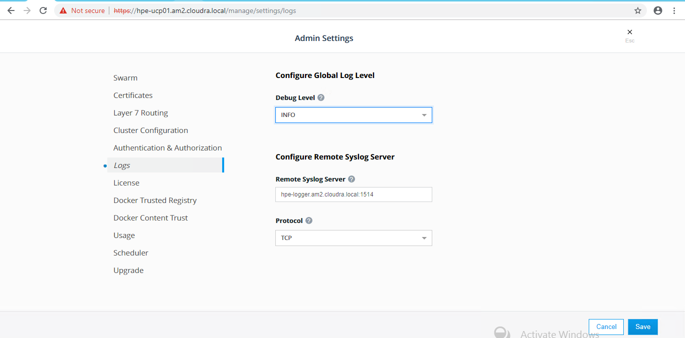

<?xml version="1.0" encoding="UTF-8"?>
<!DOCTYPE html
  PUBLIC "-//W3C//DTD XHTML 1.0 Transitional//EN" "http://www.w3.org/TR/xhtml1/DTD/xhtml1-transitional.dtd">
<html xmlns="http://www.w3.org/1999/xhtml" xml:lang="en" lang="en">
<head><meta http-equiv="Content-Type" content="text/html; charset=UTF-8" />

<meta name="DC.Type" content="topic" />
<meta name="DC.Title" content="HPE Enterprise Containers as a Service" />
<meta name="prodname" content="HPE Enterprise Containers as a Service with Docker Enterprise Edition" />
<meta name="prodname" content="HPE Enterprise Containers as a Service with Docker Enterprise Edition" />
<meta name="prodname" content="HPE Enterprise Containers as a Service with Docker Enterprise Edition" />
<meta name="prodname" content="HPE Enterprise Containers as a Service with Docker Enterprise Edition" />
<meta name="prodname" content="HPE Enterprise Containers as a Service with Docker Enterprise Edition" />
<meta name="prodname" content="HPE Enterprise Containers as a Service with Docker Enterprise Edition" />
<meta name="prodname" content="HPE Enterprise Containers as a Service with Docker Enterprise Edition" />
<meta name="prodname" content="HPE Enterprise Containers as a Service with Docker Enterprise Edition" />
<meta name="prodname" content="HPE Enterprise Containers as a Service with Docker Enterprise Edition" />
<meta name="prodname" content="HPE Enterprise Containers as a Service with Docker Enterprise Edition" />
<meta name="prodname" content="HPE Enterprise Containers as a Service with Docker Enterprise Edition" />
<meta name="prodname" content="HPE Enterprise Containers as a Service with Docker Enterprise Edition" />
<meta name="prodname" content="HPE Enterprise Containers as a Service with Docker Enterprise Edition" />
<meta name="prodname" content="HPE Enterprise Containers as a Service with Docker Enterprise Edition" />
<meta name="prodname" content="HPE Enterprise Containers as a Service with Docker Enterprise Edition" />
<meta name="prodname" content="HPE Enterprise Containers as a Service with Docker Enterprise Edition" />
<meta name="prodname" content="HPE Enterprise Containers as a Service with Docker Enterprise Edition" />
<meta name="prodname" content="HPE Enterprise Containers as a Service with Docker Enterprise Edition" />
<meta name="prodname" content="HPE Enterprise Containers as a Service with Docker Enterprise Edition" />
<meta name="prodname" content="HPE Enterprise Containers as a Service with Docker Enterprise Edition" />
<meta name="prodname" content="HPE Enterprise Containers as a Service with Docker Enterprise Edition" />
<meta name="prodname" content="HPE Enterprise Containers as a Service with Docker Enterprise Edition" />
<meta name="prodname" content="HPE Enterprise Containers as a Service with Docker Enterprise Edition" />
<meta name="prodname" content="HPE Enterprise Containers as a Service with Docker Enterprise Edition" />
<meta name="prodname" content="HPE Enterprise Containers as a Service with Docker Enterprise Edition" />
<meta name="prodname" content="HPE Enterprise Containers as a Service with Docker Enterprise Edition" />
<meta name="prodname" content="HPE Enterprise Containers as a Service with Docker Enterprise Edition" />
<meta name="prodname" content="HPE Enterprise Containers as a Service with Docker Enterprise Edition" />
<meta name="prodname" content="HPE Enterprise Containers as a Service with Docker Enterprise Edition" />
<meta name="prodname" content="HPE Enterprise Containers as a Service with Docker Enterprise Edition" />
<meta name="prodname" content="HPE Enterprise Containers as a Service with Docker Enterprise Edition" />
<meta name="prodname" content="HPE Enterprise Containers as a Service with Docker Enterprise Edition" />
<meta name="prodname" content="HPE Enterprise Containers as a Service with Docker Enterprise Edition" />
<meta name="prodname" content="HPE Enterprise Containers as a Service with Docker Enterprise Edition" />
<meta name="prodname" content="HPE Enterprise Containers as a Service with Docker Enterprise Edition" />
<meta name="prodname" content="HPE Enterprise Containers as a Service with Docker Enterprise Edition" />
<meta name="prodname" content="HPE Enterprise Containers as a Service with Docker Enterprise Edition" />
<meta name="prodname" content="HPE Enterprise Containers as a Service with Docker Enterprise Edition" />
<meta name="prodname" content="HPE Enterprise Containers as a Service with Docker Enterprise Edition" />
<meta name="prodname" content="HPE Enterprise Containers as a Service with Docker Enterprise Edition" />
<meta name="prodname" content="HPE Enterprise Containers as a Service with Docker Enterprise Edition" />
<meta name="prodname" content="HPE Enterprise Containers as a Service with Docker Enterprise Edition" />
<meta name="prodname" content="HPE Enterprise Containers as a Service with Docker Enterprise Edition" />
<meta name="prodname" content="HPE Enterprise Containers as a Service with Docker Enterprise Edition" />
<meta name="prodname" content="HPE Enterprise Containers as a Service with Docker Enterprise Edition" />
<meta name="prodname" content="HPE Enterprise Containers as a Service with Docker Enterprise Edition" />
<meta name="prodname" content="HPE Enterprise Containers as a Service with Docker Enterprise Edition" />
<meta name="prodname" content="HPE Enterprise Containers as a Service with Docker Enterprise Edition" />
<meta name="prodname" content="HPE Enterprise Containers as a Service with Docker Enterprise Edition" />
<meta name="prodname" content="HPE Enterprise Containers as a Service with Docker Enterprise Edition" />
<meta name="prodname" content="HPE Enterprise Containers as a Service with Docker Enterprise Edition" />
<meta name="prodname" content="HPE Enterprise Containers as a Service with Docker Enterprise Edition" />
<meta name="version" content="1.0" />
<meta name="version" content="1.0" />
<meta name="version" content="1.0" />
<meta name="version" content="1.0" />
<meta name="version" content="1.0" />
<meta name="version" content="1.0" />
<meta name="version" content="1.0" />
<meta name="version" content="1.0" />
<meta name="version" content="1.0" />
<meta name="version" content="1.0" />
<meta name="version" content="1.0" />
<meta name="version" content="1.0" />
<meta name="version" content="1.0" />
<meta name="version" content="1.0" />
<meta name="version" content="1.0" />
<meta name="version" content="1.0" />
<meta name="version" content="1.0" />
<meta name="version" content="1.0" />
<meta name="version" content="1.0" />
<meta name="version" content="1.0" />
<meta name="version" content="1.0" />
<meta name="version" content="1.0" />
<meta name="version" content="1.0" />
<meta name="version" content="1.0" />
<meta name="version" content="1.0" />
<meta name="version" content="1.0" />
<meta name="version" content="1.0" />
<meta name="version" content="1.0" />
<meta name="version" content="1.0" />
<meta name="version" content="1.0" />
<meta name="version" content="1.0" />
<meta name="version" content="1.0" />
<meta name="version" content="1.0" />
<meta name="version" content="1.0" />
<meta name="version" content="1.0" />
<meta name="version" content="1.0" />
<meta name="version" content="1.0" />
<meta name="version" content="1.0" />
<meta name="version" content="1.0" />
<meta name="version" content="1.0" />
<meta name="version" content="1.0" />
<meta name="version" content="1.0" />
<meta name="version" content="1.0" />
<meta name="version" content="1.0" />
<meta name="version" content="1.0" />
<meta name="version" content="1.0" />
<meta name="version" content="1.0" />
<meta name="version" content="1.0" />
<meta name="version" content="1.0" />
<meta name="version" content="1.0" />
<meta name="version" content="1.0" />
<meta name="version" content="1.0" />
<meta name="copyright" content="HPE 2018" type="primary" />
<meta name="DC.Rights.Owner" content="HPE 2018" type="primary" />
<meta name="copyright" content="HPE 2018" type="primary" />
<meta name="DC.Rights.Owner" content="HPE 2018" type="primary" />
<meta name="copyright" content="HPE 2018" type="primary" />
<meta name="DC.Rights.Owner" content="HPE 2018" type="primary" />
<meta name="copyright" content="HPE 2018" type="primary" />
<meta name="DC.Rights.Owner" content="HPE 2018" type="primary" />
<meta name="copyright" content="HPE 2018" type="primary" />
<meta name="DC.Rights.Owner" content="HPE 2018" type="primary" />
<meta name="copyright" content="HPE 2018" type="primary" />
<meta name="DC.Rights.Owner" content="HPE 2018" type="primary" />
<meta name="copyright" content="HPE 2018" type="primary" />
<meta name="DC.Rights.Owner" content="HPE 2018" type="primary" />
<meta name="copyright" content="HPE 2018" type="primary" />
<meta name="DC.Rights.Owner" content="HPE 2018" type="primary" />
<meta name="copyright" content="HPE 2018" type="primary" />
<meta name="DC.Rights.Owner" content="HPE 2018" type="primary" />
<meta name="copyright" content="HPE 2018" type="primary" />
<meta name="DC.Rights.Owner" content="HPE 2018" type="primary" />
<meta name="copyright" content="HPE 2018" type="primary" />
<meta name="DC.Rights.Owner" content="HPE 2018" type="primary" />
<meta name="copyright" content="HPE 2018" type="primary" />
<meta name="DC.Rights.Owner" content="HPE 2018" type="primary" />
<meta name="copyright" content="HPE 2018" type="primary" />
<meta name="DC.Rights.Owner" content="HPE 2018" type="primary" />
<meta name="copyright" content="HPE 2018" type="primary" />
<meta name="DC.Rights.Owner" content="HPE 2018" type="primary" />
<meta name="copyright" content="HPE 2018" type="primary" />
<meta name="DC.Rights.Owner" content="HPE 2018" type="primary" />
<meta name="copyright" content="HPE 2018" type="primary" />
<meta name="DC.Rights.Owner" content="HPE 2018" type="primary" />
<meta name="copyright" content="HPE 2018" type="primary" />
<meta name="DC.Rights.Owner" content="HPE 2018" type="primary" />
<meta name="copyright" content="HPE 2018" type="primary" />
<meta name="DC.Rights.Owner" content="HPE 2018" type="primary" />
<meta name="copyright" content="HPE 2018" type="primary" />
<meta name="DC.Rights.Owner" content="HPE 2018" type="primary" />
<meta name="copyright" content="HPE 2018" type="primary" />
<meta name="DC.Rights.Owner" content="HPE 2018" type="primary" />
<meta name="copyright" content="HPE 2018" type="primary" />
<meta name="DC.Rights.Owner" content="HPE 2018" type="primary" />
<meta name="copyright" content="HPE 2018" type="primary" />
<meta name="DC.Rights.Owner" content="HPE 2018" type="primary" />
<meta name="copyright" content="HPE 2018" type="primary" />
<meta name="DC.Rights.Owner" content="HPE 2018" type="primary" />
<meta name="copyright" content="HPE 2018" type="primary" />
<meta name="DC.Rights.Owner" content="HPE 2018" type="primary" />
<meta name="copyright" content="HPE 2018" type="primary" />
<meta name="DC.Rights.Owner" content="HPE 2018" type="primary" />
<meta name="copyright" content="HPE 2018" type="primary" />
<meta name="DC.Rights.Owner" content="HPE 2018" type="primary" />
<meta name="copyright" content="HPE 2018" type="primary" />
<meta name="DC.Rights.Owner" content="HPE 2018" type="primary" />
<meta name="copyright" content="HPE 2018" type="primary" />
<meta name="DC.Rights.Owner" content="HPE 2018" type="primary" />
<meta name="copyright" content="HPE 2018" type="primary" />
<meta name="DC.Rights.Owner" content="HPE 2018" type="primary" />
<meta name="copyright" content="HPE 2018" type="primary" />
<meta name="DC.Rights.Owner" content="HPE 2018" type="primary" />
<meta name="copyright" content="HPE 2018" type="primary" />
<meta name="DC.Rights.Owner" content="HPE 2018" type="primary" />
<meta name="copyright" content="HPE 2018" type="primary" />
<meta name="DC.Rights.Owner" content="HPE 2018" type="primary" />
<meta name="copyright" content="HPE 2018" type="primary" />
<meta name="DC.Rights.Owner" content="HPE 2018" type="primary" />
<meta name="copyright" content="HPE 2018" type="primary" />
<meta name="DC.Rights.Owner" content="HPE 2018" type="primary" />
<meta name="copyright" content="HPE 2018" type="primary" />
<meta name="DC.Rights.Owner" content="HPE 2018" type="primary" />
<meta name="copyright" content="HPE 2018" type="primary" />
<meta name="DC.Rights.Owner" content="HPE 2018" type="primary" />
<meta name="copyright" content="HPE 2018" type="primary" />
<meta name="DC.Rights.Owner" content="HPE 2018" type="primary" />
<meta name="copyright" content="HPE 2018" type="primary" />
<meta name="DC.Rights.Owner" content="HPE 2018" type="primary" />
<meta name="copyright" content="HPE 2018" type="primary" />
<meta name="DC.Rights.Owner" content="HPE 2018" type="primary" />
<meta name="copyright" content="HPE 2018" type="primary" />
<meta name="DC.Rights.Owner" content="HPE 2018" type="primary" />
<meta name="copyright" content="HPE 2018" type="primary" />
<meta name="DC.Rights.Owner" content="HPE 2018" type="primary" />
<meta name="copyright" content="HPE 2018" type="primary" />
<meta name="DC.Rights.Owner" content="HPE 2018" type="primary" />
<meta name="copyright" content="HPE 2018" type="primary" />
<meta name="DC.Rights.Owner" content="HPE 2018" type="primary" />
<meta name="copyright" content="HPE 2018" type="primary" />
<meta name="DC.Rights.Owner" content="HPE 2018" type="primary" />
<meta name="copyright" content="HPE 2018" type="primary" />
<meta name="DC.Rights.Owner" content="HPE 2018" type="primary" />
<meta name="copyright" content="HPE 2018" type="primary" />
<meta name="DC.Rights.Owner" content="HPE 2018" type="primary" />
<meta name="copyright" content="HPE 2018" type="primary" />
<meta name="DC.Rights.Owner" content="HPE 2018" type="primary" />
<meta name="copyright" content="HPE 2018" type="primary" />
<meta name="DC.Rights.Owner" content="HPE 2018" type="primary" />
<meta name="copyright" content="HPE 2018" type="primary" />
<meta name="DC.Rights.Owner" content="HPE 2018" type="primary" />
<meta name="copyright" content="HPE 2018" type="primary" />
<meta name="DC.Rights.Owner" content="HPE 2018" type="primary" />
<meta name="copyright" content="HPE 2018" type="primary" />
<meta name="DC.Rights.Owner" content="HPE 2018" type="primary" />
<meta name="copyright" content="HPE 2018" type="primary" />
<meta name="DC.Rights.Owner" content="HPE 2018" type="primary" />
<meta name="DC.Format" content="XHTML" />
<meta name="DC.Identifier" content="enterprise-caas" />
<link rel="stylesheet" type="text/css" href="commonltr.css" />
</head>
<body>

<h1 class="title topictitle1" id="ariaid-title1">HPE Enterprise Containers as a Service </h1>

<ul class="ul">
<li class="li"><a class="xref" href="#introduction">Introduction</a>
<ul class="ul">
<li class="li"><a class="xref" href="#about-ansible">About Ansible</a></li>

<li class="li"><a class="xref" href="#docker-ee">About Docker Enterprise Edition</a></li>
  
<li class="li"><a class="xref" href="#synergy">HPE Synergy</a></li>

<li class="li"><a class="xref" href="#required-versions">Required Versions</a></li>

</ul>

</li>
    
<li class="li"><a class="xref" href="#architecture">Architecture</a>
<ul class="ul">
<li class="li"><a class="xref" href="#server-reqs">Server requirements:</a></li>
    
<li class="li"><a class="xref" href="#storage-reqs">Storage requirements:</a></li>

<li class="li"><a class="xref" href="#ha">High availability</a></li>

<li class="li"><a class="xref" href="#sizing">Sizing considerations</a></li>

<li class="li"><a class="xref" href="#disaster-recovery">Disaster Recovery</a></li>

<li class="li"><a class="xref" href="#security">Security</a></li>

<li class="li"><a class="xref" href="#splunk">Monitoring with Splunk</a></li>
  
<li class="li"><a class="xref" href="#sysdig">Monitoring with Sysdig</a></li>

</ul>

</li>
  
<li class="li"><a class="xref" href="#provisioning">Provisioning the environment</a>
<ul class="ul">

<li class="li"><a class="xref" href="#verify-prereqs">Verify prerequisites</a></li>

<li class="li"><a class="xref" href="#vsphere-ha">Enable vSphere High Availability</a></li>

<li class="li"><a class="xref" href="#install-vdvs">Install vSphere Docker Volume Service driver on all ESXi hosts</a></li>

<li class="li"><a class="xref" href="#install-vdvs-win">Install vSphere Docker Volume Service driver for Windows</a></li>

<li class="li"><a class="xref" href="#create-rhel-template">Create the Red Hat Linux Template</a></li>

<li class="li"><a class="xref" href="#config-yum">Configure the yum repositories</a></li>

<li class="li"><a class="xref" href="#create-template-win">Create the Windows Template</a></li>

<li class="li"><a class="xref" href="#create-ansible-node">Create the Ansible node</a></li>

<li class="li"><a class="xref" href="#finalize-template">Finalize the template</a></li>

<li class="li"><a class="xref" href="#ansible-config">Ansible configuration</a></li>

<li class="li"><a class="xref" href="#edit-inventory">Editing the inventory</a></li>
  

 

</ul>

</li>

<li class="li"><a class="xref" href="#edit-group-var">Configuring the solution components</a>
<ul class="ul">
<li class="li"><a class="xref" href="#vmware-config">VMware configuration</a></li>

<li class="li"><a class="xref" href="#network-config">Networking configuration</a></li>
   
<li class="li"><a class="xref" href="#environment-config">Environment configuration</a></li>
   
<li class="li"><a class="xref" href="#docker-config">Docker configuration</a>
<ul class="ul">
<li class="li"><a class="xref" href="#customer-certs">Using customer supplied certificates for UCP and DTR</a></li>
      
</ul>

</li>
   
<li class="li"><a class="xref" href="#windows-config">Windows configuration</a></li>
 
<li class="li"><a class="xref" href="#monitoring-config-splunk">Splunk configuration</a></li>
 
<li class="li"><a class="xref" href="#monitoring-config-sysdig">Sysdig configuration</a></li>

<li class="li"><a class="xref" href="#monitoring-config-promgraf">Prometheus and Grafana configuration</a></li>
   
<li class="li"><a class="xref" href="#edit-vault">Protecting sensitive information</a></li>
     
</ul>

</li>
      
<li class="li"><a class="xref" href="#playbooks-overview">Overview of the playbooks</a></li>

<li class="li"><a class="xref" href="#running-playbooks">Running the playbooks</a>
<ul class="ul">
<li class="li"><a class="xref" href="#post-deployment">Post deployment</a></li>
    
</ul>

</li>

<li class="li"><a class="xref" href="#lifecycle">Solution lifecycle management</a></li>
     
<li class="li"><a class="xref" href="#backup-restore">Backup and restore</a>
<ul class="ul">
<li class="li"><a class="xref" href="#backup-restore-docker-volumes">Backup and restore Docker persistent volumes</a></li>

<li class="li"><a class="xref" href="#backup-restore-ucp-dtr">Backup and restore UCP and DTR</a></li>

</ul>

  
</li>
  

</ul>
   
  

<h1 class="title topictitle1" id="ariaid-title2">Introduction</h1>

    
 
    

HPE Enterprise Containers as a Service with Docker Enterprise Edition (EE) is a
complete solution from Hewlett Packard Enterprise that includes all the hardware,
software, professional services, and support you need to deploy a
containers-as-a-service (CaaS) platform, allowing you to get up and running quickly
and efficiently. The solution takes the HPE Synergy infrastructure and combines it
with Docker’s enterprise-grade container platform, popular open source tools, along
with deployment and advisory services from HPE Pointnext. 

HPE Enterprise Containers as a Service with Docker EE is ideal for customers
migrating legacy applications to containers, transitioning to a container DevOps
development model or needing a hybrid environment to support container and
non-containerized applications on a common VM platform. HPE Enterprise Containers as
a Service with Docker EE provides a solution for IT operations, addressing the need
to have a production ready environment that is very easy to deploy and manage. 

This document describes the best practices for deploying and operating HPE Enterprise
Containers as a Service with Docker EE. It describes how to automate the
provisioning of the environment using a set of Ansible playbooks. It also outlines a
set of manual steps to harden, secure and audit the overall status of the system. 

Note: 

The Ansible playbooks described in this document are only intended for Day 0
deployment automation of Docker EE on HPE Synergy.

The Ansible playbooks described in this document are not directly supported by
HPE and are intended as an example of deploying Docker EE on HPE Synergy. We
welcome input from the user community via GitHub to help us prioritize all
future bug fixes and feature enhancements. 

<h2 class="title topictitle2" id="about-ansible__about-ansible-title">About Ansible</h2>

Ansible is an open-source automation engine that automates software provisioning,
configuration management and application deployment.

As with most configuration management software, Ansible has two types of servers: the
controlling machine and the nodes. A single controlling machine orchestrates the nodes
by deploying modules to the nodes over SSH. The modules are temporarily stored on the
nodes and communicate with the controlling machine through a JSON protocol over the
standard output. When Ansible is not managing nodes, it does not consume resources
because no daemons or programs are executing for Ansible in the background. Ansible uses
one or more inventory files to manage the configuration of the multiple nodes in the
system.

In contrast with other popular configuration management software, such as Chef, Puppet,
and CFEngine, Ansible uses an agentless architecture. With an agent-based architecture,
nodes must have a locally installed daemon that communicates with a controlling machine.
With an agentless architecture, nodes are not required to install and run background
daemons to connect with a controlling machine. This type of architecture reduces the
overhead on the network by preventing the nodes from polling the controlling
machine.

More information about Ansible can be found at: <a class="xref" href="http://docs.ansible.com/" target="_blank">http://docs.ansible.com</a>

<h2 class="title topictitle2" id="ariaid-title4">About Docker Enterprise Edition</h2>

Docker Enterprise Edition (EE) is a leading enterprise containers-as-a-service (CaaS)
software platform for IT that manages and secures diverse applications across disparate
infrastructure, both on-premises and in the cloud. Docker EE provides integrated
container management and security from development to production. Enterprise-ready
capabilities like multi-architecture orchestration and secure software supply chain give
IT teams the ability to manage and secure containers without breaking the developer
experience.

Docker EE provides:

<ul class="ul">
<li class="li">Integrated management of all application resources from a single web admin UI.</li>

<li class="li">Frictionless deployment of applications and Compose files to production in a few clicks.</li>

<li class="li">Multi-tenant system with granular role-based access control (RBAC) and LDAP/AD
integration.</li>

<li class="li">Self-healing application deployment with the ability to apply rolling
application updates.</li>

<li class="li">End-to-end security model with secrets management, image signing and image
security scanning.</li>

</ul>

More information about Docker Enterprise Edition can be found at: <a class="xref" href="https://www.docker.com/enterprise-edition" target="_blank">https://www.docker.com/enterprise-edition</a>

<h2 class="title topictitle2" id="ariaid-title5">HPE Synergy</h2>

HPE Synergy, the first platform built from the ground up for composable infrastructure,
empowers IT to create and deliver new value instantly and continuously. This single
infrastructure reduces operational complexity for traditional workloads and increases
operational velocity for the new breed of applications and services. Through a single
interface, HPE Synergy composes compute, storage and fabric pools into any configuration
for any application. It also enables a broad range of applications from bare metal to
virtual machines to containers, and operational models like hybrid cloud and DevOps. HPE
Synergy enables IT to rapidly react to new business demands.

HPE Synergy Frames contain a management appliance called the HPE Synergy Composer which
hosts HPE OneView. HPE Synergy Composer manages the composable infrastructure and
delivers:

<ul class="ul">
<li class="li">Fluid pools of resources, where a single infrastructure of compute, storage and
fabric boots up ready for workloads and demonstrates self-assimilating capacity. </li>

<li class="li">Software-defined intelligence, with a single interface that precisely composes
logical infrastructures at near-instant speeds; and demonstrates template-driven,
frictionless operations. </li>

<li class="li">Unified API access, which enables simple line-of-code programming of every
infrastructure element; easily automates IT operational processes; and effortlessly
automates applications through infrastructure deployment. </li>

</ul>

<h2 class="title topictitle2" id="ariaid-title6"></h2>

<strong class="ph b">Target Audience: </strong>This document is primarily aimed at technical individuals working in the
Operations side of the pipeline, such as system administrators and infrastructure engineers,
but anybody with an interest in automating the provisioning of virtual servers and containers
may find this document useful. 

<strong class="ph b">Assumptions: </strong>The present document assumes a minimum
understanding in concepts such as virtualization and containerization and also some knowledge
around Linux® and VMware® technologies.

<h2 class="title topictitle2" id="ariaid-title7">Required Versions</h2>

The following software versions were used to implement the playbooks that are described in later sections. Other version may work but have not been tested.

<ul class="ul">
<li class="li">Ansible 2.4.2</li>

<li class="li">Docker EE 17.06 (tested with UCP 2.2.7 and DTR 2.4.3)</li>

<li class="li">Red Hat® Enterprise Linux 7.4</li>

<li class="li">VMWare ESXi 6.5.0 and vCenter 6.5.0</li>

</ul>

<h1 class="title topictitle1" id="ariaid-title8">Architecture</h1>

By default, the Ansible Playbooks will set up a 3 node environment. HPE and Docker
recommend a minimal starter configuration of 3 physical nodes for running Docker in
production. This is the minimal configuration that Docker recommends for cluster HA.
The distribution of the Docker and non-Docker modules over the 3 physical nodes via
virtual machines (VMs) is as follows:

<ul class="ul">
<li class="li">3 Docker Universal Control Plane (UCP) VM nodes for HA and cluster management </li>

<li class="li">3 Docker Trusted Registry (DTR) VM nodes for HA of the container registry </li>

<li class="li">3 Docker Swarm Linux worker VM nodes for container workloads </li>

<li class="li">3 Docker Swarm Windows worker VM nodes for container workloads </li>

<li class="li">1 Docker UCP load balancer VM to ensure access to UCP in the event of a node
failure </li>

<li class="li">1 Docker DTR load balancer VM to ensure access to DTR in the event of a node
failure </li>

<li class="li">1 Docker Swarm Worker node VM load balancer </li>

<li class="li">1 Logging server VM for central logging </li>

<li class="li">1 NFS server VM for storage Docker DTR images </li>

</ul>

In addition to the above, the playbooks also set up:

<ul class="ul">
<li class="li">Docker persistent storage driver from VMware </li>

<li class="li">Prometheus and Grafana monitoring tools </li>

</ul>

These nodes can live in any of the hosts and they are not redundant. The Prometheus
and Grafana services are declared in a Docker stack as replicated services with one
replica each, so if they fail, Docker EE will ensure that they are restarted on one
of the UCP VMs. cAdvisor and node-exporter are declared in the same stack as global
services, so Docker EE will ensure that there is always one copy of each running on
every machine in the cluster. The vSphere Docker volume plug-in stores data in a
shared datastore that can be accessed from any machine in the cluster.

<h2 class="title topictitle2" id="ariaid-title9">Server requirements:</h2>

The platform used in this configuration is a 3 node HPE Synergy 480 Gen10 deployment with
1 node in each Synergy frame and 

<ul class="ul">
<li class="li">384 GB DDR4-2133 RAM </li>

<li class="li">2 Intel Xeon CPU Gold 6130 2.10GHz x 16 core </li>

<li class="li">Single ESXi cluster with control plane and Docker workers spread out on all 3 nodes
</li>

</ul>

<h2 class="title topictitle2" id="ariaid-title10">Storage requirements:</h2>

3PAR store required for ESXi datastore (block storage)

Currently have 8x 480GB SSD used for datastore

NFS storage - TBD, this needs file persona enabled

will need additional storage for File Persona

    

Figure 1. HPE Synergy Configuration

  

<h2 class="title topictitle2" id="ariaid-title11">High availability</h2>

Uptime is paramount for any users implementing Docker containers in business critical
environments. HPE Enterprise Containers with Docker EE offers various levels of high
availability (HA) to support continuous availability. All containers including the
Docker system containers are protected by Docker’s swarm mode. Swarm mode can protect
against individual hardware, network, and container failures based on the user’s
declarative model. The Ansible playbooks can be modified to fit your environment and
your high availability (HA) needs.

<h3 class="title topictitle3" id="ariaid-title12">Load Balancers</h3>

HPE Enterprise Containers with Docker EE also deploys load balancers in the system to
help with container traffic management. There are three load balancer VMs – UCP load
balancer, DTR load balancer, and Docker worker node load balancer. Since these load
balancers exist in VMs, they have some degree of HA but may incur some downtime
during the restoration of these VMs due to a planned or unplanned outage. For
optimal HA configuration, the user should consider implementing a HA load balancer
architecture using the Virtual Router Redundancy Protocol (VRRP). For more
information see <a class="xref" href="http://www.haproxy.com/solutions/high-availability/" target="_blank">http://www.haproxy.com/solutions/high-availability/</a>.

Figure 2. Load balancer architecture

<h2 class="title topictitle2" id="ariaid-title13">Sizing considerations</h2>

A node is a machine in the cluster (virtual or physical) with Docker Engine running on
it. When provisioning each node, assign it a role: UCP Controller, DTR, or worker node
so that it is protected from running application workloads.

To decide what size the node should be in terms of CPU, RAM, and storage resources,
consider the following:

<ol class="ol">
<li class="li">All nodes should at least fulfil the minimal requirements, for UCP 2.0, 2GB of RAM
and 3GB of storage. More detailed requirements are in the UCP documentation. </li>

<li class="li">UCP Controller nodes should be provided with more than the minimal requirements, but
won’t need much more if nothing else runs on them. </li>

<li class="li">Ideally, worker node size will vary based on your workloads so it is impossible to
define a universal standard size. </li>

<li class="li">Other considerations like target density (average number of containers per node),
whether one standard node type or several are preferred, and other operational
considerations might also influence sizing. </li>

</ol>

If possible, node size should be determined by experimentation and testing actual
workloads; and they should be refined iteratively. A good starting point is to select a
standard or default machine type in your environment and use this size only. If your
standard machine type provides more resources than the UCP Controllers need, it makes
sense to have a smaller node size for these. Whatever the starting choice, it is
important to monitor resource usage and cost to improve the model.

For HPE Enterprise Containers with Docker EE: Ops Edition, the following tables describe
sizing configurations. The vCPU allocations are described in <a class="xref" href="#sizing__vcpu-table-conref">Table 1</a> while the memory
allocation is described in <a class="xref" href="#sizing__memory-alloc-table-conref">Table 2</a>.

<table cellpadding="4" cellspacing="0" summary="" id="sizing__vcpu-table-conref" class="table" frame="void" border="1" rules="all"><caption>Table 1. vCPU</caption><colgroup><col /><col /><col /><col /></colgroup><thead class="thead" style="text-align:left;">
<tr class="row">
<th class="entry nocellnorowborder" style="text-align:left;vertical-align:top;" id="d29e1586">vCPUs</th>
<th class="entry nocellnorowborder" style="text-align:center;vertical-align:top;" id="d29e1589">node01</th>
<th class="entry nocellnorowborder" style="text-align:center;vertical-align:top;" id="d29e1592">node02</th>
<th class="entry nocellnorowborder" style="text-align:center;vertical-align:top;" id="d29e1595">node03</th>
</tr>
</thead><tbody class="tbody">

<tr class="row">
<td class="entry nocellnorowborder" style="text-align:left;vertical-align:top;" headers="d29e1586 ">ucp1</td>
<td class="entry nocellnorowborder" style="text-align:center;vertical-align:top;" headers="d29e1589 ">4</td>
<td class="entry nocellnorowborder" style="text-align:center;vertical-align:top;" headers="d29e1592 "> </td>
<td class="entry nocellnorowborder" style="text-align:center;vertical-align:top;" headers="d29e1595 "> </td>
</tr>

<tr class="row">
<td class="entry nocellnorowborder" style="text-align:left;vertical-align:top;" headers="d29e1586 ">ucp2</td>
<td class="entry nocellnorowborder" style="text-align:center;vertical-align:top;" headers="d29e1589 "> </td>
<td class="entry nocellnorowborder" style="text-align:center;vertical-align:top;" headers="d29e1592 ">4</td>
<td class="entry nocellnorowborder" style="text-align:center;vertical-align:top;" headers="d29e1595 "> </td>
</tr>

<tr class="row">
<td class="entry nocellnorowborder" style="text-align:left;vertical-align:top;" headers="d29e1586 ">ucp3</td>
<td class="entry nocellnorowborder" style="text-align:center;vertical-align:top;" headers="d29e1589 "> </td>
<td class="entry nocellnorowborder" style="text-align:center;vertical-align:top;" headers="d29e1592 "> </td>
<td class="entry nocellnorowborder" style="text-align:center;vertical-align:top;" headers="d29e1595 ">4</td>
</tr>

<tr class="row">
<td class="entry nocellnorowborder" style="text-align:left;vertical-align:top;" headers="d29e1586 ">dtr1</td>
<td class="entry nocellnorowborder" style="text-align:center;vertical-align:top;" headers="d29e1589 ">2</td>
<td class="entry nocellnorowborder" style="text-align:center;vertical-align:top;" headers="d29e1592 "> </td>
<td class="entry nocellnorowborder" style="text-align:center;vertical-align:top;" headers="d29e1595 "> </td>
</tr>

<tr class="row">
<td class="entry nocellnorowborder" style="text-align:left;vertical-align:top;" headers="d29e1586 ">
dtr2
</td>
<td class="entry nocellnorowborder" style="text-align:center;vertical-align:top;" headers="d29e1589 ">

</td>
<td class="entry nocellnorowborder" style="text-align:center;vertical-align:top;" headers="d29e1592 ">
2
</td>
<td class="entry nocellnorowborder" style="text-align:center;vertical-align:top;" headers="d29e1595 ">

</td>
</tr>

<tr class="row">
<td class="entry nocellnorowborder" style="text-align:left;vertical-align:top;" headers="d29e1586 ">
dtr3
</td>
<td class="entry nocellnorowborder" style="text-align:center;vertical-align:top;" headers="d29e1589 ">

</td>
<td class="entry nocellnorowborder" style="text-align:center;vertical-align:top;" headers="d29e1592 ">

</td>
<td class="entry nocellnorowborder" style="text-align:center;vertical-align:top;" headers="d29e1595 ">
2
</td>
</tr>
<tr class="row">
<td class="entry nocellnorowborder" style="text-align:left;vertical-align:top;" headers="d29e1586 ">
worker1
</td>
<td class="entry nocellnorowborder" style="text-align:center;vertical-align:top;" headers="d29e1589 ">
4
</td>
<td class="entry nocellnorowborder" style="text-align:center;vertical-align:top;" headers="d29e1592 ">

</td>
<td class="entry nocellnorowborder" style="text-align:center;vertical-align:top;" headers="d29e1595 ">

</td>
</tr>
<tr class="row">
<td class="entry nocellnorowborder" style="text-align:left;vertical-align:top;" headers="d29e1586 ">
worker2
</td>
<td class="entry nocellnorowborder" style="text-align:center;vertical-align:top;" headers="d29e1589 ">

</td>
<td class="entry nocellnorowborder" style="text-align:center;vertical-align:top;" headers="d29e1592 ">
4
</td>
<td class="entry nocellnorowborder" style="text-align:center;vertical-align:top;" headers="d29e1595 ">

</td>
</tr>
<tr class="row">
<td class="entry nocellnorowborder" style="text-align:left;vertical-align:top;" headers="d29e1586 ">
worker3
</td>
<td class="entry nocellnorowborder" style="text-align:center;vertical-align:top;" headers="d29e1589 ">

</td>
<td class="entry nocellnorowborder" style="text-align:center;vertical-align:top;" headers="d29e1592 ">

</td>
<td class="entry nocellnorowborder" style="text-align:center;vertical-align:top;" headers="d29e1595 ">
4
</td>
</tr>
<tr class="row">
<td class="entry nocellnorowborder" style="text-align:left;vertical-align:top;" headers="d29e1586 ">win-worker1</td>
<td class="entry nocellnorowborder" style="text-align:center;vertical-align:top;" headers="d29e1589 ">4</td>
<td class="entry nocellnorowborder" style="text-align:center;vertical-align:top;" headers="d29e1592 "> </td>
<td class="entry nocellnorowborder" style="text-align:center;vertical-align:top;" headers="d29e1595 "> </td>
</tr>
<tr class="row">
<td class="entry nocellnorowborder" style="text-align:left;vertical-align:top;" headers="d29e1586 ">win-worker2</td>
<td class="entry nocellnorowborder" style="text-align:center;vertical-align:top;" headers="d29e1589 "> </td>
<td class="entry nocellnorowborder" style="text-align:center;vertical-align:top;" headers="d29e1592 ">4</td>
<td class="entry nocellnorowborder" style="text-align:center;vertical-align:top;" headers="d29e1595 "> </td>
</tr>
<tr class="row">
<td class="entry nocellnorowborder" style="text-align:left;vertical-align:top;" headers="d29e1586 ">win-worker3</td>
<td class="entry nocellnorowborder" style="text-align:center;vertical-align:top;" headers="d29e1589 "> </td>
<td class="entry nocellnorowborder" style="text-align:center;vertical-align:top;" headers="d29e1592 "> </td>
<td class="entry nocellnorowborder" style="text-align:center;vertical-align:top;" headers="d29e1595 ">4</td>
</tr>
<tr class="row">
<td class="entry nocellnorowborder" style="text-align:left;vertical-align:top;" headers="d29e1586 ">
ucb_lb
</td>
<td class="entry nocellnorowborder" style="text-align:center;vertical-align:top;" headers="d29e1589 ">
2
</td>
<td class="entry nocellnorowborder" style="text-align:center;vertical-align:top;" headers="d29e1592 ">

</td>
<td class="entry nocellnorowborder" style="text-align:center;vertical-align:top;" headers="d29e1595 ">

</td>
</tr>
<tr class="row">
<td class="entry nocellnorowborder" style="text-align:left;vertical-align:top;" headers="d29e1586 ">
dtr_lb
</td>
<td class="entry nocellnorowborder" style="text-align:center;vertical-align:top;" headers="d29e1589 ">

</td>
<td class="entry nocellnorowborder" style="text-align:center;vertical-align:top;" headers="d29e1592 ">
2
</td>
<td class="entry nocellnorowborder" style="text-align:center;vertical-align:top;" headers="d29e1595 ">

</td>
</tr>
<tr class="row">
<td class="entry nocellnorowborder" style="text-align:left;vertical-align:top;" headers="d29e1586 ">
worker_lb
</td>
<td class="entry nocellnorowborder" style="text-align:center;vertical-align:top;" headers="d29e1589 ">

</td>
<td class="entry nocellnorowborder" style="text-align:center;vertical-align:top;" headers="d29e1592 ">

</td>
<td class="entry nocellnorowborder" style="text-align:center;vertical-align:top;" headers="d29e1595 ">
2
</td>
</tr>
<tr class="row">
<td class="entry nocellnorowborder" style="text-align:left;vertical-align:top;" headers="d29e1586 ">
nfs
</td>
<td class="entry nocellnorowborder" style="text-align:center;vertical-align:top;" headers="d29e1589 ">

</td>
<td class="entry nocellnorowborder" style="text-align:center;vertical-align:top;" headers="d29e1592 ">

</td>
<td class="entry nocellnorowborder" style="text-align:center;vertical-align:top;" headers="d29e1595 ">
2
</td>
</tr>
<tr class="row">
<td class="entry nocellnorowborder" style="text-align:left;vertical-align:top;" headers="d29e1586 ">
logger
</td>
<td class="entry nocellnorowborder" style="text-align:center;vertical-align:top;" headers="d29e1589 ">

</td>
<td class="entry nocellnorowborder" style="text-align:center;vertical-align:top;" headers="d29e1592 ">
2
</td>
<td class="entry nocellnorowborder" style="text-align:center;vertical-align:top;" headers="d29e1595 ">

</td>
</tr>
<tr class="row">
<td class="entry nocellnorowborder" style="text-align:left;vertical-align:top;" headers="d29e1586 ">
Total vCPU per node
</td>
<td class="entry nocellnorowborder" style="text-align:center;vertical-align:top;" headers="d29e1589 ">
12
</td>
<td class="entry nocellnorowborder" style="text-align:center;vertical-align:top;" headers="d29e1592 ">
14
</td>
<td class="entry nocellnorowborder" style="text-align:center;vertical-align:top;" headers="d29e1595 ">
14
</td>
</tr>
</tbody></table>

Note: 

In the case of one ESX host failure, two nodes are enough to accommodate the amount
of vCPU required

<table cellpadding="4" cellspacing="0" summary="" id="sizing__memory-alloc-table-conref" class="table" frame="void" border="1" rules="all"><caption>Table 2. Memory allocation</caption><colgroup><col /><col /><col /><col /></colgroup><thead class="thead" style="text-align:left;">
<tr class="row">
<th class="entry nocellnorowborder" style="text-align:left;vertical-align:top;" id="d29e1896">RAM (GB)</th>
<th class="entry nocellnorowborder" style="text-align:center;vertical-align:top;" id="d29e1899">node01</th>
<th class="entry nocellnorowborder" style="text-align:center;vertical-align:top;" id="d29e1902">node02</th>
<th class="entry nocellnorowborder" style="text-align:center;vertical-align:top;" id="d29e1905">node03</th>
</tr>
</thead><tbody class="tbody">		

<tr class="row">
<td class="entry nocellnorowborder" style="text-align:left;vertical-align:top;" headers="d29e1896 ">ucp1</td>
<td class="entry nocellnorowborder" style="text-align:center;vertical-align:top;" headers="d29e1899 ">8</td>
<td class="entry nocellnorowborder" style="text-align:center;vertical-align:top;" headers="d29e1902 "> </td>
<td class="entry nocellnorowborder" style="text-align:center;vertical-align:top;" headers="d29e1905 "> </td>
</tr>

<tr class="row">
<td class="entry nocellnorowborder" style="text-align:left;vertical-align:top;" headers="d29e1896 ">ucp2</td>
<td class="entry nocellnorowborder" style="text-align:center;vertical-align:top;" headers="d29e1899 "> </td>							
<td class="entry nocellnorowborder" style="text-align:center;vertical-align:top;" headers="d29e1902 ">8</td>
<td class="entry nocellnorowborder" style="text-align:center;vertical-align:top;" headers="d29e1905 "> </td>
</tr>

<tr class="row">
<td class="entry nocellnorowborder" style="text-align:left;vertical-align:top;" headers="d29e1896 ">ucp3</td>
<td class="entry nocellnorowborder" style="text-align:center;vertical-align:top;" headers="d29e1899 "> </td>
<td class="entry nocellnorowborder" style="text-align:center;vertical-align:top;" headers="d29e1902 "> </td>
<td class="entry nocellnorowborder" style="text-align:center;vertical-align:top;" headers="d29e1905 ">8</td>
</tr>

<tr class="row">
<td class="entry nocellnorowborder" style="text-align:left;vertical-align:top;" headers="d29e1896 ">dtr1</td>
<td class="entry nocellnorowborder" style="text-align:center;vertical-align:top;" headers="d29e1899 ">16</td>
<td class="entry nocellnorowborder" style="text-align:center;vertical-align:top;" headers="d29e1902 "> </td>
<td class="entry nocellnorowborder" style="text-align:center;vertical-align:top;" headers="d29e1905 "> </td>
</tr>

<tr class="row">
<td class="entry nocellnorowborder" style="text-align:left;vertical-align:top;" headers="d29e1896 ">dtr2</td>
<td class="entry nocellnorowborder" style="text-align:center;vertical-align:top;" headers="d29e1899 "> </td>
<td class="entry nocellnorowborder" style="text-align:center;vertical-align:top;" headers="d29e1902 ">16</td>
<td class="entry nocellnorowborder" style="text-align:center;vertical-align:top;" headers="d29e1905 "> </td>
</tr>

<tr class="row">
<td class="entry nocellnorowborder" style="text-align:left;vertical-align:top;" headers="d29e1896 ">dtr3</td>
<td class="entry nocellnorowborder" style="text-align:center;vertical-align:top;" headers="d29e1899 "> </td>
<td class="entry nocellnorowborder" style="text-align:center;vertical-align:top;" headers="d29e1902 "> </td>
<td class="entry nocellnorowborder" style="text-align:center;vertical-align:top;" headers="d29e1905 ">16</td>
</tr>

<tr class="row">
<td class="entry nocellnorowborder" style="text-align:left;vertical-align:top;" headers="d29e1896 ">worker1</td>
<td class="entry nocellnorowborder" style="text-align:center;vertical-align:top;" headers="d29e1899 ">64</td>
<td class="entry nocellnorowborder" style="text-align:center;vertical-align:top;" headers="d29e1902 "> </td>
<td class="entry nocellnorowborder" style="text-align:center;vertical-align:top;" headers="d29e1905 "> </td>
</tr>

<tr class="row">
<td class="entry nocellnorowborder" style="text-align:left;vertical-align:top;" headers="d29e1896 ">worker2</td>
<td class="entry nocellnorowborder" style="text-align:center;vertical-align:top;" headers="d29e1899 "> </td>
<td class="entry nocellnorowborder" style="text-align:center;vertical-align:top;" headers="d29e1902 ">64</td>
<td class="entry nocellnorowborder" style="text-align:center;vertical-align:top;" headers="d29e1905 "> </td>
</tr>

<tr class="row">
<td class="entry nocellnorowborder" style="text-align:left;vertical-align:top;" headers="d29e1896 ">worker3</td>
<td class="entry nocellnorowborder" style="text-align:center;vertical-align:top;" headers="d29e1899 "> </td>
<td class="entry nocellnorowborder" style="text-align:center;vertical-align:top;" headers="d29e1902 "> </td>
<td class="entry nocellnorowborder" style="text-align:center;vertical-align:top;" headers="d29e1905 ">64</td>
</tr>

<tr class="row">
<td class="entry nocellnorowborder" style="text-align:left;vertical-align:top;" headers="d29e1896 ">win-worker1</td>
<td class="entry nocellnorowborder" style="text-align:center;vertical-align:top;" headers="d29e1899 ">64</td>
<td class="entry nocellnorowborder" style="text-align:center;vertical-align:top;" headers="d29e1902 "> </td>
<td class="entry nocellnorowborder" style="text-align:center;vertical-align:top;" headers="d29e1905 "> </td>
</tr>

<tr class="row">
<td class="entry nocellnorowborder" style="text-align:left;vertical-align:top;" headers="d29e1896 ">win-worker2</td>
<td class="entry nocellnorowborder" style="text-align:center;vertical-align:top;" headers="d29e1899 "> </td>
<td class="entry nocellnorowborder" style="text-align:center;vertical-align:top;" headers="d29e1902 ">64</td>
<td class="entry nocellnorowborder" style="text-align:center;vertical-align:top;" headers="d29e1905 "> </td>
</tr>

<tr class="row">
<td class="entry nocellnorowborder" style="text-align:left;vertical-align:top;" headers="d29e1896 ">win-worker3</td>
<td class="entry nocellnorowborder" style="text-align:center;vertical-align:top;" headers="d29e1899 "> </td>
<td class="entry nocellnorowborder" style="text-align:center;vertical-align:top;" headers="d29e1902 "> </td>
<td class="entry nocellnorowborder" style="text-align:center;vertical-align:top;" headers="d29e1905 ">64</td>
</tr>

<tr class="row">
<td class="entry nocellnorowborder" style="text-align:left;vertical-align:top;" headers="d29e1896 ">ucb_lb</td>
<td class="entry nocellnorowborder" style="text-align:center;vertical-align:top;" headers="d29e1899 ">4</td>
<td class="entry nocellnorowborder" style="text-align:center;vertical-align:top;" headers="d29e1902 "> </td>
<td class="entry nocellnorowborder" style="text-align:center;vertical-align:top;" headers="d29e1905 "> </td>
</tr>

<tr class="row">
<td class="entry nocellnorowborder" style="text-align:left;vertical-align:top;" headers="d29e1896 ">dtr_lb</td>
<td class="entry nocellnorowborder" style="text-align:center;vertical-align:top;" headers="d29e1899 "> </td>
<td class="entry nocellnorowborder" style="text-align:center;vertical-align:top;" headers="d29e1902 ">4</td>
<td class="entry nocellnorowborder" style="text-align:center;vertical-align:top;" headers="d29e1905 "> </td>
</tr>

<tr class="row">
<td class="entry nocellnorowborder" style="text-align:left;vertical-align:top;" headers="d29e1896 ">worker_lb</td>
<td class="entry nocellnorowborder" style="text-align:center;vertical-align:top;" headers="d29e1899 "> </td>
<td class="entry nocellnorowborder" style="text-align:center;vertical-align:top;" headers="d29e1902 "> </td>
<td class="entry nocellnorowborder" style="text-align:center;vertical-align:top;" headers="d29e1905 ">4</td>
</tr>

<tr class="row">
<td class="entry nocellnorowborder" style="text-align:left;vertical-align:top;" headers="d29e1896 ">nfs</td>
<td class="entry nocellnorowborder" style="text-align:center;vertical-align:top;" headers="d29e1899 "> </td>
<td class="entry nocellnorowborder" style="text-align:center;vertical-align:top;" headers="d29e1902 "> </td>
<td class="entry nocellnorowborder" style="text-align:center;vertical-align:top;" headers="d29e1905 ">4</td>
</tr>

<tr class="row">
<td class="entry nocellnorowborder" style="text-align:left;vertical-align:top;" headers="d29e1896 ">logger</td>
<td class="entry nocellnorowborder" style="text-align:center;vertical-align:top;" headers="d29e1899 "> </td>
<td class="entry nocellnorowborder" style="text-align:center;vertical-align:top;" headers="d29e1902 ">4</td>
<td class="entry nocellnorowborder" style="text-align:center;vertical-align:top;" headers="d29e1905 "> </td>
</tr>

<tr class="row">
<td class="entry nocellnorowborder" style="text-align:left;vertical-align:top;" headers="d29e1896 ">Total RAM required (per node)</td>
<td class="entry nocellnorowborder" style="text-align:center;vertical-align:top;" headers="d29e1899 ">92</td>
<td class="entry nocellnorowborder" style="text-align:center;vertical-align:top;" headers="d29e1902 ">96</td>
<td class="entry nocellnorowborder" style="text-align:center;vertical-align:top;" headers="d29e1905 ">96</td>
</tr>

<tr class="row">
<td class="entry nocellnorowborder" style="text-align:left;vertical-align:top;" headers="d29e1896 ">Total RAM required</td>
<td class="entry nocellnorowborder" style="text-align:center;vertical-align:top;" headers="d29e1899 "> </td>
<td class="entry nocellnorowborder" style="text-align:center;vertical-align:top;" headers="d29e1902 ">284</td>
<td class="entry nocellnorowborder" style="text-align:center;vertical-align:top;" headers="d29e1905 "> </td>
</tr>

<tr class="row">
<td class="entry nocellnorowborder" style="text-align:left;vertical-align:top;" headers="d29e1896 ">Available RAM</td>
<td class="entry nocellnorowborder" style="text-align:center;vertical-align:top;" headers="d29e1899 ">384</td>
<td class="entry nocellnorowborder" style="text-align:center;vertical-align:top;" headers="d29e1902 ">384</td>
<td class="entry nocellnorowborder" style="text-align:center;vertical-align:top;" headers="d29e1905 ">384</td>
</tr>
</tbody></table>

Note: 

In the case of one ESX host failure, the two surviving hosts can accommodate the
amount of RAM required for all VMs.

<h2 class="title topictitle2" id="ariaid-title14">Disaster Recovery</h2>

In order to protect your installation from disasters, you need to take regular backups of
the swarm, UCP and DTR. In the event where half or more manager nodes are lost and
cannot be recovered to a healthy state, the system is considered to have lost quorum and
can only be restored through the manual procedure described in the Docker
documentation.

For more information, see <a class="xref" href="https://docs.docker.com/datacenter/ucp/2.2/guides/admin/backups-and-disaster-recovery/" target="_blank">https://docs.docker.com/datacenter/ucp/2.2/guides/admin/backups-and-disaster-recovery/</a>.

<h2 class="title topictitle2" id="ariaid-title15">Security</h2>

The Docker Reference architecture for Securing Docker EE and Security Best Practices is
available at <a class="xref" href="https://success.docker.com/article/Docker_Reference_Architecture-_Securing_Docker_EE_and_Security_Best_Practices" target="_blank">https://success.docker.com/article/Docker_Reference_Architecture-_Securing_Docker_EE_and_Security_Best_Practices</a>

In addition to having all logs centralized in a single place and the image scanning
feature enabled for the DTR nodes, there are other guidelines that should be followed in
order to keep your Docker environment as secure as possible. The HPE Reference
Configuration paper for securing Docker on HPE Hardware places a special emphasis on
securing Docker in DevOps environments and covers best practices in terms of Docker
security. The document can be found at: <a class="xref" href="http://h20195.www2.hpe.com/V2/GetDocument.aspx?docname=a00020437enw" target="_blank">http://h20195.www2.hpe.com/V2/GetDocument.aspx?docname=a00020437enw</a>. Some
newer Docker security features that were not covered in the reference configuration are
outlined below.

<h3 class="title topictitle3" id="ariaid-title16">Prevent tags from being overwritten</h3>

By default, an image tag can be overwritten by a user with the correct access rights.
As an example, an image such as library/wordpress:latest can be pushed and tagged by
different users, yet have different functionality. This might make it difficult to
trace back the image to the build that generated it.

Docker DTR can prevent this from happening with the immutable tags feature that can
be configured on a per repository basis. Once an image is pushed with a tag, that
particular tag cannot be overwritten.

More information about immutable tags can be found at: <a class="xref" href="https://docs.docker.com/datacenter/dtr/2.3/guides/user/manage-images/prevent-tags-from-being-overwritten/%20" target="_blank">https://docs.docker.com/datacenter/dtr/2.3/guides/user/manage-images/prevent-tags-from-being-overwritten/</a>

<h3 class="title topictitle3" id="ariaid-title17">Isolate swarm nodes to a specific team</h3>

With Docker EE Advanced, you can enable physical isolation of resources by organizing
nodes into collections and granting Scheduler access for different users. To control
access to nodes, move them to dedicated collections where you can grant access to
specific users, teams, and organizations.

More information about this subject can be found at: <a class="xref" href="https://docs.docker.com/datacenter/ucp/2.2/guides/access-control/isolate-volumes-between-teams/" target="_blank">https://docs.docker.com/datacenter/ucp/2.2/guides/access-control/isolate-volumes-between-teams/</a>.

<h2 class="title topictitle2" id="ariaid-title18">Monitoring with Splunk</h2>

<h3 class="title sectiontitle">Architecture</h3>

Figure 3. Splunk architecture

<ol class="ol">
<li class="li">All universal forwarders are running natively on the operating system. This is to allow
greater flexibility in terms of configuration options</li>

<li class="li">Each and every Universal forwarder sends the data it collects to one or more indexers
(blue arrows to the central splunk). Although the diagram only shows one indexer it is
possible to configure several indexers.</li>

<li class="li">The "blue" universal forwarders are running natively on the host. They collect and forward the data they find in the following files by use of a splunk 'monitor'
<ul class="ul">
<li class="li">/var/log/messages</li>

<li class="li">/var/log/secure (Red Hat)</li>

</ul>

Note: The list of files that the Universal Forwarder should monitor can be modified very easily

</li>

<li class="li">The "green" Universal Forwarders are running on the Linux worker nodes and collect the following data:
<ul class="ul">
<li class="li">logs
<ul class="ul">
<li class="li">/var/log/messages from the docker host (this include the daemon engine logs)</li>

<li class="li">/var/log/secure from the docker hosts</li>

<li class="li">container logs via a splunk technical addon</li>

</ul>

</li>

<li class="li">metrics (via a technical addon)
<ul class="ul">
<li class="li">docker stats</li>

<li class="li">docker top</li>

<li class="li">docker events</li>

<li class="li">docker service stats</li>

</ul>

</li>

</ul>

</li>

<li class="li">The orange Universal Forwarders are running on the Windows worker nodes  and collect the following data
<ul class="ul">
<li class="li">windows logs</li>

<li class="li">CPU stats</li>

<li class="li">Memory Stats</li>

<li class="li">Network Interface Stats</li>

<li class="li">and more</li>

</ul>

See <a class="xref" href="https://splunkbase.splunk.com/app/1680/">https://splunkbase.splunk.com/app/1680/</a> for more information (Splunk App for Windows Infrastructure)
</li>

<li class="li">UCP operational logs and ESXi logs are forwarded to the logger VM respectively via TCP ports 1514 and 514. Port 1514 is assigned a special "sourcetype" ('ucp') which is then used by the Splunk Docker APP to interpret UCP logs. The Universal forwarder runs the rsyslog daemon which will record the log messages coming from the ESX machines into the VM's /var/log/messages. </li>

<li class="li">Other syslog senders can be configured to send their data to the logger VM or directly to central splunk</li>
       
<li class="li">On your central splunk installation, you should install the following add-ons and apps
<ul class="ul">
<li class="li">to monitor Linux Worker nodes, the <strong class="ph b">Docker app</strong> should be installed on central splunk. More info on this docker app can be found at: 
<ul class="ul">
<li class="li"><a class="xref" href="https://github.com/splunk/docker-itmonitoring">https://github.com/splunk/docker-itmonitoring</a></li>

<li class="li"><a class="xref" href="https://hub.docker.com/r/splunk/universalforwarder/">https://hub.docker.com/r/splunk/universalforwarder/</a></li>

</ul>

</li>

<li class="li">To monitor the Windows worker nodes, install the <strong class="ph b">Splunk App for Windows Infrastructure</strong> on central splunk and its dependencies
<ul class="ul">
<li class="li">Splunk App for Windows Infrastructure - see <a class="xref" href="https://splunkbase.splunk.com/app/1680/">https://splunkbase.splunk.com/app/1680/</a></li>

<li class="li">Splunk Add-on for Microsoft Windows - see <a class="xref" href="https://splunkbase.splunk.com/app/742/">https://splunkbase.splunk.com/app/742/</a></li>

<li class="li">Splunk Add-on for Microsoft Windows DNS (if not installed on central splunk, you will see yellow icons on some dashboards with 
the message 'eventtype wineventlog-dns does not exist or is disabled') -  see <a class="xref" href="https://splunkbase.splunk.com/app/3208/">https://splunkbase.splunk.com/app/3208/</a></li>

<li class="li">Splunk Supporting Add-on for Active Directory (if not installed on central splunk, you will see yellow icons on some dashboards with 
the message 'eventtype 'wineventlog-ds does not exist or is disabled') - see <a class="xref" href="https://splunkbase.splunk.com/app/1151/">https://splunkbase.splunk.com/app/1151/</a></li>

</ul>

</li>

</ul>

</li>

</ol>

<h2 class="title topictitle2" id="ariaid-title19">Monitoring with Sysdig</h2>

Sysdig's approach to Docker monitoring uses transparent instrumentation to see inside
containers from the outside, with no need for agents in each container. Metrics from Docker
containers, and from your applications running inside them, are aggregated in real-time across
each service to provide meaningful monitoring dashboards and alerts for your application.

  

Figure 4. Sysdig architecture
  
  

  
  

<strong class="ph b">Sysdig Monitor</strong> allows you to analyze response times, application performance metrics,
container and server utilization metrics, and network metrics. You can build dashboards across
applications, micro-services, container and networks, and explore metadata from Docker,
Kubernetes, Mesos and AWS. 

<strong class="ph b">Sysdig Secure</strong> provides security at the orchestrator as well as the container level.
You create service-aware policies that allow you to take actions (like killing a container) or
send alerts (to Slack, Splunk, etc) whenever a policy violation occurs. All commands are
audited to help you identigy anomolous actions, along with taking snapshots of all activities
pre-and-post a policy violation. 

 The implementation in this solution uses the Software as a Service (SaaS) version of Sysdig.
A Sysdig Agent software is deployed on each UCP, DTR and Linux worker node and captured data
is relayed back to your Sysdig SaaS Cloud portal. 

Note: The Sysdig functionality is not turned on by default in this solution - see
the section on Configuration for more information on how to enable Sysdig.

<h1 class="title topictitle1" id="ariaid-title20">Provisioning the environment</h1>

This section describes in detail how to provision the environment described
previously in the architecture section. The high level steps this guide will take
are shown in the figure:

Figure 5. Provisioning steps

<h2 class="title topictitle2" id="ariaid-title21">Verify prerequisites</h2>

You must assemble the information required to assign values for each and every variable
used by the playbooks, before you start deployment. The variables are fully documented
in the following sections “Editing the group variables” and “Editing the vault”. A
summary of the information required is presented in <a class="xref" href="#verify-prereqs__verify-prereqs-table-conref">Table 3</a>.

<table cellpadding="4" cellspacing="0" summary="" id="verify-prereqs__verify-prereqs-table-conref" class="table" frame="void" border="1" rules="all"><caption>Table 3. Summary of information required</caption><colgroup><col /><col /></colgroup><thead class="thead" style="text-align:left;">
<tr class="row">
<th class="entry nocellnorowborder" style="text-align:left;vertical-align:top;" id="d29e2560">Component </th>
<th class="entry nocellnorowborder" style="text-align:left;vertical-align:top;" id="d29e2563">Details </th>
</tr>
</thead><tbody class="tbody">
<tr class="row">
<td class="entry nocellnorowborder" style="text-align:left;vertical-align:top;" headers="d29e2560 ">Virtual Infrastructure </td>
<td class="entry nocellnorowborder" style="text-align:left;vertical-align:top;" headers="d29e2563 ">The FQDN of your vCenter server and the name of the Datacenter. You
will also need administrator credentials in order to create templates,
and spin up virtual machines. </td>
</tr>
<tr class="row">
<td class="entry nocellnorowborder" style="text-align:left;vertical-align:top;" headers="d29e2560 ">L3 Network requirements </td>
<td class="entry nocellnorowborder" style="text-align:left;vertical-align:top;" headers="d29e2563 ">You will need one IP address for each and every VM configured in the
Ansible inventory (see the section “Editing the inventory”). At the time
of writing, the example inventory configures 14 virtual machines so you
would need to allocate 14 IP addresses to use this example inventory.
Note that the Ansible playbooks do not support DHCP so you need static
IP addresses. All the IPs should be in the same subnet. You will also
have to specify the size of the subnet (for example /22 or /24) and the
L3 gateway for this subnet. </td>
</tr>
<tr class="row">
<td class="entry nocellnorowborder" style="text-align:left;vertical-align:top;" headers="d29e2560 ">DNS </td>
<td class="entry nocellnorowborder" style="text-align:left;vertical-align:top;" headers="d29e2563 ">You will need to know the IP addresses of your DNS server. In
addition, all the VMs you configure in the inventory should have their
names registered in DNS. In addition, you will need the domain name to
use for configuring the virtual machines (such as <a class="xref" href="http://example.com/" target="_blank">example.com</a>)
</td>
</tr>
<tr class="row">
<td class="entry nocellnorowborder" style="text-align:left;vertical-align:top;" headers="d29e2560 ">NTP Services </td>
<td class="entry nocellnorowborder" style="text-align:left;vertical-align:top;" headers="d29e2563 ">You need time services configured in your environment. The solution
being deployed (including Docker) uses certificates and certificates are
time sensitive. You will need the IP addresses of your time servers
(NTP). </td>
</tr>
<tr class="row">
<td class="entry nocellnorowborder" style="text-align:left;vertical-align:top;" headers="d29e2560 ">RHEL Subscription </td>
<td class="entry nocellnorowborder" style="text-align:left;vertical-align:top;" headers="d29e2563 ">A RHEL subscription is required to pull extra packages that are not
on the DVD. </td>
</tr>
<tr class="row">
<td class="entry nocellnorowborder" style="text-align:left;vertical-align:top;" headers="d29e2560 ">Docker Prerequisites </td>
<td class="entry nocellnorowborder" style="text-align:left;vertical-align:top;" headers="d29e2563 ">You will need a URL for the official Docker EE software download and
a license file. Refer to the Docker documentation to learn more about
this URL and the licensing requirements at: <a class="xref" href="https://docs.docker.com/engine/installation/linux/docker-ee/rhel/" target="_blank">https://docs.docker.com/engine/installation/linux/docker-ee/rhel/</a>
in the section entitled “Docker EE repository URL” </td>
</tr>
<tr class="row">
<td class="entry nocellnorowborder" style="text-align:left;vertical-align:top;" headers="d29e2560 ">Proxy </td>
<td class="entry nocellnorowborder" style="text-align:left;vertical-align:top;" headers="d29e2563 ">The playbooks pull the Docker packages from the Internet. If your
environment accesses the Internet through a proxy, you will need the
details of the proxy including the fully qualified domain name and the
port number. </td>
</tr>
</tbody></table>

<h2 class="title topictitle2" id="ariaid-title22">Enable vSphere High Availability</h2>

You must enable vSphere High Availability (HA) to support virtual machine failover during
an HA event such as a host failure. Sufficient CPU and memory resources must be reserved
across the system so that all VMs on the affected host(s) can fail over to remaining
available hosts in the system. You configure an Admission Control Policy (ACP) to
specify the percentage CPU and memory to reserve on all the hosts in the cluster to
support HA functionality.

Note: 

You should not use the default Admission Control Policy. Instead, you should
calculate the memory and CPU requirements that are specific to your environment.

<h2 class="title topictitle2" id="ariaid-title23">Install vSphere Docker Volume Service driver on all ESXi hosts</h2>

vSphere Docker Volume Service technology enables stateful containers to access the
storage volumes. This is a one-off manual step. In order to be able to use Docker
volumes using the vSphere driver, you must first install the latest release of the
vSphere Docker Volume Service (vDVS) driver, which is available as a vSphere
Installation Bundle (VIB). To perform this operation, log in to each of the ESXi hosts,
download and install the latest release of vDVS driver.

<pre class="pre codeblock"><code># esxcli software vib install -v /tmp/vmware-esx-vmdkops-&lt;version&gt;.vib --no-sig-check</code></pre>

More information on how to download and install the driver can be found at <a class="xref" href="http://vmware.github.io/vsphere-storage-for-docker/documentation/install.html" target="_blank">http://vmware.github.io/vsphere-storage-for-docker/documentation/install.html</a>

Note: 

You cannot mount the same persistent volume created through vSphere Docker Volume
Service (vDVS) on containers running on two different hosts at the same time.

<h2 class="title topictitle2" id="ariaid-title24">Install vSphere Docker Volume Service driver for Windows</h2>

VMware README confirms that the same docker vsphere plugin we are using for Linux is
supported for Docker (Docker for Windows) version 17.06.<a class="xref" href="https://github.com/vmware/vsphere-storage-for-docker/blob/master/README.md" target="_blank">https://github.com/vmware/vsphere-storage-for-docker/blob/master/README.md</a>

Docker (Windows): 17.06 and above (Windows containers mode only)

Following location has version 0.21 of the windows software packaged in a Zip file,
please note this is a development branch. Browse to <a class="xref" href="https://bintray.com/vmware/vDVS/VDVS_Windows" target="_blank">https://bintray.com/vmware/vDVS/VDVS_Windows</a> and download  <code class="ph codeph">vsphere-storage-for-docker_windows_0.21.zip</code>

Image will need to be downloaded and installed direct
<pre class="pre codeblock"><code>curl -L https://vmware.bintray.com/vDVS/&lt;FILE_PATH&gt;" -o &lt;FILE.EXT&gt;</code></pre>

Unpack vsphere-storage-for-docker_windows_0.20.zip - ZIP archive, unpacked size 5,884,055
bytes on each of the windows worker nodes.

<ol class="ol">
<li class="li">Unzip file and then execute program.execute cmd.exe /C unzip -o Source*.zip -d
Destination ;</li>

<li class="li">Run executable vdvs.exe, on each of the windows worker nodes this is dependent on
<a class="xref" href="https://jira.simplivt.local:8443/browse/VDI-1515" target="_blank">VDI-1515</a> being
finished.</li>

<li class="li">Test scenario; Run docker info command to check that the storage vdvs plugin is
available, then spin up a container with an attached volume, check you can create
data within the volume.</li>

</ol>

<h2 class="title topictitle2" id="ariaid-title25">Create the Red Hat Linux Template</h2>

The section explains how to create the Red Hat Linux VM Template that you will use as
the base for all your nodes. In order to create a VM Template you will first create
a Virtual Machine with the OS installed and then convert the Virtual Machine to a VM
Template. Since the goal of automation is to remove as many repetitive tasks as
possible, the VM Template is created as lean as possible, with any additional
software installs and/or system configuration performed subsequently using Ansible.
It would be possible to automate the creation of the template. However, as this is
a one-off task, it is appropriate to do it manually. The steps to create a VM template
manually are described below.

<ol class="ol">
<li class="li">Log in to vCenter and create a new Virtual Machine with the following
characteristics:
<ul class="ul">
<li class="li">Guest OS Family: Linux, Guest OS Version: Red Hat Enterprise Linux (64-bit) </li>

<li class="li">Hard Disk size: 50GB, (Thin provisioning) </li>

<li class="li">A single network controller connected to the network or VLAN of your choice.
All VMs will connect to this same network. </li>

<li class="li">Optionally you can remove the floppy drive </li>

</ul>

</li>

<li class="li">Install Red Hat Enterprise 7
<ol class="ol" type="a">
<li class="li">Select a language which is selected by Docker </li>

<li class="li">For the software selection, choose <strong class="ph b">Infrastructure Server</strong> as the base
environment and add the <strong class="ph b">Guest Agents</strong> from the lists of add-ons
available for this environment. The Infrastructure Server environment is
selected here versus the Minimal Install because Customization of Linux
guest operating systems requires that Perl is installed in the Linux guest
operating system. </li>

<li class="li">Configure the network settings so that you can later access the VM using
SSH. Specify and IP address for the network interface, a default gateway,
DNSs settings and possibly HTTP/HTTS proxy that apply in your environment. </li>

<li class="li">Specify a password for the root account and optionally created an admin user </li>

<li class="li">wait for the installation to finish and the VM to reboot. </li>

</ol>

</li>

</ol>

<h2 class="title topictitle2" id="ariaid-title26">Configure the yum repositories</h2>

The Red Hat packages required during the deployment of the solution come from two
repositories: <code class="ph codeph">rhel-7-server-rpms </code>and <code class="ph codeph">rhel
7-server-extras-rpms</code>. The first repository can be found on the Red Hat DVD
but the second cannot. There are two options, with both options requiring a Red Hat
Network account. Logon in your VM template using SSH using the credentials you
configured for the root account and implement one of the two options below: 

<strong class="ph b">Option 1:</strong> Use Red Hat subscription manager to register your system. This is the
easiest way and will automatically give you access to the official Red Hat repositories.
Use the <code class="ph codeph">subscription-manager register</code> command as follows. 

<pre class="pre codeblock"><code># subscription-manager register --auto-attach</code></pre>

If you are behind a proxy, you must configure this before running the above command
to register.

<pre class="pre codeblock"><code># subscription-manager config --server.proxy_hostname=&lt;proxy IP&gt; --server.proxy_port=&lt;proxy port&gt;</code></pre>

Verify that you don't have the issue described here: <a class="xref" href="https://access.redhat.com/solutions/3317671" target="_blank">https://access.redhat.com/solutions/3317671</a> by entering the following
command.

<pre class="pre codeblock"><code># yum repolist</code></pre>

If you have the issue, fix it with the following command

<pre class="pre codeblock"><code># subscription-manager repos --disable=rhel-7-server-rt-beta-rpms</code></pre>

The playbooks will later automatically enable the <code class="ph codeph">extras</code> repository on
the VMs that need it.

<strong class="ph b">Option 2:</strong> Use an internal repository. Instead of pulling the packages from
Red Hat, you can create copies of the required repositories on a dedicated node. You
can then configure the package manager to pull the packages from the dedicated node.
Your <code class="ph codeph">/etc/yum.repos.d/redhat.repo</code> could look as follows.

<pre class="pre codeblock"><code>
[RHEL7-Server]
name=Red Hat Enterprise Linux $releasever - $basearch
baseurl=http://yourserver.example.com/rhel-7-server-rpms/
enabled=1
gpgcheck=1
gpgkey=file:///etc/pki/rpm-gpg/RPM-GPG-KEY-redhat-release

[RHEL7-Server-extras]
name=Red Hat Enterprise Linux Extra pkg $releasever - $basearch
baseurl=http://yourserver.example.com/rhel-7-server-extras-rpms/
enabled=1
gpgcheck=1
gpgkey=file:///etc/pki/rpm-gpg/RPM-GPG-KEY-redhat-release
</code></pre>

The following articles explain how you can create a local mirror of the Red Hat
repositories and how to share them. <a class="xref" href="https://access.redhat.com/solutions/23016" target="_blank">https://access.redhat.com/solutions/23016</a>

<a class="xref" href="https://access.redhat.com/solutions/7227" target="_blank">https://access.redhat.com/solutions/7227</a>

Before converting the VM to a template, you will need to setup access for the
Ansible host to configure the individual VMs. This is explained in the next
section.

<h2 class="title topictitle2" id="ariaid-title27">Create the Windows Template</h2>

The section explains how to create the Windows VM Template that you will use as the
base for all your Windows nodes. In order to create a VM Template you will first
create a Virtual Machine with the OS installed and then convert the Virtual Machine
to a VM Template. Since the goal of automation is to remove as many repetitive tasks
as possible, the VM Template is created as lean as possible, with any additional
software installs and/or system configuration performed subsequently using Ansible.
It would be possible to automate the creation of the template. However, as this is
a one-off task, it is appropriate to do it manually. The steps to create a VM template
manually are described below.

<ol class="ol">
<li class="li">Log in to vCenter and create a new Virtual Machine with the following
characteristics:

<ul class="ul">
<li class="li">Guest OS Family: Windows, Guest OS Version: Microsoft Windows Server
2016 (64-bit)
</li>

<li class="li">Hard Disk size: 50GB (Thin provisioning), 1 vCPU and 4 GB of RAM. Both vCPU and memory can be altered later after you deploy from this template. 
</li>

<li class="li">A single network controller connected to the network or VLAN of your
choice. All VMs will connect to this same network.
</li>

<li class="li">You should change your network type to VMXNET3, and attach the windows
2016 ISO image from a datastore ensuring you connect the CD/DVD drive on
boot.
</li>

<li class="li">Don’t forget to click on the VM Options tab, and in the Boot Options
section, select Force BIOS setup(*) to ensure that the machine enters the
BIOS setup screen on next boot of this VM. This will allow you to adjust the
boot order, placing the virtual CDROM in front of your hard drive.</li>

<li class="li">Optionally you can remove the floppy drive						
</li>

</ul>

</li>

<li class="li">Install Windows 2016
<ul class="ul">
<li class="li">Now we can power on the selected VM. Then Open Console.</li>

<li class="li">Once connected to the console you will be placed in the BIOS setup screen,
tab over to the Boot tab, click on CD-ROM Drive and hit the + sign which
will move up the CDROM drive above the Hard drive which allows your Windows
2016 ISO image to be loaded first on boot. F10 Save and exit is next
step.</li>

<li class="li">Enter your choices for Language, Time/Currency Format, Keyboard and then
Install Now</li>

<li class="li">Select the OS you want to install, and then select Custom: Install Windows
Only</li>

<li class="li">Select drive 0, the 50 GB drive you specified earlier, as the location for
installing windows</li>

<li class="li">Add a password for the Administrator user</li>

<li class="li"> install VMware Tools and
reboot</li>

<li class="li">Once rebooted add a temporary network IP address.</li>

<li class="li">Using sconfig utility from (Dos) command line: 
<ul class="ul">
<li class="li">Install windows updates. </li>

<li class="li">Enable remote desktop.</li>

</ul>

</li>

<li class="li">Perform any other customisations you require at this point.</li>

<li class="li">Prior to converting a VM to Template, just remember to use Sysprep: <code class="ph codeph">C:\Windows\System32\Sysprep\Sysprep.exe</code>
<ul class="ul">
<li class="li">Ensure ‘System Out-of-Box Experience (OOBE)’ is selected</li>

<li class="li">Select the ‘Generalise’ option</li>

<li class="li">Select ‘Shutdown’ from the Shutdown Options.</li>

</ul>

</li>

<li class="li">Shutdown VM, and untick the connect CD/DVD so that the Windows 2016 ISO no
longer going to be mounted.</li>

<li class="li">Boot the windows VM one final time and enter, regional settings applicable to your location, and enter keyboard mapping, then Shutdown VM.</li>

<li class="li">vmware_guest module used by the playbooks will generate a new SID.</li>

<li class="li">Then we’re ready to turn our VM into a template. Right click on your VM and click on Template -&lt; Convert to Template.</li>
	
	
<li class="li"><code class="ph codeph">Convert VM to Template</code>  will create a new template visible under VM Templates in Folders, ready for future use.</li>

</ul>

</li>

</ol>

<h2 class="title topictitle2" id="ariaid-title28">Create the Ansible node</h2>

In addition to the VM Template, you need another Virtual Machine where Ansible will be
installed. This node will act as the driver to automate the provisioning of the
environment and it is essential that it is properly installed. The steps are as
follows:

<ol class="ol">
<li class="li">Create a Virtual Machine and install your preferred OS (in this example, and for the
sake of simplicity, RHEL7 will be used). The rest of the instructions assume that,
if you use a different OS, you understand the possible differences in syntax for the
provided commands. If you use RHEL 7, select Infrastructure Server as the base
environment and the Guests Agentsadd-on during the installation.</li>

<li class="li"> Log in to the root account and create an SSH key pair. Do not protect the key with
a passphrase (unless you want to use ssh-agent). <pre class="pre codeblock"><code># ssh-keygen</code></pre>
</li>

<li class="li">Configure the following yum repositories, rhel-7-server-rpms and
rhel-7-server-extras-rpms as explained in <a class="xref" href="https://confluence.simplivt.local/display/PE/Create+the+Linux+Red+Hat+Template" target="_blank">https://confluence.simplivt.local/display/PE/Create+the+Linux+Red+Hat+Template</a>the
"extras" repo can be enabled with:
<pre class="pre codeblock"><code># subscription-manager repos --enable=rhel-7-server-extras-rpms</code></pre>
</li>

<li class="li">Configure the EPEL repository. For more information, see: <a class="xref" href="http://fedoraproject.org/wiki/EPEL" target="_blank">http://fedoraproject.org/wiki/EPEL</a>. Note that yum-config-manager comes
with the Infrastructure Server base environment, if you did not select this
environment you will have to install the yum-utils package.
<pre class="pre codeblock"><code># rpm -ivh https://dl.fedoraproject.org/pub/epel/epel-release-latest-7.noarch.rpm 
# yum-config-manager --enable rhel-7-server-extras-rpms</code></pre>
</li>

<li class="li">Install Ansible. The playbooks require Ansible 2.4.2 and above
<pre class="pre codeblock"><code># yum install ansible</code></pre>
</li>

<li class="li">Make a list of all the hostnames and IPs that will be in your system and update your
<code class="ph codeph">/etc/hosts</code> file accordingly. This includes your UCP nodes, DTR
nodes, worker nodes, NFS server, logger server and load balancers.</li>

<li class="li">Install the following packages which are a mandatory requirement for the playbooks
to function as expected. (Update pip if requested).
<pre class="pre codeblock"><code># yum install python-pyvmomi python-netaddr python2-jmespath python-pip gcc python-devel openssl-devel git 
# pip install --upgrade pip 
# pip install cryptography 
# pip install pysphere 
# pip install "pywinrm&gt;=0.2.2"</code></pre>
</li>

<li class="li">Copy your SSH public key to the VM Template so that, in the future, your Ansible
node can SSH without the need of a password to all the Virtual Machines created from
the VM Template. <pre class="pre codeblock"><code># ssh-copy-id root@&lt;VM_Template&gt;</code></pre>
</li>

</ol>

Please note that in both the Ansible node and the VM Template you might need to configure
the network so one node can reach the other. Instructions for this step have been
omitted since it is a basic step and could vary depending on the user’s environment.

<h2 class="title topictitle2" id="ariaid-title29">Finalize the template</h2>

From the root account in the ansible box:

Copy the SSH public key you created on your ansible box to the VM Template so that,
in the future, your Ansible node can SSH without the need of a password to all the
Virtual Machines created from the VM Template.

<pre class="pre codeblock"><code>ssh-copy-id root@&lt;IP of your VM_Template&gt;</code></pre>

Now that the VM Template has the public key of the Ansible node, we’re ready to convert
this VM to a VM Template. Perform the following steps in the VM Template to finalize its
creation:

<ol class="ol">
<li class="li">Clean up the template by running the following commands from the <strong class="ph b">Virtual
Machine Console</strong>
<pre class="pre codeblock"><code>
# rm /etc/ssh/ssh_host_*
# nmcli con del ens192
# logrotate -f /etc/logrotate.conf
# rm /var/log/*-201?*
# history -c		
</code></pre>

</li>

<li class="li">Shutdown the VM
<pre class="pre codeblock"><code># shutdown -h now</code></pre>				

</li>

<li class="li">Once the Virtual Machine is ready and turned off, convert it to a template						
</li>

</ol>

This completes the creation of the VM Template.

<h1 class="title topictitle1" id="ariaid-title30">Configuring the solution components</h1>

Once the inventory is ready, the next step is to modify the group variables to match your
environment. To do so, you need to edit the file <code class="ph codeph">group_vars/vars</code>. The
variables can be defined in any order but for the sake of clarity they have been divided
into sections.

<h2 class="title topictitle2" id="ariaid-title31">Ansible configuration</h2>

On the Ansible node, retrieve the latest version of the playbooks using Git.

<pre class="pre codeblock"><code># git clone &lt;repository&gt;</code></pre>

Change to the directory which you just cloned:

<pre class="pre codeblock"><code># cd ~/Docker-Synergy</code></pre>

Change to the <code class="ph codeph">ops</code> directory: 

<pre class="pre codeblock"><code># cd ops</code></pre>

Note: File names are relative to the <code class="ph codeph">ops</code> directory. For example
<code class="ph codeph">vm_hosts</code> is located in <code class="ph codeph">~/Docker-Synergy/ops</code> and
<code class="ph codeph">group_vars/vars</code> relates to
<code class="ph codeph">~/Docker-Synergy/ops/groups_vars/vars</code>.

You now need to prepare the configuration to match your own environment, prior to
deploying Docker EE and the rest of the nodes. To do so, you will need to
modify a number of files including:

<ul class="ul">
<li class="li"><code class="ph codeph">site.yml</code>, the main entry point for the playbooks.</li>
   
<li class="li"><code class="ph codeph">vm_hosts</code>, the inventory file.</li>

</ul>

 and also to create a number of files: 

<ul class="ul">   
<li class="li"><code class="ph codeph">group_vars/vars</code>, the group variables file.</li>

<li class="li"><code class="ph codeph">group_vars/vault</code>, containing sensitive information that needs to be protected.</li>

<li class="li"><code class="ph codeph">group_vars/backup</code>, containing backup-related variables. </li>

</ul>

For the latter group, a set of sample files has been provided to help you get started:

<ul class="ul">   
<li class="li"><code class="ph codeph">group_vars/vars.sample</code>, a sample group variables file.</li>

<li class="li"><code class="ph codeph">group_vars/vault.sample</code>, a sample vault file.</li>

<li class="li"><code class="ph codeph">group_vars/backup.sample</code>, a sample backup configuration file. </li>

</ul>

The file <code class="ph codeph">group_vars/win_worker.yml</code> supports  advanced configuration of Windows remote
management and in general should not require modification.

You should work from the <code class="ph codeph">root</code> account for the configuration steps and later when you run
the playbooks.

<h2 class="title topictitle2" id="ariaid-title32">Editing the inventory</h2>

The inventory is the file named <code class="ph codeph">vm_hosts</code> in the
<code class="ph codeph">~Docker-Synergy/ops</code> directory. You need to edit this file to
describe the configuration you want to deploy.

The nodes inside the inventory are organized in groups. The groups are defined by
brackets and the group names are static so they must not be changed. Anything else
(hostnames, specifications, IP addresses…) are meant to be amended to match the user
needs. The groups are as follows:

<ul class="ul">
<li class="li"><code class="ph codeph">[ucp_main]</code>: A group containing one single node which will be the
main UCP node and swarm leader. Do not add more than one node under this group.</li>

<li class="li"><code class="ph codeph">[ucp]</code>: A group containing all the UCP nodes, including the main UCP
node. Typically you should have either 3 or 5 nodes under this group.</li>

<li class="li"><code class="ph codeph">[dtr_main]</code>: A group containing one single node which will be the
first DTR node to be installed. Do not add more than one node under this group.</li>

<li class="li"><code class="ph codeph">[dtr]</code>: A group containing all the DTR nodes, including the main DTR
node. Typically you should have either 3 or 5 nodes under this group.</li>

<li class="li"><code class="ph codeph">[worker]</code>: A group containing all the worker nodes. Typically you
should have either 3 or 5 nodes under this group.</li>

<li class="li"><code class="ph codeph">[win_worker]</code>: A group containing all the windows worker nodes.
Typically you should have either 3 or 5 nodes under this group.</li>

<li class="li"><code class="ph codeph">[ucp_lb]</code>: A group containing one single node which will be the load
balancer for the UCP nodes. Do not add more than one node under this group.</li>

<li class="li"><code class="ph codeph">[dtr_lb]</code>: A group containing one single node which will be the load
balancer for the DTR nodes. Do not add more than one node under this group.</li>

<li class="li"><code class="ph codeph">[worker_lb]</code>: A group containing one single node which will be the
load balancer for the worker nodes. Do not add more than one node under this
group.</li>

<li class="li"><code class="ph codeph">[lbs]</code>: A group containing all the load balancers. This group will
have 3 nodes, also defined in the three groups above.</li>

<li class="li"><code class="ph codeph">[nfs]</code>: A group containing one single node which will be the NFS
node. Do not add more than one node under this group.</li>

<li class="li"><code class="ph codeph">[logger]</code>: A group containing one single node which will be the
logger node. Do not add more than one node under this group.</li>

<li class="li"><code class="ph codeph">[local]</code>: A group containing the local Ansible host. It contains an
entry that should not be modified.</li>

</ul>

There are also a few special groups:

<ul class="ul">
<li class="li">[docker:children]: A group of groups including all the nodes where Docker will be
installed.</li>

<li class="li">[vms:children]: A group of groups including all the Virtual Machines involved apart
from the local host.</li>

</ul>

Finally, you will find some variables defined for each group:

<ul class="ul">
<li class="li">[vms:vars]: A set of variables defined for all VMs. Currently only the size of the
boot disk is defined here.</li>

<li class="li">[ucp:vars]: A set of variables defined for all nodes in the [<code class="ph codeph">ucp</code>]
group.</li>

<li class="li">[dtr:vars]: A set of variables defined for all nodes in the [<code class="ph codeph">dtr</code>]
group.</li>

<li class="li">[worker:vars]: A set of variables defined for all nodes in the
[<code class="ph codeph">worker</code>] group.</li>

<li class="li">[win_worker:vars]: A set of variables defined for all nodes in the
[<code class="ph codeph">win_worker</code>] group.</li>

<li class="li">[lbs:vars]: A set of variables defined for all nodes in the [<code class="ph codeph">lbs</code>]
group.</li>

<li class="li">[nfs:vars]: A set of variables defined for all nodes in the [<code class="ph codeph">nfs</code>]
group.</li>

<li class="li">[logger:vars]: A set of variables defined for all nodes in the
[<code class="ph codeph">logger</code>] group.</li>

</ul>

If you wish to configure your nodes with different specifications rather than the ones
defined by the group, it is possible to declare the same variables at the node level,
overriding the group value. For instance, you could have one of your workers with higher
specifications by doing:

<pre class="pre codeblock"><code>[worker] 
worker01 ip_addr='10.0.0.10/16' esxi_host='esxi1.domain.local' 
worker02 ip_addr='10.0.0.11/16' esxi_host='esxi1.domain.local' 
worker03 ip_addr='10.0.0.12/16' esxi_host='esxi1.domain.local' cpus='16' ram'32768' 

[worker:vars] 
cpus='4' ram='16384' disk2_size='200'</code></pre>

In the example above, the <code class="ph codeph">worker03</code> node would have 4 times more CPU and
double the RAM compared to the rest of the worker nodes.

The different variables you can use are as described in Table 4 below. They are all
mandatory unless if specified otherwise.

<table cellpadding="4" cellspacing="0" summary="" class="table" frame="void" border="1" rules="all"><caption>Table 4. Variables</caption><colgroup><col /><col /><col /></colgroup><thead class="thead" style="text-align:left;">
<tr class="row">
<th class="entry nocellnorowborder" style="text-align:left;vertical-align:top;" id="d29e3495">Variable</th>
<th class="entry nocellnorowborder" style="text-align:left;vertical-align:top;" id="d29e3498">Scope</th>
<th class="entry nocellnorowborder" style="text-align:left;vertical-align:top;" id="d29e3501">Description</th>
</tr>
</thead><tbody class="tbody">
<tr class="row">
<td class="entry nocellnorowborder" style="text-align:left;vertical-align:top;" headers="d29e3495 ">ip_addr</td>
<td class="entry nocellnorowborder" style="text-align:left;vertical-align:top;" headers="d29e3498 ">Node</td>
<td class="entry nocellnorowborder" style="text-align:left;vertical-align:top;" headers="d29e3501 ">IP address in CIDR format to be given to a node</td>
</tr>
<tr class="row">
<td class="entry nocellnorowborder" style="text-align:left;vertical-align:top;" headers="d29e3495 ">esxi_host</td>
<td class="entry nocellnorowborder" style="text-align:left;vertical-align:top;" headers="d29e3498 ">Node</td>
<td class="entry nocellnorowborder" style="text-align:left;vertical-align:top;" headers="d29e3501 ">ESXi host where the node will be deployed. If the cluster is configured with DRS, this option will be overriden</td>
</tr>
<tr class="row">
<td class="entry nocellnorowborder" style="text-align:left;vertical-align:top;" headers="d29e3495 ">cpus</td>
<td class="entry nocellnorowborder" style="text-align:left;vertical-align:top;" headers="d29e3498 ">Node/Group</td>
<td class="entry nocellnorowborder" style="text-align:left;vertical-align:top;" headers="d29e3501 ">Number of CPUs to assign to a VM or a group of VMs</td>
</tr>
<tr class="row">
<td class="entry nocellnorowborder" style="text-align:left;vertical-align:top;" headers="d29e3495 ">ram</td>
<td class="entry nocellnorowborder" style="text-align:left;vertical-align:top;" headers="d29e3498 ">Node/Group</td>
<td class="entry nocellnorowborder" style="text-align:left;vertical-align:top;" headers="d29e3501 ">Amount of RAM in MB to assign to a VM or a group of VMs</td>
</tr>
<tr class="row">
<td class="entry nocellnorowborder" style="text-align:left;vertical-align:top;" headers="d29e3495 ">disk2_usage</td>
<td class="entry nocellnorowborder" style="text-align:left;vertical-align:top;" headers="d29e3498 ">Node/Group</td>
<td class="entry nocellnorowborder" style="text-align:left;vertical-align:top;" headers="d29e3501 ">Size of the second disk in GB to attach to a VM or a group of VMs. This variable is only mandatory on Docker nodes (UCP, DTR, worker) and NFS node. It is not required for the logger node or the load balancers.</td>
</tr>
</tbody></table>

<h2 class="title topictitle2" id="ariaid-title33">VMware configuration</h2>

All VMware-related variables are mandatory and are described in <a class="xref" href="#vmware-config__vmware-variables-table-conref">Table 5</a>.

<table cellpadding="4" cellspacing="0" summary="" id="vmware-config__vmware-variables-table-conref" class="table" frame="void" border="1" rules="all"><caption>Table 5. VMware variables</caption><colgroup><col /><col /></colgroup><thead class="thead" style="text-align:left;">
<tr class="row">
<th class="entry nocellnorowborder" style="text-align:left;vertical-align:top;" id="d29e3605">Variable</th>
<th class="entry nocellnorowborder" style="text-align:left;vertical-align:top;" id="d29e3608">Description</th>
</tr>
</thead><tbody class="tbody">
<tr class="row">
<td class="entry nocellnorowborder" style="text-align:left;vertical-align:top;" headers="d29e3605 ">vcenter_hostname</td>
<td class="entry nocellnorowborder" style="text-align:left;vertical-align:top;" headers="d29e3608 ">IP or hostname of the vCenter appliance</td>
</tr>
<tr class="row">
<td class="entry nocellnorowborder" style="text-align:left;vertical-align:top;" headers="d29e3605 ">vcenter_username</td>
<td class="entry nocellnorowborder" style="text-align:left;vertical-align:top;" headers="d29e3608 ">Username to log in to the vCenter appliance. It might include a domain, for
example, '<code class="ph codeph">administrator@vsphere.local</code>'. Note: The corresponding
password is stored in a separate file (<code class="ph codeph">group_vars/vault</code>) with the
variable named <code class="ph codeph">vcenter_password</code>.</td>
</tr>
<tr class="row">
<td class="entry nocellnorowborder" style="text-align:left;vertical-align:top;" headers="d29e3605 ">vcenter_validate_certs</td>
<td class="entry nocellnorowborder" style="text-align:left;vertical-align:top;" headers="d29e3608 ">‘no’</td>
</tr>
<tr class="row">
<td class="entry nocellnorowborder" style="text-align:left;vertical-align:top;" headers="d29e3605 ">datacenter</td>
<td class="entry nocellnorowborder" style="text-align:left;vertical-align:top;" headers="d29e3608 ">Name of the datacenter where the environment will be provisioned</td>
</tr>
<tr class="row">
<td class="entry nocellnorowborder" style="text-align:left;vertical-align:top;" headers="d29e3605 ">vm_username</td>
<td class="entry nocellnorowborder" style="text-align:left;vertical-align:top;" headers="d29e3608 ">Username to log into the VMs. It needs to match the one from the VM Template, so
unless you have created an user, you must use 'root'. Note: The corresponding password
is stored in a separate file (<code class="ph codeph">group_vars/vault</code>) with the variable
named <code class="ph codeph">vm_password</code>.</td>
</tr>
<tr class="row">
<td class="entry nocellnorowborder" style="text-align:left;vertical-align:top;" headers="d29e3605 ">vm_template</td>
<td class="entry nocellnorowborder" style="text-align:left;vertical-align:top;" headers="d29e3608 ">Name of the RHEL VM Template to be use. Note that this is the name from a vCenter
perspective, not the hostname.</td>
</tr>

<tr class="row">
<td class="entry nocellnorowborder" style="text-align:left;vertical-align:top;" headers="d29e3605 ">folder_name</td>
<td class="entry nocellnorowborder" style="text-align:left;vertical-align:top;" headers="d29e3608 ">vCenter folder to deploy the VMs. If you do not wish to deploy in a particular
folder, the value should be <code class="ph codeph">/</code>. Note: If you want to deploy in a
specific folder, you need to create this folder in the inventory of the selected
datacenter before starting the deployment.</td>
</tr>
<tr class="row">
<td class="entry nocellnorowborder" style="text-align:left;vertical-align:top;" headers="d29e3605 ">datastores</td>
<td class="entry nocellnorowborder" style="text-align:left;vertical-align:top;" headers="d29e3608 ">List of datastores to be used, in list format, i.e.
['<code class="ph codeph">Datastore1</code>','<code class="ph codeph">Datastore2</code>'...]. This or these
datastore(s) must exist before you run the playbooks.</td>
</tr>
<tr class="row">
<td class="entry nocellnorowborder" style="text-align:left;vertical-align:top;" headers="d29e3605 ">disk2</td>
<td class="entry nocellnorowborder" style="text-align:left;vertical-align:top;" headers="d29e3608 ">UNIX® name of the second disk for the Docker VMs. Typically
<code class="ph codeph">/dev/sdb</code></td>
</tr>
<tr class="row">
<td class="entry nocellnorowborder" style="text-align:left;vertical-align:top;" headers="d29e3605 ">disk2_part</td>
<td class="entry nocellnorowborder" style="text-align:left;vertical-align:top;" headers="d29e3608 ">UNIX name of the partition of the second disk for the Docker VMs. Typically
<code class="ph codeph">/dev/sdb1</code></td>
</tr>
<tr class="row">
<td class="entry nocellnorowborder" style="text-align:left;vertical-align:top;" headers="d29e3605 ">vsphere_plugin_version</td>
<td class="entry nocellnorowborder" style="text-align:left;vertical-align:top;" headers="d29e3608 ">Version of the vSphere plugin for Docker. The default is 0.20 which is the latest
version at the time of writing this document. The version of the plugin should match
the version of the vSphere Installation Bundle (VIB) that you installed on the ESXi
servers.</td>
</tr>
<tr class="row">
<td class="entry nocellnorowborder" style="text-align:left;vertical-align:top;" headers="d29e3605 ">vm_portgroup</td>
<td class="entry nocellnorowborder" style="text-align:left;vertical-align:top;" headers="d29e3608 ">Used by the playbook <code class="ph codeph">create_vms.yml</code>, this variable is used to
specify the portgroup connected to the network that connects all the VMs. There is
currently only one network. 

Note: It is recommended that the template which is used as the base
for all deployed VMs specifies a network adapter but it is not required. If 
a network adapter is specified, you should not attach this adapter to a standard switch
if the portgroup designated by <code class="ph codeph">vm_portgroup</code> is connected to a distributed vSwitch.
In addition, you should make sure that the adapter specifies <code class="ph codeph">Connect At Power On</code>.

</td>
</tr>
</tbody></table>

<h2 class="title topictitle2" id="ariaid-title34">Networking configuration</h2>

All network-related variables are mandatory and are described in <a class="xref" href="#network-config__network-config-table-conref">Table 6</a>.

<table cellpadding="4" cellspacing="0" summary="" id="network-config__network-config-table-conref" class="table" frame="void" border="1" rules="all"><caption>Table 6. Network variables</caption><colgroup><col /><col /></colgroup><thead class="thead" style="text-align:left;">
<tr class="row">
<th class="entry nocellnorowborder" style="text-align:left;vertical-align:top;" id="d29e3802">Variable</th>
<th class="entry nocellnorowborder" style="text-align:left;vertical-align:top;" id="d29e3805">Description</th>
</tr>
</thead><tbody class="tbody">
<tr class="row">
<td class="entry nocellnorowborder" style="text-align:left;vertical-align:top;" headers="d29e3802 ">nic_name</td>
<td class="entry nocellnorowborder" style="text-align:left;vertical-align:top;" headers="d29e3805 ">Name of the device, for RHEL this is typically
<code class="ph codeph">ens192</code> and it is recommended to leave it as
is.</td>
</tr>
<tr class="row">
<td class="entry nocellnorowborder" style="text-align:left;vertical-align:top;" headers="d29e3802 ">gateway</td>
<td class="entry nocellnorowborder" style="text-align:left;vertical-align:top;" headers="d29e3805 ">IP address of the gateway to be used</td>
</tr>
<tr class="row">
<td class="entry nocellnorowborder" style="text-align:left;vertical-align:top;" headers="d29e3802 ">dns</td>
<td class="entry nocellnorowborder" style="text-align:left;vertical-align:top;" headers="d29e3805 ">List of DNS servers to be used, in list format, i.e.
['<code class="ph codeph">10.10.173.1</code>','<code class="ph codeph">10.10.173.2</code>'...]</td>
</tr>
<tr class="row">
<td class="entry nocellnorowborder" style="text-align:left;vertical-align:top;" headers="d29e3802 ">domain_name</td>
<td class="entry nocellnorowborder" style="text-align:left;vertical-align:top;" headers="d29e3805 ">Domain name for your Virtual Machines</td>
</tr>
<tr class="row">
<td class="entry nocellnorowborder" style="text-align:left;vertical-align:top;" headers="d29e3802 ">ntp_server</td>
<td class="entry nocellnorowborder" style="text-align:left;vertical-align:top;" headers="d29e3805 ">List of NTP servers to be used, in list format, i.e.
['<code class="ph codeph">1.2.3.4</code>','<code class="ph codeph"><a class="xref" href="http://0.us.pool.net.org/" target="_blank">0.us.pool.net.org</a></code>'...]</td>
</tr>
</tbody></table>

<h2 class="title topictitle2" id="ariaid-title35">Environment configuration</h2>

All Environment-related variables should be here. All of them are described in
<a class="xref" href="#environment-config__env-variables-table">Table 7</a> below.

<table cellpadding="4" cellspacing="0" summary="" id="environment-config__env-variables-table" class="table" frame="void" border="1" rules="all"><caption>Table 7. Environment variables</caption><colgroup><col /><col /></colgroup><thead class="thead" style="text-align:left;">
<tr class="row">
<th class="entry nocellnorowborder" style="vertical-align:top;" id="d29e3912">Variable</th>
<th class="entry nocellnorowborder" style="vertical-align:top;" id="d29e3915">Description</th>
</tr>
</thead><tbody class="tbody">
<tr class="row">
<td class="entry nocellnorowborder" style="vertical-align:top;" headers="d29e3912 ">env</td>
<td class="entry nocellnorowborder" style="vertical-align:top;" headers="d29e3915 ">Dictionary containing all environment variables. It contains
three entries described below. Please leave empty the proxy related
settings if not required:<ul class="ul">
<li class="li">http_proxy: HTTP proxy URL, such as '<a class="xref" href="http://15.184.4.2:8080/" target="_blank">http://15.184.4.2:8080</a>'. This variable defines
the HTTP proxy url if your environment is behind a
proxy.</li>

<li class="li">https_proxy: HTTPS proxy URL, such as '<a class="xref" href="http://15.184.4.2:8080/" target="_blank">http://15.184.4.2:8080</a>'. This variable defines
the HTTPS proxy url if your environment is behind a
proxy.</li>

<li class="li">no_proxy: List of hostnames or IPs that don't require proxy,
such as 'localhost,127.0.0.1,.cloudra.local,10.10.174.'</li>

</ul>
</td>
</tr>
</tbody></table>

<h2 class="title topictitle2" id="ariaid-title36">Docker configuration</h2>

All Docker-related variables are mandatory and are described in <a class="xref" href="#docker-config__docker-config-table-conref">Table 8</a>.

<table cellpadding="4" cellspacing="0" summary="" id="docker-config__docker-config-table-conref" class="table" frame="void" border="1" rules="all"><caption>Table 8. Docker variables</caption><colgroup><col /><col /><col /></colgroup><thead class="thead" style="text-align:left;">
<tr class="row">
<th class="entry nocellnorowborder" style="text-align:left;vertical-align:top;" id="d29e3989">Variable</th>
<th class="entry nocellnorowborder" style="text-align:left;vertical-align:top;" id="d29e3992">File</th>
<th class="entry nocellnorowborder" style="text-align:left;vertical-align:top;" id="d29e3995">Description</th>
</tr>
</thead><tbody class="tbody">
<tr class="row">
<td class="entry nocellnorowborder" style="text-align:left;vertical-align:top;" headers="d29e3989 ">docker_ee_url</td>
<td class="entry nocellnorowborder" style="text-align:left;vertical-align:top;" headers="d29e3992 "><strong class="ph b">group_vars/vault</strong></td>
<td class="entry nocellnorowborder" style="text-align:left;vertical-align:top;" headers="d29e3995 ">Note: This is a private link to your Docker EE subscription.  The value for
<code class="ph codeph">docker_ee_url</code> is the URL documented at the
following address: <a class="xref" href="https://docs.docker.com/engine/installation/linux/docker-ee/rhel/" target="_blank">https://docs.docker.com/engine/installation/linux/docker-ee/rhel/</a>.</td>
</tr>
<tr class="row">
<td class="entry nocellnorowborder" style="text-align:left;vertical-align:top;" headers="d29e3989 ">docker_ee_version</td>
<td class="entry nocellnorowborder" style="text-align:left;vertical-align:top;" headers="d29e3992 ">group_vars/vars</td>    
<td class="entry nocellnorowborder" style="text-align:left;vertical-align:top;" headers="d29e3995 ">
<ul class="ul">
<li class="li">If this variable is ommited, <code class="ph codeph">install_docker.yml</code> will install the latest stable version of docker-ee available in the repo specified with <code class="ph codeph">docker_ee_url</code></li>

<li class="li">If you want to install a specific version of Docker EE, enter the full speficication of the packages, for example:
<pre class="pre codeblock"><code>docker_ee_version: 'docker-ee-17.06.2.ee.6-3.el7.rhel.x86_64'</code></pre>
</li>

</ul>

</td>
</tr>
<tr class="row">
<td class="entry nocellnorowborder" style="text-align:left;vertical-align:top;" headers="d29e3989 ">rhel_version</td>
<td class="entry nocellnorowborder" style="text-align:left;vertical-align:top;" headers="d29e3992 ">group_vars/vars</td>  
<td class="entry nocellnorowborder" style="text-align:left;vertical-align:top;" headers="d29e3995 ">For the Docker installation, this sets the version of your RHEL OS, such as <code class="ph codeph">7.4</code>. The
playbooks were tested with RHEL 7.3. and RHEL 7.4.</td>
</tr>
<tr class="row">
<td class="entry nocellnorowborder" style="text-align:left;vertical-align:top;" headers="d29e3989 ">dtr_version</td>
<td class="entry nocellnorowborder" style="text-align:left;vertical-align:top;" headers="d29e3992 ">group_vars/vars</td>  
<td class="entry nocellnorowborder" style="text-align:left;vertical-align:top;" headers="d29e3995 ">Version of the Docker DTR you wish to install. You can use a
numeric version or <code class="ph codeph">latest</code> for the most recent one.
The playbooks were tested with 2.3.3. and 2.4.0.</td>
</tr>
<tr class="row">
<td class="entry nocellnorowborder" style="text-align:left;vertical-align:top;" headers="d29e3989 ">ucp_version</td>
<td class="entry nocellnorowborder" style="text-align:left;vertical-align:top;" headers="d29e3992 ">group_vars/vars</td>      
<td class="entry nocellnorowborder" style="text-align:left;vertical-align:top;" headers="d29e3995 ">Version of the Docker UCP you wish to install. You can use a
numeric version or <code class="ph codeph">latest</code> for the most recent one.
The playbooks were tested with UCP 2.2.3. and 2.2.4.</td>
</tr>
<tr class="row">
<td class="entry nocellnorowborder" style="text-align:left;vertical-align:top;" headers="d29e3989 ">images_folder</td>
<td class="entry nocellnorowborder" style="text-align:left;vertical-align:top;" headers="d29e3992 ">group_vars/vars</td>     
<td class="entry nocellnorowborder" style="text-align:left;vertical-align:top;" headers="d29e3995 ">Directory in the NFS server that will be mounted in the DTR nodes
and that will host your Docker images.</td>
</tr>
<tr class="row">
<td class="entry nocellnorowborder" style="text-align:left;vertical-align:top;" headers="d29e3989 ">license_file</td>
<td class="entry nocellnorowborder" style="text-align:left;vertical-align:top;" headers="d29e3992 ">group_vars/vars</td>     
<td class="entry nocellnorowborder" style="text-align:left;vertical-align:top;" headers="d29e3995 ">Full path to your Docker EE license file on your Ansible host. The license file is available from the Docker
Store</td>
</tr>
<tr class="row">
<td class="entry nocellnorowborder" style="text-align:left;vertical-align:top;" headers="d29e3989 ">ucp_username</td>
<td class="entry nocellnorowborder" style="text-align:left;vertical-align:top;" headers="d29e3992 ">group_vars/vars</td>     
<td class="entry nocellnorowborder" style="text-align:left;vertical-align:top;" headers="d29e3995 ">Username of the administrator user for UCP and DTR, typically
<code class="ph codeph">admin</code>.</td>
</tr>
<tr class="row">
<td class="entry nocellnorowborder" style="text-align:left;vertical-align:top;" headers="d29e3989 ">ucp_password</td>
<td class="entry nocellnorowborder" style="text-align:left;vertical-align:top;" headers="d29e3992 "><strong class="ph b">group_vars/vault</strong></td>     
<td class="entry nocellnorowborder" style="text-align:left;vertical-align:top;" headers="d29e3995 ">The password for the <code class="ph codeph">ucp_username</code> account.</td> 
</tr>

</tbody></table>

<h3 class="title topictitle3" id="ariaid-title37">Using customer supplied certificates for UCP and DTR</h3>

<h4 class="title topictitle4" id="ariaid-title38">Variables</h4>

<strong class="ph b">ucp_certs_dir:</strong> in group_vars/vars

<ul class="ul">
<li class="li">if <strong class="ph b">ucp_certs_dir</strong> is not defined, UCP is installed with self-signed
certificates and DTR is installed with the <code class="ph codeph">--ucp-insecure-tls</code>
switch</li>

<li class="li">If <strong class="ph b">ucp_certs_dir</strong> is defined, it should points to a folder on the ansible
machine which should contain 3 files <ul class="ul">
<li class="li">ca.pem, this is the root CA certificate in PEM format</li>

<li class="li">cert.pem, this is the server certificate optionally followed by
intermediate CAs</li>

<li class="li">key.pem, this is the private key that comes with the cert.pem
certificates</li>

</ul>

</li>

</ul>

<strong class="ph b">dtr_certs_dir:</strong> in group_vars/vars 

<ul class="ul">
<li class="li">if <strong class="ph b">dtr_certs_dir</strong> is not defined, DTR is installed with self-signed
certificates</li>

<li class="li">if <strong class="ph b">dtr_certs_dir</strong> is defined, this variable points to a folder on the
ansible machine which should contain 3 files <ul class="ul">
<li class="li">ca.pem, this is the root CA certificate in PEM format </li>

<li class="li">cert.pem, this is the DTR server certificate optionally followed by
intermediate CAs</li>

<li class="li">key.pem, this is the private key that comes with the cert.pem
certificates</li>

</ul>

</li>

</ul>

Note: The installation will fail if the <code class="ph codeph">ca.pem</code>, <code class="ph codeph">cert.pem</code> and <code class="ph codeph">key.pem</code> files
cannot be found in the folders designated by <code class="ph codeph">dtr_certs_dir</code> and <code class="ph codeph">ucp_certs_dir</code> or if
they don't constitute valid certificates. Note that there is an ansible module that
would help verifying the validity of the certificates but it requires a version of
PyOpenSSL which is not compatible with the version installed on Red Hat 7.4
(PyOpenSSL is required by RH subscription manager).

<h2 class="title topictitle2" id="ariaid-title39">Windows configuration</h2>

<table cellpadding="4" cellspacing="0" summary="" id="windows-config__windows-config-table-conref" class="table" frame="void" border="1" rules="all"><caption>Table 9. Windows variables</caption><colgroup><col /><col /><col /></colgroup><thead class="thead" style="text-align:left;">
<tr class="row">
<th class="entry nocellnorowborder" style="text-align:left;vertical-align:top;" id="d29e4291">Variable</th>
<th class="entry nocellnorowborder" style="text-align:left;vertical-align:top;" id="d29e4294">File</th>
<th class="entry nocellnorowborder" style="text-align:left;vertical-align:top;" id="d29e4297">Description</th>
</tr>
</thead><tbody class="tbody">

<tr class="row">
<td class="entry nocellnorowborder" style="text-align:left;vertical-align:top;" headers="d29e4291 ">enable_windows</td>
<td class="entry nocellnorowborder" style="text-align:left;vertical-align:top;" headers="d29e4294 ">group_vars/vars</td>  
<td class="entry nocellnorowborder" style="text-align:left;vertical-align:top;" headers="d29e4297 ">If <code class="ph codeph">true</code>, the creation of Windows 2016 worker
nodes will be actioned. The default value is
<code class="ph codeph">false</code>.</td>
</tr>   

<tr class="row">
<td class="entry nocellnorowborder" style="text-align:left;vertical-align:top;" headers="d29e4291 ">win_vm_template</td>
<td class="entry nocellnorowborder" style="text-align:left;vertical-align:top;" headers="d29e4294 ">group_vars/vars</td>  
<td class="entry nocellnorowborder" style="text-align:left;vertical-align:top;" headers="d29e4297 ">Name of the Windows 2016 VM Template to use. Note that this is the name from a
vCenter perspective, not the hostname.</td>
</tr>

<tr class="row">
<td class="entry nocellnorowborder" style="text-align:left;vertical-align:top;" headers="d29e4291 ">win_username</td>
<td class="entry nocellnorowborder" style="text-align:left;vertical-align:top;" headers="d29e4294 ">group_vars/vars</td>     
<td class="entry nocellnorowborder" style="text-align:left;vertical-align:top;" headers="d29e4297 ">Windows user name. The default is <code class="ph codeph">Administrator</code>
</td>
</tr>

<tr class="row">
<td class="entry nocellnorowborder" style="text-align:left;vertical-align:top;" headers="d29e4291 ">win_password</td>
<td class="entry nocellnorowborder" style="text-align:left;vertical-align:top;" headers="d29e4294 "><strong class="ph b">group_vars/vault</strong></td>     
<td class="entry nocellnorowborder" style="text-align:left;vertical-align:top;" headers="d29e4297 ">The password for the Windows account.
</td>
</tr>

<tr class="row">
<td class="entry nocellnorowborder" style="text-align:left;vertical-align:top;" headers="d29e4291 ">windows_vdvs_ps</td>
<td class="entry nocellnorowborder" style="text-align:left;vertical-align:top;" headers="d29e4294 ">group_vars/vars</td>     
<td class="entry nocellnorowborder" style="text-align:left;vertical-align:top;" headers="d29e4297 ">Variable used to download the PowerShell script that is used to install vDVS for Windows. For example,
<code class="ph codeph">https://raw.githubusercontent.com/vmware/vsphere-storage-for-docker/master/install-vdvs.ps1</code>
</td>
</tr>

<tr class="row">
<td class="entry nocellnorowborder" style="text-align:left;vertical-align:top;" headers="d29e4291 ">windows_vdvs_path</td>
<td class="entry nocellnorowborder" style="text-align:left;vertical-align:top;" headers="d29e4294 ">group_vars/vars</td>     
<td class="entry nocellnorowborder" style="text-align:left;vertical-align:top;" headers="d29e4297 ">Variable used to download vSphere Docker Volume Service software. This variable is combined 
with <code class="ph codeph">windows_vdvs_version</code> (below) to generate a URL of the form {{ windows_vdvs_path }}_{{ windows_vdvs_version }}.zip to download the software. 
For example, to download version 0.21, set <code class="ph codeph">windows_vdvs_path</code> equal to https://vmware.bintray.com/vDVS/vsphere-storage-for-docker_windows 
and <code class="ph codeph">windows_vdvs_version</code> equal to <code class="ph codeph">0.21</code>
</td>
</tr>

<tr class="row">
<td class="entry nocellnorowborder" style="text-align:left;vertical-align:top;" headers="d29e4291 ">windows_vdvs_version</td>
<td class="entry nocellnorowborder" style="text-align:left;vertical-align:top;" headers="d29e4294 ">group_vars/vars</td> 
<td class="entry nocellnorowborder" style="text-align:left;vertical-align:top;" headers="d29e4297 ">Combined with <code class="ph codeph">windows_vdvs_path</code>, this variable is used to generate the URL for downloading the software.</td>
</tr>  

<tr class="row">
<td class="entry nocellnorowborder" style="text-align:left;vertical-align:top;" headers="d29e4291 ">windows_vdvs_directory</td>
<td class="entry nocellnorowborder" style="text-align:left;vertical-align:top;" headers="d29e4294 ">group_vars/vars</td>    
<td class="entry nocellnorowborder" style="text-align:left;vertical-align:top;" headers="d29e4297 ">Variable used to determine where vDVS software will be unzipped and installed from. The default is <code class="ph codeph">C:\Users\Administrator\Downloads</code></td>
</tr>
</tbody></table>

   

<h3 class="title sectiontitle">group_vars/win_worker.yml</h3>

There is a separate file in the <code class="ph codeph">group_vars</code> directory named <code class="ph codeph">win_worker.yml</code> for advanced Windows-specific congiguration. These variables are
used in the following playbooks:  

<ul class="ul" id="windows-config__windows-playbooks">
<li class="li">playbooks/create_windows_vms.yml</li>

<li class="li">playbooks/install_docker_window.yml</li>

<li class="li">playbooks/scale_workers_windows.yml</li>

</ul>

In general, it should not be necessary to modify this file, but the variables are doucmented here for the sake of completeness.

<table cellpadding="4" cellspacing="0" summary="" id="windows-config__windows-advanced-config-table-content" class="table" frame="void" border="1" rules="all"><caption>Table 10. Advanced windows variables</caption><colgroup><col /><col /><col /></colgroup><thead class="thead" style="text-align:left;">
<tr class="row">
<th class="entry nocellnorowborder" style="text-align:left;vertical-align:top;" id="d29e4481">Variable</th>
<th class="entry nocellnorowborder" style="text-align:left;vertical-align:top;" id="d29e4484">File</th>
<th class="entry nocellnorowborder" style="text-align:left;vertical-align:top;" id="d29e4487">Description</th>
</tr>
</thead><tbody class="tbody"> 

<tr class="row">
<td class="entry nocellnorowborder" style="text-align:left;vertical-align:top;" headers="d29e4481 ">ansible_user</td>
<td class="entry nocellnorowborder" style="text-align:left;vertical-align:top;" headers="d29e4484 "><strong class="ph b">group_vars/win_worker.yml</strong></td>  
<td class="entry nocellnorowborder" style="text-align:left;vertical-align:top;" headers="d29e4487 ">Defaults to the Windows user account <code class="ph codeph">win_username</code> as specified in <code class="ph codeph">groupr_vars/vars</code> </td>
</tr>   

<tr class="row">
<td class="entry nocellnorowborder" style="text-align:left;vertical-align:top;" headers="d29e4481 ">ansible_password</td>
<td class="entry nocellnorowborder" style="text-align:left;vertical-align:top;" headers="d29e4484 "><strong class="ph b">group_vars/win_worker.yml</strong></td>  
<td class="entry nocellnorowborder" style="text-align:left;vertical-align:top;" headers="d29e4487 ">Defaults to the Windows user password <code class="ph codeph">win_password</code> as specified in <code class="ph codeph">group_vars/vault</code></td>
</tr>   

<tr class="row">
<td class="entry nocellnorowborder" style="text-align:left;vertical-align:top;" headers="d29e4481 ">ansible_port</td>
<td class="entry nocellnorowborder" style="text-align:left;vertical-align:top;" headers="d29e4484 "><strong class="ph b">group_vars/win_worker.yml</strong></td> 
<td class="entry nocellnorowborder" style="text-align:left;vertical-align:top;" headers="d29e4487 ">5986</td>
</tr>

<tr class="row">
<td class="entry nocellnorowborder" style="text-align:left;vertical-align:top;" headers="d29e4481 ">ansible_connection</td>
<td class="entry nocellnorowborder" style="text-align:left;vertical-align:top;" headers="d29e4484 "><strong class="ph b">group_vars/win_worker.yml</strong></td>
<td class="entry nocellnorowborder" style="text-align:left;vertical-align:top;" headers="d29e4487 ">winrm</td>
</tr>

<tr class="row">
<td class="entry nocellnorowborder" style="text-align:left;vertical-align:top;" headers="d29e4481 ">ansible_winrm_server_cert_validation</td>
<td class="entry nocellnorowborder" style="text-align:left;vertical-align:top;" headers="d29e4484 "><strong class="ph b">group_vars/win_worker.yml</strong></td>  
<td class="entry nocellnorowborder" style="text-align:left;vertical-align:top;" headers="d29e4487 ">Defaults to <code class="ph codeph">ignore</code></td>
</tr>

<tr class="row">
<td class="entry nocellnorowborder" style="text-align:left;vertical-align:top;" headers="d29e4481 ">ansible_winrm_operation_timeout_sec</td>
<td class="entry nocellnorowborder" style="text-align:left;vertical-align:top;" headers="d29e4484 "><strong class="ph b">group_vars/win_worker.yml</strong></td>   
<td class="entry nocellnorowborder" style="text-align:left;vertical-align:top;" headers="d29e4487 ">Defaults to <code class="ph codeph">250</code></td>
</tr>

<tr class="row">
<td class="entry nocellnorowborder" style="text-align:left;vertical-align:top;" headers="d29e4481 ">ansible_winrm_read_timeout_sec</td>
<td class="entry nocellnorowborder" style="text-align:left;vertical-align:top;" headers="d29e4484 "><strong class="ph b">group_vars/win_worker.yml</strong></td>   
<td class="entry nocellnorowborder" style="text-align:left;vertical-align:top;" headers="d29e4487 ">Defaults to <code class="ph codeph">300</code></td>
</tr>

<tr class="row">
<td class="entry nocellnorowborder" style="text-align:left;vertical-align:top;" headers="d29e4481 ">windows_timezone</td>
<td class="entry nocellnorowborder" style="text-align:left;vertical-align:top;" headers="d29e4484 ">g<strong class="ph b">roup_vars/win_worker.yml</strong></td>  
<td class="entry nocellnorowborder" style="text-align:left;vertical-align:top;" headers="d29e4487 ">Defaults to <code class="ph codeph">15</code></td>
</tr>

</tbody></table>

    

 

<h2 class="title topictitle2" id="ariaid-title40">Splunk configuration</h2>

<h3 class="title topictitle3" id="ariaid-title41">Splunk deployment overview</h3>

This solution supports two types of Splunk deployment. Firstly, there is a built-in deployment 
useful for demos and for getting up to speed with Splunk. Alternatively, the solution can be configuired
to interact with a standalone production Splunk deployment that you set up independently.  In this case, you must
explicitly configure the universal forwarders with external "forward servers" (splunk indexers), whereas this
happens automatically with the built-in option.

In the standalone deployment, you can enable SSL authentication between the universal forwarders and
the indexers, by setting the <code class="ph codeph">splunk_ssl</code> variable to <code class="ph codeph">yes</code>
in the file <code class="ph codeph">group_vars/vars</code>. The built-in deployment does not support SSL and so, in this instance,
the <code class="ph codeph">splunk_ssl</code> variable is ignored.

After the installation is complete, the Splunk UI can be reached at htttp://&lt;fqdn&gt;:8000,
where &lt;fqdn&gt; is the FQDN of one of your Linux Docker nodes. Mesh routing does not currently work on
Windows so you must use a Linux node to access the UI.

  

<h3 class="title topictitle3" id="ariaid-title42">Before you deploy Splunk</h3>

  

You should select the Splunk deployment type that you require  by setting the variable 
<code class="ph codeph">monitoring_stack</code> in the <code class="ph codeph">group_vars/vars</code> file to either <strong class="ph b">splunk</strong>,
 to use a standalone Splunk deployment, or <strong class="ph b">splunk_demo</strong> for the built-in version.
If you omit this variable, or if it has an invalid value, no Splunk deployment will be configured.

  

For both types of deployment, you need to download the Splunk Universal forwarder images/packages from 
<a class="xref" href="https://www.splunk.com/en_us/download/universal-forwarder.html">https://www.splunk.com/en_us/download/universal-forwarder.html</a>. 
 Packages are available for 64-bit Linux  and 64-bit Windows 8.1/Windows 10.  
 Download the RPM package for Linux 64-bit (2.6+ kernel Linux distributions) to <code class="ph codeph">./files/splunk/linux</code>.
If you are deploying Windows nodes, download the MSI package for Windows 64 bit to <code class="ph codeph">./files/splunk/windows</code>.
For a dual Linux/Windows deployment, the images and packages must have same name and version, with their respective extensions, for example:

  

<ul class="ul">
<li class="li">files/splunk/windows/splunkforwarder-7.0.2.msi</li>

<li class="li">files/splunk/linux/splunkforwarder-7.0.2.rpm</li>

</ul>

You need to set the variable <code class="ph codeph">splunk_architecture_universal_forwarder_package</code> to
the name you selected for the package(s), not including the file extension. Depending on the Splunk deployment you have chosen,
edit the file <code class="ph codeph">templates/monitoring/<strong class="ph b">splunk</strong>/vars.yml</code> or the file <code class="ph codeph">templates/monitoring/<strong class="ph b">splunk_demo</strong>/vars.yml</code>
and set the variable, for example:   

  
<pre class="pre codeblock"><code>splunk_architecture_universal_forwarder_package: 'splunkforwarder-7.0.2'
</code></pre>  

If you are using a standalone Splunk deployment, you must specify the list of indexers using the variable
<code class="ph codeph">splunk_architecture_forward_servers</code>in <code class="ph codeph">group_vars/vars</code>, for example: 

  
<pre class="pre codeblock"><code>splunk_architecture_forward_servers:
- splunk-indexer1.cloudra.local:9997
- splunk-indexer2.cloudra.local:9997
</code></pre>  
 

By default, the indexers are configured in a single load balancing group. This can be
changed by editing the file <code class="ph codeph">outputs.conf.j2</code> in the folder <code class="ph codeph">template/monitoring/splunk/</code>.
More information regarding  forwarding using Universal Forwader can be found at
<a class="xref" href="http://docs.splunk.com/Documentation/Forwarder/7.0.2/Forwarder/Configureforwardingwithoutputs.conf">http://docs.splunk.com/Documentation/Forwarder/7.0.2/Forwarder/Configureforwardingwithoutputs.conf</a>.

If you want to use your own certificates 
  to secure the communications between the indexers and the universal forwaders,
  see the following section <a class="xref" href="#splunk-ssl">Enabling SSL</a>.

  

  
  

You can specify advanced Splunk configuration in the following files:  

<ul class="ul">
<li class="li">files/splunk/linux/SPLUNK_HOME</li>

<li class="li">files/splunk/linux/DOCKER_TAS</li>

<li class="li">files/splunk/windows/SPLUNK_HOME</li>

</ul>

These files will be copied as-is to the systems running the universal forwarder.

<h3 class="title topictitle3" id="ariaid-title43">Enabling SSL between the universal forwarders and the Splunk indexers using your
certificates</h3>

    

<h4 class="title sectiontitle">Summary</h4>

<ol class="ol">
<li class="li">Set the variable <code class="ph codeph">splunk_ssl</code> to <code class="ph codeph">yes</code> in <code class="ph codeph">group_vars/vars</code></li>

  
<li class="li">Put your root CA certificate and your server certificate files in
<code class="ph codeph">/root/Docker-Synergy/ops/files/splunk/linux/SPLUNK_HOME/etc/mycerts</code></li>

  
<li class="li">Uncomment the <code class="ph codeph">[sslConfig]</code> stanza in the file 
<code class="ph codeph">/files/splunk/linux/SPLUNK_HOME/etc/system/local/server.conf</code>

</li>

</ol>

    
    
    

<h4 class="title sectiontitle">Limitations</h4>
    

SSL only works with Linux worker nodes. The Universal Forwarders verify that the indexers they connect to have a certificate signed
by the configured root CA and that the Common Name in the certificate presented by the
indexer matches its FQDN as listed by the variable
<code class="ph codeph">splunk_architecture_forward_servers</code>.

<h4 class="title sectiontitle">Prerequisites</h4>

    

Configure your indexers to use SSL on port 9998. The following is an example <code class="ph codeph">inputs.conf</code>
file located in <code class="ph codeph">$SPLUNK_HOME/etc/system/local</code> that enables SSL on port 9998 and configures
the certificate file for use by the indexer itself, in this instance <code class="ph codeph">/opt/splunk/etc/mycerts/indexer.pem</code>. 

    
<pre class="pre codeblock"><code>[splunktcp-ssl://9998]
disabled=0
connection_host = ip

[SSL]
serverCert=/opt/splunk/etc/mycerts/indexer.pem
#requireClientCert = true
#sslAltNameToCheck = forwarder,forwarder.cloudra.local

[tcp://1514]
connection_host = dns
sourcetype = ucp
</code></pre>

For more information, see the documentation at 
<a class="xref" href="https://docs.splunk.com/Documentation/Splunk/7.0.2/Security/ConfigureSplunkforwardingtousesignedcertificates">https://docs.splunk.com/Documentation/Splunk/7.0.2/Security/ConfigureSplunkforwardingtousesignedcertificates</a>.
In addition, you can see how to create your own certificates and
the content of the file designated with <code class="ph codeph">serverCert</code> at 
<a class="xref" href="http://docs.splunk.com/Documentation/Splunk/7.0.2/Security/Howtoself-signcertificates">http://docs.splunk.com/Documentation/Splunk/7.0.2/Security/Howtoself-signcertificates</a>. 

In this instance, the folder <code class="ph codeph">mycerts</code> was
created under <code class="ph codeph">/opt/splunk/etc</code> and the file <code class="ph codeph">indexer.pem</code>  was copied to this folder.

    
    
    

Indexers are configured with the Root CA cert used to signed all certificates. This can
be done by editing the file <code class="ph codeph">server.conf</code> in <code class="ph codeph">$SPLUNK_HOME/etc/system/local</code> on your
indexer(s). The following code block shows the relevant portion of this file where
<code class="ph codeph">sssRootCaPath</code> is pointing to the root CA certificate. 

<pre class="pre codeblock"><code>[sslConfig]
sslRootCAPath = /opt/splunk/etc/mycerts/ca.pem</code></pre>
    

Note: In order to be able to download and install additional applications, you
may want to append the file <code class="ph codeph">$SPLUNK_HOME/auth/appsCA.pem</code> to your <code class="ph codeph">ca.pem</code> file. If you
don't do this, the Splunk UI will make this suggestion when you attempt to <code class="ph codeph">Find more
apps</code>. 

 
    

Splunk should be restarted on the indexers if you had to make these changes (see the
Splunk documentation for more information).

<h4 class="title sectiontitle">Before you deploy</h4>

Generate the forwarder certificate and  name it <code class="ph codeph">forwarder.pem</code>. Make sure that you
copy the root CA certificate to <code class="ph codeph">ca.pem</code>

    

Copy <code class="ph codeph">ca.pem</code> and <code class="ph codeph">forwarder.pem</code> to <code class="ph codeph">files/splunk/linux/SPLUNK_HOME/etc/mycerts/</code>
(overwriting any existing files)

    

Edit the file <code class="ph codeph">server.conf</code> under <code class="ph codeph">files/splunk/linux/SPLUNK_HOME/etc/system/local</code> and
uncomment the last two lines as suggested in the file itself. Your file should look like
this:

<pre class="pre codeblock"><code>#
# uncomment the section below if you want to enable SSL
#
[sslConfig]
sslRootCAPath = /opt/splunkforwarder/etc/mycerts/ca.pem</code></pre>
    
    

Set <code class="ph codeph">splunk_ssl</code> to <code class="ph codeph">yes</code> in the file <code class="ph codeph">group_vars/vars</code>, uncommenting the line if required.
  Make sure that the <code class="ph codeph">splunk_architecture_forward_servers</code> list specifies all your indexers together with the
port that was configured to accept SSL:

    
<pre class="pre codeblock"><code>monitoring_stack: splunk
splunk_ssl: yes
splunk_architecture_forward_servers:
- indexer1.cloudra.local:9998
- indexer2.cloudra.local:9998</code></pre>

<h4 class="title sectiontitle">Hybrid environment Linux/ Windows</h4>

Currently, you cannot deploy your own certificates for use by the Universal Forwarders
deployed on Windows machines. If you want to have your Linux machines in a hybrid deployment to use SSL proceed as
follows.

    
    

Comment out the <code class="ph codeph">splunk_architecture_forward_servers</code> (and its values)
from <code class="ph codeph">group_vars/vars</code>

<pre class="pre codeblock"><code>monitoring_stack: splunk
splunk_ssl: yes
#splunk_architecture_forward_servers:
#  - clh2-ansible.cloudra.local:9998</code></pre>

Create a file named <code class="ph codeph">vms.yml</code> in the folder <code class="ph codeph">group_vars</code> and specify the list of forward
servers to use by the Linux servers. This list is typically the same as the one used for
Windows servers but specifies a TCP port that enables SSL.

    
<pre class="pre codeblock"><code>splunk_architecture_forward_servers:
- clh2-ansible.cloudra.local:9998</code></pre>

    

Edit the <code class="ph codeph">group_vars/win_worker.yml</code> file and specify the list of forward servers to use by the Windows servers.
 This list is typically the same as the one used for Linux servers  but specifies a TCP port that does not enable SSL.
 
<pre class="pre codeblock"><code>splunk_architecture_forward_servers:
- clh2-ansible.cloudra.local:9997</code></pre>

<h3 class="title topictitle3" id="ariaid-title44">Configuring syslog in UCP</h3>

In order to see some data in the UCP operational dashboard. You need to have UCP send its
logs to the VM configured in the [logger] group. For example if your vm_host file looks like
the following, you will configure UCP to send its logs to clh-logger.cloudra.local:1514. You
need to select the TCP protocol

<pre class="pre codeblock"><code>[logger]
clh-logger ip_addr='10.60.59.24/16' esxi_host='esxi-clh-2.cloudra.local'</code></pre>

Figure 6. Configure Remote Syslog Server in UCP

<h3 class="title topictitle3" id="ariaid-title45">Configuring syslog in ESX</h3>

This configuration must be done manually for each ESX server. The syslog server should be the
server configured in the [logger] group of the vm_hosts inventory. The protocol should tcp and
the port 514.

More information can be found here:
https://docs.vmware.com/en/VMware-vSphere/6.5/com.vmware.vsphere.security.doc/GUID-9F67DB52-F469-451F-B6C8-DAE8D95976E7.html

Figure 7. Configure Syslog on ESXi Hosts

<h3 class="title topictitle3" id="ariaid-title46">Limitations</h3>

<ul class="ul">
<li class="li">The Docker App has a number of open issues
<ul class="ul">
<li class="li">https://github.com/splunk/docker-itmonitoring/issues/19</li>

<li class="li">https://github.com/splunk/docker-itmonitoring/issues/20</li>

</ul>

</li>

<li class="li">The Docker events tab is not working</li>

</ul>

<h2 class="title topictitle2" id="ariaid-title47">Sysdig configuration</h2>

The playbook <code class="ph codeph">playbooks/install_sysdig.yml</code> is used to automate the
configuration of the SaaS setup. By default, the playbook is commented out in
<code class="ph codeph">site.yml</code> and must be explicitly enabled. An access key variable must be set
in the <code class="ph codeph">group_vars/vault</code> file as detailed in <a class="xref" href="#monitoring-config-sysdig__sysdig-config-table-content">Table 11</a>.

<table cellpadding="4" cellspacing="0" summary="" id="monitoring-config-sysdig__sysdig-config-table-content" class="table" frame="void" border="1" rules="all"><caption>Table 11. Sysdig variables</caption><colgroup><col /><col /><col /></colgroup><thead class="thead" style="text-align:left;">
<tr class="row">
<th class="entry nocellnorowborder" style="text-align:left;vertical-align:top;" id="d29e5158">Variable</th>
<th class="entry nocellnorowborder" style="text-align:left;vertical-align:top;" id="d29e5161">File</th>
<th class="entry nocellnorowborder" style="text-align:left;vertical-align:top;" id="d29e5164">Description</th>
</tr>
</thead><tbody class="tbody">
<tr class="row">
<td class="entry nocellnorowborder" style="text-align:left;vertical-align:top;" headers="d29e5158 ">sysdig_access_key</td>
<td class="entry nocellnorowborder" style="text-align:left;vertical-align:top;" headers="d29e5161 "><strong class="ph b">group_vars/vault</strong></td>
<td class="entry nocellnorowborder" style="text-align:left;vertical-align:top;" headers="d29e5164 ">This is your access key for the Sysdig portal</td>
</tr>
</tbody></table>

Note: You must have outgoing port 6666 open in your firewall, to allow data to flow
to <code class="ph codeph">collector.sysdigcloud.com</code>

Using the Sysdig software as a solution (SaaS) website <a class="xref" href="https://app.sysdigcloud.com">https://app.sysdigcloud.com</a>, you are able to view, analyze and
inspect various different dashboards.

<h2 class="title topictitle2" id="ariaid-title48">Prometheus and Grafana configuration</h2>

All Monitoring-related variables for Prometheus and Grafana are described in <a class="xref" href="#monitoring-config-promgraf__monitoring-config-table-conref">Table 12</a>. The variables determine
the versions of various software tools that are used and it is
recommended that the values given below are used.

 

<table cellpadding="4" cellspacing="0" summary="" id="monitoring-config-promgraf__monitoring-config-table-conref" class="table" frame="void" border="1" rules="all"><caption>Table 12. Monitoring variables</caption><colgroup><col /><col /></colgroup><thead class="thead" style="text-align:left;">
<tr class="row">
<th class="entry nocellnorowborder" style="text-align:left;vertical-align:top;" id="d29e5233">Variable</th>
<th class="entry nocellnorowborder" style="text-align:left;vertical-align:top;" id="d29e5236">Description</th>
</tr>
</thead><tbody class="tbody">
<tr class="row">
<td class="entry nocellnorowborder" style="text-align:left;vertical-align:top;" headers="d29e5233 ">cadvisor_version</td>
<td class="entry nocellnorowborder" style="text-align:left;vertical-align:top;" headers="d29e5236 ">
<code class="ph codeph">v0.25.0</code>
</td>
</tr>
<tr class="row">
<td class="entry nocellnorowborder" style="text-align:left;vertical-align:top;" headers="d29e5233 ">node_exporter_version</td>
<td class="entry nocellnorowborder" style="text-align:left;vertical-align:top;" headers="d29e5236 ">
<code class="ph codeph">v1.14.0</code>
</td>
</tr>
<tr class="row">
<td class="entry nocellnorowborder" style="text-align:left;vertical-align:top;" headers="d29e5233 ">prometheus_version</td>
<td class="entry nocellnorowborder" style="text-align:left;vertical-align:top;" headers="d29e5236 ">
<code class="ph codeph">v1.7.1</code>
</td>
</tr>
<tr class="row">
<td class="entry nocellnorowborder" style="text-align:left;vertical-align:top;" headers="d29e5233 ">grafana_version</td>
<td class="entry nocellnorowborder" style="text-align:left;vertical-align:top;" headers="d29e5236 ">
<code class="ph codeph">4.4.3</code>
</td>
</tr>
<tr class="row">
<td class="entry nocellnorowborder" style="text-align:left;vertical-align:top;" headers="d29e5233 ">prom_persistent_vol_name</td>
<td class="entry nocellnorowborder" style="text-align:left;vertical-align:top;" headers="d29e5236 ">The name of the volume which will be used to store the monitoring
data. The volume is created using the vsphere docker volume
plugin.</td>
</tr>
<tr class="row">
<td class="entry nocellnorowborder" style="text-align:left;vertical-align:top;" headers="d29e5233 ">prom_persistent_vol_size</td>
<td class="entry nocellnorowborder" style="text-align:left;vertical-align:top;" headers="d29e5236 ">The size of the volume which will hold the monitoring data. The
exact syntax is dictated by the vSphere Docker Volume plugin. The
default value is 10GB.</td>
</tr>
</tbody></table>

<h2 class="title topictitle2" id="ariaid-title49">Protecting sensitive information</h2>

A vault file is used to protect any sensitive variables that should not appear in clear text in your
<code class="ph codeph">group_vars/vars</code> file. The vault file will be encrypted and will require a password to be entered before
it can be read or updated.

    

A sample vault file is provided named <code class="ph codeph">group_vars/vault.sample</code> that you can
use as a model for your vault file. To create a vault, you create a new file called
<code class="ph codeph">group_vars/vault</code> and add entries similar to:

<pre class="pre codeblock"><code>---
docker_ee_url: 'your_url_here'
vcenter_password: 'xxxx'
vm_password: 'xxxx'
ucp_password: 'zzzz'
win_password: 'yourpass'
sysdig_access_key: 'enter_sysdig_access_key'
rhn_orgid: "YourOrgId"
rhn_key: "YourActivationKey"</code></pre>

<code class="ph codeph">rhn_orgid</code> and <code class="ph codeph">rhn_key</code> are the credentials needed to
subscribe the virtual machines with Red Hat Customer Portal. For more info regarding
activation keys see the following URL: <a class="xref" href="https://access.redhat.com/articles/1378093" target="_blank">https://access.redhat.com/articles/1378093</a>

    

To encrypt the vault you need to run the following command:

<pre class="pre codeblock"><code># ansible-vault encrypt group_vars/vault</code></pre>

You will be prompted for a password that will decrypt the vault when required. You can
update the values in your vault by running:

<pre class="pre codeblock"><code># ansible-vault edit group_vars/vault</code></pre>

For Ansible to be able to read the vault, you need to specify a file where the password
is stored, for instance in a file called <code class="ph codeph">.vault_pass</code>. Once the file is
created, take the following precautions to avoid illegitimate access to this file:

<ol class="ol">
<li class="li"> Change the permissions so only <code class="ph codeph">root</code> can read it using <code class="ph codeph">#
chmod 600 .vault_pass</code>
</li>

<li class="li"> Add the file to your <code class="ph codeph">.gitignore</code> file if you are using a Git repository to manage your playbooks. </li>

</ol>

<h1 class="title topictitle1" id="ariaid-title50">Overview of the playbooks</h1>

<h2 class="title topictitle2" id="ariaid-title51">site.yml and related playbooks</h2>

  
 
 

The playbook <code class="ph codeph">./site.yml</code> is the day 0 playbook you use to deploy the solution. It is the main entry point and invokes the 
playbooks described in this section.

    
<ul class="ul">
	
<li class="li"><code class="ph codeph">playbooks/create_vms.yml</code> will create all the necessary Virtual Machines for 
the environment from the VM Template defined in the <code class="ph codeph">vm_template</code> variable.</li>

<li class="li"><code class="ph codeph">playbooks/config_networking.yml</code> will configure the network settings in all the Virtual Machines.</li>

<li class="li"><code class="ph codeph">playbooks/config_subscription.yml</code> registers and subscribes all virtual machines to the Red Hat Customer Portal. 
This is only needed if you pull packages from Red Hat. This playbook is commented out by default but you should uncomment 
it to make sure each VM registers with the Red Hat portal. It is commented out so that you can test the deployment first 
without having to unregister all the VMs from the Red Hat Customer Portal between each test. If you are using an 
internal repository, as described in the section "Create a VM template", you can keep this playbook commented out.</li>

<li class="li"><code class="ph codeph">playbooks/install_haproxy.yml</code> installs and configures the HAProxy package in the 
load balancer nodes. HAProxy is the tool chosen to implement load balancing for UCP nodes, DTR nodes and worker nodes.</li>

<li class="li"><code class="ph codeph">playbooks/config_ntp.yml</code> configures the <strong class="ph b">chrony</strong> client package in all Virtual Machines in 
order to have a synchronized clock across the environment. It will use the list of servers specified in the 
<code class="ph codeph">ntp_servers</code> variable in the file <code class="ph codeph">group_vars/vars</code>.</li>

<li class="li"><code class="ph codeph">playbooks/install_docker.yml</code> installs Docker along with all its dependencies.</li>

<li class="li"><code class="ph codeph">playbooks/install_rsyslog.yml</code> installs and configures <strong class="ph b">rsyslog</strong> in the logger node 
and in all Docker nodes. The logger node will be configured to receive all <code class="ph codeph">syslogs</code> on port 514 and 
the Docker nodes will be configured to send all logs (including container logs) to the logger node.</li>

<li class="li"><code class="ph codeph">playbooks/config_docker_lvs.yml</code> performs a set of operations on the Docker nodes 
in order to create a partition on the second disk and carry out the LVM configuration, 
required for a sound Docker installation.</li>

<li class="li"><code class="ph codeph">playbooks/docker_post_config.yml</code> performs a variety of tasks to complete 
the installation of the Docker environment, including configuration of the HTTP/HTTPS proxies, if any, 
and installation of the VMware vSphere Storage for Docker volume plugin.</li>

<li class="li"><code class="ph codeph">playbooks/install_nfs_server.yml</code> installs and configures an NFS server on the NFS node.</li>

<li class="li"><code class="ph codeph">playbooks/install_nfs_clients.yml</code> installs the required packages on the DTR nodes 
to be able to mount an NFS share.</li>

<li class="li"><code class="ph codeph">playbooks/create_main_ucp.yml</code> installs and
configures the first Docker UCP instance on the target node
defined by the group <code class="ph codeph">ucp_main</code> in the
<code class="ph codeph">vm_hosts</code> inventory.</li>

<li class="li"><code class="ph codeph">playbooks/scale_ucp.yml</code> installs and configures
additional instances of UCP on the target node defined by
the group <code class="ph codeph">ucp</code> in the
vm_hosts inventory, except for the node defined in the group
<code class="ph codeph">ucp_main</code>.</li>

	

<li class="li"><code class="ph codeph">playbooks/create_main_dtr.yml</code> installs and
configures the first Docker DTR instance on the target nodes
defined by the group <code class="ph codeph">dtr_main</code> in the <code class="ph codeph">vm_hosts</code> inventory.</li>

	
<li class="li"><code class="ph codeph">playbooks/scale_workers.yml</code> installs and configures additional workers 
on the target nodes defined by the group <code class="ph codeph">worker</code> in the <code class="ph codeph">vm_hosts</code> inventory.</li>

	

<li class="li"><code class="ph codeph">playbooks/install_logspout.yml</code> installs and configures <strong class="ph b">Logspout</strong> on all Docker nodes. 
Logspout is repsonsible for sending logs produced by containers running on the Docker nodes to the central logger VM.
By default, this playbook is commented out in <code class="ph codeph">site.yml</code>.
</li>

<li class="li"><code class="ph codeph">playbooks/config_monitoring.yml</code> configures a monitoring system for the Docker environment 
based on Grafana, Prometheus, cAdvisor and node-exporter Docker containers. By default, this playbook is commented out in <code class="ph codeph">site.yml</code>, so if you want to use the solution to automatically
deploy a Prometheus/Grafana monitoring system, you must explicitly uncomment both this and the <code class="ph codeph">playbooks/install_logspout.yml</code>
playbook.
</li>

<li class="li"><code class="ph codeph">playbooks/monitoring.yml</code> configures Splunk for monitoring. 
The variable <code class="ph codeph">monitoring_stack</code> in <code class="ph codeph">group_vars/vars</code> is used to specify the type of deployment you want.	
A value of <code class="ph codeph">splunk_demo</code> will result in this playbook deploying a splunk enterprise instance for demo purposes. A value of <code class="ph codeph">splunk</code>
is used to configure an external production Splunk deployment.
</li>

<li class="li"><code class="ph codeph">playbooks/config_scheduler.yml</code> configures the scheduler to prevent regular users 
(i.e. non-admin users) to schedule containers on the Docker nodes running instances of UCP and DTR.</li>

	

<li class="li"><code class="ph codeph">playbooks/scale_dtr.yml</code> installs and configures additional instances (or replicas) 
of DTR on the target nodes defined by the group <code class="ph codeph">dtr</code> in the <code class="ph codeph">vm_hosts</code> inventory, 
with the exception of the node defined in the group <code class="ph codeph">dtr_main</code>.</li>

	

<li class="li"><code class="ph codeph">playbooks/reconfigure_dtr.yml</code>	is used to reconfigure DTR with the FQDN of the UCP Load Balancer and also 
enables image scanning.
</li>

<li class="li"><code class="ph codeph">playbooks/install_sysdig.yml</code> is used to configure Sysdig. It opens the required port in the firewall, 
and installs the latest version of the Sysdig agent image on the nodes. By default, this playbook is commented out in <code class="ph codeph">site.yml</code>, so if you want to use the solution to 
automatically configure Sysdig, you must uncomment this line.
</li>
	
</ul>

    

 

<h2 class="title topictitle2" id="ariaid-title52">Windows playbooks</h2>

    

    
<ul class="ul">  
<li class="li"><code class="ph codeph">playbooks/create_windows_vms.yml</code> will create all the necessary Windows 2016 VMs 
for the environment based on the Windows VM Template defined in the <code class="ph codeph">win_vm_template</code> variable.</li>
   
    

<li class="li"><code class="ph codeph">playbooks/install_docker_windows.yml</code> installs Docker along with all its dependencies 
on your Windows VMs</li>

<li class="li"><code class="ph codeph">playbooks/scale_workers_win.yml</code> installs and configures additional Windows workers on the target nodes 
    defined by the group <code class="ph codeph">win_worker</code> in the <code class="ph codeph">vm_hosts</code> inventory.</li>

    
</ul>
 

    

    

<h2 class="title topictitle2" id="ariaid-title53">Backup and restore playbooks</h2>

    

    

<h3 class="title sectiontitle">Backup playbooks</h3>

    
<ul class="ul">
<li class="li"><code class="ph codeph">playbooks/backup_swarm.yml</code> is used to backup the swarm data</li>

<li class="li"><code class="ph codeph">playbooks/backup_ucp.yml</code> is used to backup UCP</li>

<li class="li"><code class="ph codeph">playbooks/backup_dtr_meta.yml</code> is used to backup DTR metadata</li>

<li class="li"><code class="ph codeph">playbooks/backup_dtr_images.yml</code> is used to backup DTR images</li>

</ul>

    

<h3 class="title sectiontitle">Restore playbooks</h3>

    
<ul class="ul">
<li class="li"><code class="ph codeph">playbooks/restore_dtr_images.yml</code> is used to restore DTR images</li>

<li class="li"><code class="ph codeph">playbooks/restore_dtr_metadata.yml</code> is used to restore DTR metadata</li>

<li class="li"><code class="ph codeph">playbooks/restore_ucp.yml</code> is used to restore UCP</li>

</ul>

    
    

    
    

<h2 class="title topictitle2" id="ariaid-title54">Convenience playbooks</h2>

    

 

<ul class="ul">
<li class="li"><code class="ph codeph">playbooks/clean_all.yml</code> powers off and deletes all VMs in your inventory.</li>
    
<li class="li"><code class="ph codeph">playbooks/distribute_keys.yml</code> distributes public keys between all nodes, to allow each node to 
password-less log in to every other node. As this is not essential and can be regarded as a security risk 
(a worker node probably should not be able to log in to a UCP node, for instance), this playbook is not run from
 <code class="ph codeph">site.yml</code> by default.</li>
    
</ul>

    

 

        

<h2 class="title topictitle2" id="ariaid-title55">Convenience scripts</h2>

    

 

<ul class="ul">
<li class="li"><code class="ph codeph">backup.sh</code> can be used to take a backup of the swarm, UCP DTR and the DTR images in one go.</li>

<li class="li"><code class="ph codeph">restore_dtr.sh</code> can be used to restore DTR metadat and DTR images.</li>

<li class="li"><code class="ph codeph">scale_worker.sh</code> can be used to scale the worker nodes.</li>

</ul>

 

    

<h1 class="title topictitle1" id="ariaid-title56">Running the playbooks</h1>

At this point, the system is ready to be deployed.

Make sure you are logged on as root in your ansible box and that our current directory is /root/Docker-Synergy/ops

Start the deployment using the following command

<pre class="pre">
<code class="ph codeph"># ansible-playbook -i vm_hosts site.yml --vault-password-file .vault_pass</code>
</pre>

The playbooks should run for 35-40 minutes depending on your server specifications and the size of your environment.

<h2 class="title topictitle2" id="ariaid-title57">
Post deployment
</h2>

The playbooks are intended to be used to deploy a new environment. You should only use them for Day 0 deployment purposes.

The ansible log is stored in the <code class="ph codeph">ops</code> folder of the repo (<code class="ph codeph">/root/Docker-Synergy/ops</code>). If the deployment fails, you may find useful hints in this log

<h3 class="title topictitle3" id="ariaid-title58">How to verify certs</h3>

The following commands should return the CA certificates used by
        UCP/DTR. This certificates is the same as the one pointed to
        by the <code class="ph codeph">--cacert</code> switch. If the deployment was not
        successfully, curl will output something like <strong class="ph b">output
                2.</strong>

<pre class="pre codeblock"><code># curl --cacert &lt;ucp_certs_dir&gt;/ca.pem https://&lt;your ucp fqdn&gt;/ca 
# curl --cacert &lt;dtr_certs_dir&gt;/ca.pem https://&lt;your dtr fqdn&gt;/ca
</code></pre>

<strong class="ph b">Output 1</strong>: certificates successfully deployed
        (content will depend on your own CA certificate)

<pre class="pre codeblock"><code>-----BEGIN CERTIFICATE-----
MIIDyTCCArGgAwIBAgIUUeo+H6xGSB7/9gqq9T2SUwJPLggwDQYJKoZIhvcNAQEL
BQAwbDELMAkGA1UEBhMCRlIxFTATBgNVBAcTDFRoZSBJbnRlcm5ldDETMBEGA1UE
ChMKQ2hyaXN0b3BoZTEUMBIGA1UECxMLQ0EgU2VydmljZXMxGzAZBgNVBAMTEkNo
cmlzdG9waGUgTGVoeSBDQTAeFw0xNzA1MjcxMDU2MDBaFw0yMjA1MjYxMDU2MDBa
MGwxCzAJBgNVBAYTAkZSMRUwEwYDVQQHEwxUaGUgSW50ZXJuZXQxEzARBgNVBAoT
CkNocmlzdG9waGUxFDASBgNVBAsTC0NBIFNlcnZpY2VzMRswGQYDVQQDExJDaHJp
c3RvcGhlIExlaHkgQ0EwggEiMA0GCSqGSIb3DQEBAQUAA4IBDwAwggEKAoIBAQDl
jMKM+7+rZ+o9F73BmuiB1tvlBWaeJmBhfZpfglPJlS6Tb0Xu0YkZcLvs27RVt9JD
GUdDJ6B+Kd3byPPErhkFxOT6vB0qmDRSO+3C9Pc7mGO9xlUghlfVPPT0/OxF8FXB
bPAR0B7hYg/ExZ58518rMFPYOuhoZhLOqxCtGEpxXFDRcHuFnYmJzgNp9cgl+aH5
/v/J7Vs8HAH9qM487MLHFmVVtzAequRpx2Aqw0lHGEnpeGQ76rLV5ENIFLk1EQ63
ZqCfHZ9m59fUoSS8Z45jE9QDab7rJYWgOzYFqrbR/I8zoNAHhJVvl+coeqKBB0cQ
w4wuS9g7qHVKYIDHPQ2LAgMBAAGjYzBhMA4GA1UdDwEB/wQEAwIBBjAPBgNVHRMB
Af8EBTADAQH/MB0GA1UdDgQWBBQinHoBX2mXjB8dcxyF/UvW+fgUEjAfBgNVHSME
GDAWgBQinHoBX2mXjB8dcxyF/UvW+fgUEjANBgkqhkiG9w0BAQsFAAOCAQEAvXxP
E802K00Iyi5Qd36cdXkwZkvyj9h8sqgdMKGxS2FVHikYweuMHR06dJCgiWqf9vwX
IYF4ErPKEEFnEndBz4QtSfqmcc4/0pjU5W5b1YACpBtT4DCMrgYwWQmyBCpZgJ3Q
f5uvyKb2O3dsOcP+EZ8nq5HviQx+cXt8RnLSDjUDQfGOGaICQgH9KwcREFfgAqKK
XkJ8WcsHocJO8J9J3RaWsM2BQc7wRntJc0kA7ooTH13OtQTP1jFcQp5xNdI4J3Mz
j9BAYERjkGqu7v9tfOem99oVGUal20pu4r73eWUm1mL948xuw6PgiRSLZrXhn/RS
uvFVnS/vPYJozOXIZA==
-----END CERTIFICATE-----</code></pre>

<strong class="ph b">Output 2</strong>: certificates were not successfully
        deployed

<pre class="pre codeblock"><code>
curl: (60) Peer's Certificate issuer is not recognized.
More details here: http://curl.haxx.se/docs/sslcerts.html
 
curl performs SSL certificate verification by default, using a "bundle"
 of Certificate Authority (CA) public keys (CA certs). If the default
 bundle file isn't adequate, you can specify an alternate file
 using the --cacert option.
If this HTTPS server uses a certificate signed by a CA represented in
 the bundle, the certificate verification probably failed due to a
 problem with the certificate (it might be expired, or the name might
 not match the domain name in the URL).
If you'd like to turn off curl's verification of the certificate, use
 the -k (or --insecure) option.
</code></pre>

	

<h3 class="title topictitle3" id="ariaid-title59">Enable certs for browser (Windows 2016 example)</h3>

Choose <code class="ph codeph">Manage computer certificates</code> in the control panel

	

Figure 8. Manage computer certificates

  	

	

Import the <code class="ph codeph">ca.pem</code> for UCP into the Trusted Root Certification Authorities

Figure 9. Import the ca.pem
	
  	

	

It should show up in the list of certificates:

	

Figure 10. List certificates
	
  

You may need to restart your browser for this to take effect:

	

Figure 11. Secure HTTPS

  	

	
	

<h1 class="title topictitle1" id="ariaid-title60">Solution lifecycle management</h1>

<h2 class="title sectiontitle">Introduction</h2>

Lifecycle management with respect to this solution refers to the maintenance and
management of software and hardware of various components that make up the solution
stack. Lifecycle management is required to keep the solution up-to-date and ensure
that the latest versions of the software are running to provide optimal performance,
security and fix any existing defects within the product.

In this section, we will cover life cycle management of the different components that
are used in this solution. 

The lifecycle of the following stacks need to be maintained and managed. 

<ol class="ol">
<li class="li">Monitoring Tools (Splunk or Prometheus and Grafana)</li>

<li class="li">Docker Enterprise Edition Environment</li>

<li class="li">Virtual Machine Operating systems</li>

<li class="li">Synergy environment</li>

</ol>

The general practice and recommendation is to follow a bottom-up approach for
updating all components of the environment and making sure the dependencies are met.
In our solution, we would start with Synergy and end with the monitoring
environment. If all components are not being updated at the same time, the same
approach can be followed – updating only the components that require updates while
adhering to the interdependencies of each component that is being updated.

<h2 class="title sectiontitle">Synergy environment</h2>

HPE Synergy Composer powered by HPE OneView provides fast, reliable, and simplified
firmware and driver management across many HPE Synergy components. HPE OneView
manages firmware to reduce manual interactions and errors, in addition to minimizing
downtime. Firmware updates of management appliances and shared infrastructure are
nondisruptive to the production workload. 

More information is available at <a class="xref" href="https://support.hpe.com/hpsc/doc/public/display?docId=c05212310">Best Practices for HPE Synergy Firmware and Driver
Updates</a>

<h2 class="title sectiontitle">VMware Components</h2>

The solution in this deployment guide is built on VMware vSphere and leverages VMware
ESXi and vCenter. For more information on upgrading vSphere, see the VMware
documentation: <a class="xref" href="https://docs.vmware.com/en/VMware-vSphere/6.5/com.vmware.vsphere.upgrade.doc/GUID-EB29D42E-7174-467C-AB40-DB37236FEAF5.html">Introduction to vSphere Upgrade</a>.

<h2 class="title sectiontitle">vSphere Docker Volume Service Plug-in</h2>

 vSphere Docker Volume service plug-in is part of an open source project by VMware
that enables running stateful containers by providing persistent Docker volumes
leveraging existing storage technology from VMware. There are two parts to the
plug-in, namely, client software and server software (see <a class="xref" href="#lifecycle__vdvs-components-table-conref">Table 13</a>).
Every version of the plug-in that is released includes both pieces of software and
it is imperative that the version number installed on the client side and server
side are the same. 

When updating the Docker Volume service plug-in, ensure the ESXi version you are
running is supported and that the client software is compatible with the operating
system.

<table cellpadding="4" cellspacing="0" summary="" id="lifecycle__vdvs-components-table-conref" class="table" frame="void" border="1" rules="all"><caption>Table 13. vSphere Docker Volume service components</caption><colgroup><col /><col /><col /><col /></colgroup><thead class="thead" style="text-align:left;">
<tr class="row">
<th class="entry nocellnorowborder" style="text-align:left;vertical-align:top;" id="d29e6052">Order</th>
<th class="entry nocellnorowborder" style="text-align:left;vertical-align:top;" id="d29e6055">Component</th>
<th class="entry nocellnorowborder" style="text-align:left;vertical-align:top;" id="d29e6058">Dependency (compatibility)</th>
<th class="entry nocellnorowborder" style="text-align:left;vertical-align:top;" id="d29e6061">Download/Documentation</th>
</tr>
</thead><tbody class="tbody">
<tr class="row">
<td class="entry nocellnorowborder" style="text-align:left;vertical-align:top;" headers="d29e6052 ">1.</td>
<td class="entry nocellnorowborder" style="text-align:left;vertical-align:top;" headers="d29e6055 ">Server Software</td>
<td class="entry nocellnorowborder" style="text-align:left;vertical-align:top;" headers="d29e6058 "><ol class="ol"><li class="li">VMware ESXi</li>
<li class="li">Docker EE</li>
</ol>
</td>
<td class="entry nocellnorowborder" rowspan="2" style="text-align:left;vertical-align:middle;" headers="d29e6061 "><a class="xref" href="http://vmware.github.io/vsphere-storage-for-docker/documentation/index.html">vSphere Docker Volume Service on GitHub</a></td>
</tr>
<tr class="row">
<td class="entry nocellnorowborder" style="text-align:left;vertical-align:top;" headers="d29e6052 ">2.</td>
<td class="entry nocellnorowborder" style="text-align:left;vertical-align:top;" headers="d29e6055 ">Client Software</td>
<td class="entry nocellnorowborder" style="text-align:left;vertical-align:top;" headers="d29e6058 "><ol class="ol"><li class="li">VM Operating System</li>
<li class="li">Docker EE</li>
</ol>
</td>
</tr>
</tbody></table>

<h2 class="title sectiontitle">Red Hat Enterprise Linux operating system</h2>

This solution is built using Red Hat Enterprise Linux (see <a class="xref" href="#lifecycle__rhel-components-table-content">Table 14</a>) as the base operating system. When upgrading the operating system on the 
VMs, first verify that the OS version is compatible to run Docker EE by looking at the Docker OS compatibility metric.

<table cellpadding="4" cellspacing="0" summary="" id="lifecycle__rhel-components-table-content" class="table" frame="void" border="1" rules="all"><caption>Table 14. Operating system</caption><colgroup><col /><col /><col /><col /></colgroup><thead class="thead" style="text-align:left;">
<tr class="row">
<th class="entry nocellnorowborder" style="text-align:left;vertical-align:top;" id="d29e6141">Order</th>
<th class="entry nocellnorowborder" style="text-align:left;vertical-align:top;" id="d29e6144">Component</th>
<th class="entry nocellnorowborder" style="text-align:left;vertical-align:top;" id="d29e6147">Dependency (compatibility)</th>
<th class="entry nocellnorowborder" style="text-align:left;vertical-align:top;" id="d29e6150">Download/Documentation</th>
</tr>
</thead><tbody class="tbody">
<tr class="row">
<td class="entry nocellnorowborder" style="text-align:left;vertical-align:top;" headers="d29e6141 ">1.</td>
<td class="entry nocellnorowborder" style="text-align:left;vertical-align:top;" headers="d29e6144 ">Red Hat Enterprise Linux</td>
<td class="entry nocellnorowborder" style="text-align:left;vertical-align:top;" headers="d29e6147 "><ul class="ul"><li class="li">Docker EE</li>
<li class="li">vDVS client software plugin</li>
</ul>
</td>
<td class="entry nocellnorowborder" style="text-align:left;vertical-align:top;" headers="d29e6150 "><a class="xref" href="https://access.redhat.com/articles/11258">RHEL</a></td>
</tr>
</tbody></table>

    
    

<h2 class="title sectiontitle">Docker EE Environment</h2>

Each release of Docker Enterprise Edition contains three technology components – UCP,
DTR and the Docker Daemon or Engine. It is imperative that the components belonging
to the same version are deployed or upgraded together – see <a class="xref" href="#lifecycle__dockeree-components-table-content">Table 15</a>

A banner will be displayed on the UI, as shown in <a class="xref" href="#lifecycle__docker-update">Figure 12</a>, when an update is
available for UCP or DTR. You can start the upgrade process by clicking on the
banner.

Figure 12. Docker update notification

<table cellpadding="4" cellspacing="0" summary="" id="lifecycle__dockeree-components-table-content" class="table" frame="void" border="1" rules="all"><caption>Table 15. Docker EE components</caption><colgroup><col /><col /><col /><col /></colgroup><thead class="thead" style="text-align:left;">
<tr class="row">
<th class="entry nocellnorowborder" style="text-align:left;vertical-align:top;" id="d29e6230">Order</th>
<th class="entry nocellnorowborder" style="text-align:left;vertical-align:top;" id="d29e6233">Component</th>
<th class="entry nocellnorowborder" style="text-align:left;vertical-align:top;" id="d29e6236">Dependency (compatibility)</th>
<th class="entry nocellnorowborder" style="text-align:left;vertical-align:top;" id="d29e6239">Download/Documentation</th>
</tr>
</thead><tbody class="tbody">
<tr class="row">
<td class="entry nocellnorowborder" style="text-align:left;vertical-align:top;" headers="d29e6230 ">1.</td>
<td class="entry nocellnorowborder" style="text-align:left;vertical-align:top;" headers="d29e6233 ">Docker Daemon/Engine</td>
<td class="entry nocellnorowborder" rowspan="3" style="text-align:left;vertical-align:middle;" headers="d29e6236 "><ol class="ol">
<li class="li">VM Operating System</li>

<li class="li">vDVS plugin</li>

<li class="li">Prometheus and Grafana</li>

</ol>
</td>
<td class="entry nocellnorowborder" rowspan="3" style="text-align:left;vertical-align:middle;" headers="d29e6239 "><ul class="ul">
<li class="li"><a class="xref" href="https://success.docker.com/Policies/Maintenance_Lifecycle">Docker Lifecycle Maintenance</a></li>

<li class="li"><a class="xref" href="https://success.docker.com/Policies/Compatibility_Matrix">Docker Compatibility Matrix</a></li>

</ul>

</td>
</tr>
<tr class="row">
<td class="entry nocellnorowborder" style="text-align:left;vertical-align:top;" headers="d29e6230 ">2.</td>
<td class="entry nocellnorowborder" style="text-align:left;vertical-align:top;" headers="d29e6233 ">Universal Control Plane</td>
</tr>
<tr class="row">
<td class="entry nocellnorowborder" style="text-align:left;vertical-align:top;" headers="d29e6230 ">3.</td>
<td class="entry nocellnorowborder" style="text-align:left;vertical-align:top;" headers="d29e6233 ">Docker Trusted Registry</td>
</tr>
</tbody></table>

<h2 class="title sectiontitle">Monitoring Tools</h2>

    

To learn more about upgrading Splunk, see the relevant documentation at <a class="xref" href="http://docs.splunk.com/Documentation/Splunk/7.0.3/Installation/HowtoupgradeSplunk">How to upgrade Splunk Enterprise</a>

    

The Sysdig agent runs as a container and the latest version is pulled from the Docker hub on first installation. Re-run the<code class="ph codeph">install_sysdig.yml</code> playbook
to update to the newest version if required.

    
    

Prometheus and Grafana monitoring tools (see <a class="xref" href="#lifecycle__promgraf-table-content">Table 16</a>) run as containers within the
Docker environment. Newer versions of these tools can be deployed by pulling the
Docker images from Docker Hub. Verify that the version of Prometheus that is being
used is compatible with the version of Docker EE.

    

<table cellpadding="4" cellspacing="0" summary="" id="lifecycle__promgraf-table-content" class="table" frame="void" border="1" rules="all"><caption>Table 16. Monitoring tools: Prometheus and Grafana</caption><colgroup><col /><col /><col /><col /></colgroup><thead class="thead" style="text-align:left;">
<tr class="row">
<th class="entry nocellnorowborder" style="text-align:left;vertical-align:top;" id="d29e6349">Order</th>
<th class="entry nocellnorowborder" style="text-align:left;vertical-align:top;" id="d29e6352">Component</th>
<th class="entry nocellnorowborder" style="text-align:left;vertical-align:top;" id="d29e6355">Dependency (compatibility)</th>
<th class="entry nocellnorowborder" style="text-align:left;vertical-align:top;" id="d29e6358">Download/Documentation</th>
</tr>
</thead><tbody class="tbody">  
<tr class="row">
<td class="entry nocellnorowborder" style="text-align:left;vertical-align:top;" headers="d29e6349 ">1.</td>
<td class="entry nocellnorowborder" style="text-align:left;vertical-align:top;" headers="d29e6352 ">Prometheus</td>
<td class="entry nocellnorowborder" style="text-align:left;vertical-align:top;" headers="d29e6355 "><ol class="ol"><li class="li">Grafana</li>
<li class="li">Docker EE</li>
</ol>
</td>
<td class="entry nocellnorowborder" rowspan="2" style="text-align:left;vertical-align:middle;" headers="d29e6358 "><ol class="ol"><li class="li">Prometheus Images on Docker Hub</li>
<li class="li"><a class="xref" href="http://docs.grafana.org/installation/upgrading/">Upgrading Grafana</a></li>

</ol>
</td>
</tr>    
<tr class="row">
<td class="entry nocellnorowborder" style="text-align:left;vertical-align:top;" headers="d29e6349 ">2.</td>
<td class="entry nocellnorowborder" style="text-align:left;vertical-align:top;" headers="d29e6352 ">Grafana</td>
<td class="entry nocellnorowborder" style="text-align:left;vertical-align:top;" headers="d29e6355 "><ol class="ol"><li class="li">Prometheus</li>
<li class="li">Docker EE</li>
</ol>
</td>   
</tr>
</tbody></table>

    
    
    

<h2 class="title sectiontitle">Windows operating system and Docker EE</h2>

Docker Enterprise Edition for Windows Server (Docker EE) enables native Docker containers on Windows Server. 
Windows Server 2016 and later versions are supported. This solution has been tested with Windows worker nodes running Windows Server 2016 
and with Docker EE 17.06.

    

Note: 

Docker Universal Control Plane is not currently supported on Windows Server 1709 due to image incompatibility issues. 
For more information, see the Docker documentation <a class="xref" href="https://docs.docker.com/install/windows/docker-ee/">Install Docker Enterprise Edition for Windows Server</a>

        

This solution recommends that you only run Windows Server 2016 on your Windows worker nodes 
and that you install any required updates to your Windows nodes in a timely manner.

    

  

For information on how to update Docker EE on Windows Server 2016, see the Docker 
documentation <a class="xref" href="https://docs.docker.com/install/windows/docker-ee/#update-docker-ee">Update Docker EE</a>

    

<h1 class="title topictitle1" id="ariaid-title61">Backup and restore</h1>

<h2 class="title topictitle2" id="ariaid-title62">Backup and restore Docker persistent volumes</h2>

<h3 class="title sectiontitle">Prerequisites</h3>

<ul class="ul">
<li class="li">VSphere clusters should have access to a datastore specifically for backups. This is a
separate Virtual Volume created on the 3PAR StoreServ and presented to all the hosts in
the vSphere cluster. </li>

<li class="li">Backup software must be available. A recommendation for HPE Recovery Manager Central and
HPE StoreServ is included but other customer backup/restore solutions are acceptable </li>

</ul>

<h3 class="title sectiontitle">Restrictions</h3>

<ul class="ul">
<li class="li">Volumes may not be in use when a volume is cloned. Any container that has the volume
attached must be paused prior to creating the clone. The container can be resumed once the
clone is complete.</li>

<li class="li">When docker volumes need to be restored from backup, the backup datastore needs to be
detached from all vSphere cluster servers prior to restoration.</li>

</ul>

<h3 class="title topictitle3" id="ariaid-title63">Persistent storage backup solution</h3>

<h4 class="title sectiontitle">Creating the volume</h4>

Docker persistent volumes can be created from a worker node using the following
command:

<pre class="pre codeblock"><code>docker volume create --driver=vsphere --name=MyVolume@MyDatastore -o size=10gb </code></pre>

<h4 class="title sectiontitle">Cloning the volume</h4>

Note: Prior to creating a clone of a volume, any containers accessing the volume
should be paused or stopped.

Docker volumes can be cloned to a new datastore:

<pre class="pre codeblock"><code>docker volume create --driver=vsphere --name=CloneVolumme@DockerBackup -o clone-from=MyVolume@MyDatastore -o access=read-only </code></pre>

<h4 class="title sectiontitle">Snapshot and Backup 3PAR Virtual Volumes with Recovery Manager Central and
StoreOnce</h4>

HPE Recovery Manager Central (RMC) software integrates HPE 3PAR StoreServ All-Flash
arrays with HPE StoreOnce Systems to leverage the performance of snapshots with the
protection of backups. RMC uses a direct backup model to orchestrate data protection
between the array and the backup system without a backup application. When the first full
backup is complete, each subsequent backup is incremental, making it significantly faster
than traditional backup methods, particularly for higher volumes of data. Backups to HPE
StoreOnce are block-level copies of volumes, de-duplicated to save space. Because RMC
snapshots are self-contained, fully independent volumes, they can be restored to any 3PAR
array in the event of a disaster.

RMC enables you to replicate data from the source storage system (HPE 3PAR StoreServ) to
destination storage system (HPE StoreOnce). The replication is based on point-in-time
snapshots.

Recovery Manager Central is installed as a VM on VMware vSphere ESXi. It can be installed
on the Synergy platform on a separate (from the Docker Solution) vSphere cluster or
external to the Synergy environment as long as the external server has connectivity to the
HPE 3PAR StoreServ and HPE StoreOnce. RMC can be installed directly on an ESXi host or can
be deployed to a VMware vCenter managed environment. For this solution, the standalone
"RMC only" is installed. If RMC is installed in the Synergy environment, iSCSI connection
to the 3PAR StoreServ is required.

Figure 13. HPE Recovery Manger Central and StoreOnce

<ul class="ul">
<li class="li">The connectivity between HPE 3PAR StoreServ and RMC for data traffic is over iSCSI. </li>

<li class="li">The connectivity between StoreOnce and RMC is over CoEthernet (Catalyst
OverEthernet)</li>

<li class="li">The connectivity between RMC, HPE 3PAR StoreServ, and HPEStoreOnce for management
traffic is over IP. </li>

</ul>

Figure 14. Connectivity

Refer to <a class="xref" href="https://hpe.sharepoint.com/teams/StorageSolutions/Data%20Center%20Virtualization/RMC-V/Manuals/Manual_5.0/RMC_5.0_user_guide.pdf#search=RMC">RMC User guide</a> TODO PUBLIC URL NEEDED for detailed instructions on
setup and configuration of RMC and StoreOnce. When RMC is installed, it can be configured
with the Backup Appliance Persona. The Backup persona allows the RMC to manage snapshots
and Express Protect Backups. During installation, RMC configuration should specify Data
Protection of RMC Core. The initial configuration of backups can be set up using the
Protection Wizard. The Protection Wizard assists with creation of a Recovery Set. Create a
Recovery Set and select to protect your DockerBackup volume. Once you have created your
Recovery Set, the next step is to create Protection Jobs. The Auto Protection Job
simplifies the initial configuration of policies. The Auto Protection Job will
automatically configure the storage, define default backup policies and protection
policies and will schedule snapshots or express protect jobs with the created
policies.

Figure 15. Recovery Set Overview

RMC uses the Express Protect feature to enable the backup of the snapshot data from the
3PAR array to the StoreOnce system for deduplication and long-term retention. 

Figure 16. Express Protect

The Express Restore feature restores either snapshots or base volumes.

RMC leverages 3PAR StoreServ SnapDiff technology to create an application-consistent
snapshot. Only changed blocks are sent to the StoreOnce system, which minimizes network
traffic and saves disk space on the backup system. 

<h4 class="title sectiontitle">Restoring the volume</h4>

If a docker persistent storage volume needs to be restored from backup, the 3PAR volume
can be restored either from a snapshot saved on the 3PAR or from a backup on StoreOnce.
Stop any applications using the docker volume. Use vSphere Web UI to Unmount the datastore
from the vSphere cluster. Use RMC to detach the 3PAR virtual volumes prior to restoring
the backup. The volume can be restored from a Recovery Set restore point. The Express
Protect restore point will restore the volume from the StoreOnce system. A Snapshot Set
restore point will restore a 3PAR StoreServ snapshot.

Figure 17. Restore points

Once the 3PAR virtual volume is restored, the volume must be reattached to the vSphere
cluster from RMC. After the volume is reattached, the datastore must be mounted.
Applications can then access the restored docker volume.

<h2 class="title topictitle2" id="ariaid-title64">Backup and restore UCP and DTR</h2>

<h3 class="title sectiontitle">Introduction</h3>

The playbooks provided in this solution implement the backup and restore procedures as they
are described in the Docker documentation at <a class="xref" href="https://docs.docker.com/enterprise/backup/">https://docs.docker.com/enterprise/backup/</a>

<ul class="ul">
<li class="li"><code class="ph codeph">playbooks/backup_swarm.yml</code> is used to backup the swarm data</li>

<li class="li"><code class="ph codeph">playbooks/backup_ucp.yml</code> is used to backup UCP</li>

<li class="li"><code class="ph codeph">playbooks/backup_dtr_meta.yml</code> is used to backup DTR metadata</li>

<li class="li"><code class="ph codeph">playbooks/backup_dtr_images.yml</code> is used to backup DTR images</li>

</ul>

  

Note: It is important that you make copies of the backed up data and that you store the copies in a separate physical location. 
You must also recognize that the backed up data contains sensitive information such as private keys and so it is important to restrict
access to the generated files. However, the playbooks do not backup the sensitive information in your <code class="ph codeph">group_vars/vault</code> file so you should make 
sure to keep track of the credentials for the UCP Administrator. 

  
  

<h3 class="title sectiontitle">Backup variables</h3>

<a class="xref" href="#backup-restore-ucp-dtr__backup-ucp-table-content">Table 17</a>
shows the variables related to backing up UCP and DTR. All these variables are defined in
the file <strong class="ph b">group_vars/backup</strong>. All the data that is backed up is streamed over an SSH
connection to the backup server. Currently, the playbooks only support the use of the
Ansible box as the backup server.

<table cellpadding="4" cellspacing="0" summary="" id="backup-restore-ucp-dtr__backup-ucp-table-content" class="table" frame="void" border="1" rules="all"><caption>Table 17. Backup variables</caption><colgroup><col /><col /><col /></colgroup><thead class="thead" style="text-align:left;">
<tr class="row">
<th class="entry nocellnorowborder" style="text-align:left;vertical-align:top;" id="d29e6714">Variable</th>
<th class="entry nocellnorowborder" style="text-align:left;vertical-align:top;" id="d29e6717">File</th>
<th class="entry nocellnorowborder" style="text-align:left;vertical-align:top;" id="d29e6720">Description</th>
</tr>
</thead><tbody class="tbody">
<tr class="row">
<td class="entry nocellnorowborder" style="text-align:left;vertical-align:top;" headers="d29e6714 ">backup_server</td>
<td class="entry nocellnorowborder" style="text-align:left;vertical-align:top;" headers="d29e6717 "><strong class="ph b">group_vars/backup</strong></td>
<td class="entry nocellnorowborder" style="text-align:left;vertical-align:top;" headers="d29e6720 ">Currently, the playbooks only support the use of the Ansible box as the backup
server. </td>
</tr>
<tr class="row">
<td class="entry nocellnorowborder" style="text-align:left;vertical-align:top;" headers="d29e6714 ">backup_dest</td>
<td class="entry nocellnorowborder" style="text-align:left;vertical-align:top;" headers="d29e6717 "><strong class="ph b">group_vars/backup</strong></td>
<td class="entry nocellnorowborder" style="text-align:left;vertical-align:top;" headers="d29e6720 ">This variable should point to an existing folder on your ansible box where the
root use has write access. All the backups will be stored in this folder. For
example, <code class="ph codeph">/root/backup</code></td>
</tr>
<tr class="row">
<td class="entry nocellnorowborder" style="text-align:left;vertical-align:top;" headers="d29e6714 ">#swarm_offline_backup</td>
<td class="entry nocellnorowborder" style="text-align:left;vertical-align:top;" headers="d29e6717 "><strong class="ph b">group_vars/backup</strong></td>
<td class="entry nocellnorowborder" style="text-align:left;vertical-align:top;" headers="d29e6720 ">This variable is commented out by default. More information on the use of this variable is provided below. </td>
</tr>    
</tbody></table>

<h3 class="title sectiontitle">Backing up the Swarm</h3>

 When you backup the swarm, your services and stacks definitions are backed up as well as
networks definitions. However, Docker volumes or their contents will not be backed up. (If
Docker volumes are defined in stacks, they will be re-created when you restore the stacks,
but their content will be lost). You can backup the swarm using the playbook named
<code class="ph codeph">backup_swarm.yml</code> which is located in the <code class="ph codeph">playbooks</code>
folder on your Ansible server. The playbook is invoked as follows: 

<pre class="pre codeblock"><code># ansible-playbook -i vm_hosts playbooks/backup_swarm.yml</code></pre>

This playbook creates two archives in the folder specified by the variable
<code class="ph codeph">backup_dest</code> in <code class="ph codeph">group_vars/backup</code>. By default, the file
is named using the following pattern:

    
<pre class="pre codeblock"><code>&lt;backup_dest&gt;/backup_swarm_&lt;vmname&gt;_&lt;timestamp&gt;.tgz
&lt;backup_dest&gt;/backup_swarm_&lt;vmname&gt;_&lt;timestamp&gt;.vars.tgz
</code></pre>
    

where <code class="ph codeph">&lt;vmname&gt;</code> is the name of the host (in the inventory) that was used
to take the backup, and <code class="ph codeph">&lt;timestamp&gt;</code> is the time at which the backup was
taken. The file with the extension <code class="ph codeph">.vars.tgz</code> contains information 
regarding the system that was backed up.

    

You can override the generated file name by defining the variable <strong class="ph b">backup_name</strong> on the
command line when running the playbook. In the example below: 

<pre class="pre codeblock"><code># ansible-playbook -i vm_hosts playbooks/backup_swarm.yml -e backup_name=<strong class="ph b">my_swarm_backup</strong></code></pre>

the generated files won't have <code class="ph codeph">&lt;vmname&gt;</code> or
<code class="ph codeph">&lt;timestamp&gt;</code> appended:

    
<pre class="pre codeblock"><code>&lt;backup_dest&gt;/my_swarm_backup.tgz
&lt;backup_dest&gt;/my_swarm_backup.vars.tgz
</code></pre>

    
Warning: <strong class="ph b">Online versus offline backups:</strong> By default, The playbook performs online backups.
You can take offline backups by setting the variable <code class="ph codeph">swarm_backup_offline</code> to <code class="ph codeph">"true"</code>.
The playbook will then stop the Docker daemon on the machine used to take the backup (a manager/UCP node).
Before it does so, the playbook will verify that enough managers are running in the cluster to
maintain the quroum. If this is not the case, the playbook will exit with an error. For more information, see the Docker
documentation at <a class="xref" href="https://docs.docker.com/engine/swarm/admin_guide/#recover-from-disasterv">https://docs.docker.com/engine/swarm/admin_guide/#recover-from-disasterv</a>

<h3 class="title sectiontitle">Backing up the Universal Control Plane (UCP)</h3>

When you backup UCP, you save the following data/metadata: 

<table cellpadding="4" cellspacing="0" summary="" id="backup-restore-ucp-dtr__backup-ucp-data-meta-table-content" class="table" frame="void" border="1" rules="all"><caption>Table 18. UCP data backed up</caption><colgroup><col /><col /></colgroup><thead class="thead" style="text-align:left;">
<tr class="row">
<th class="entry nocellnorowborder" style="text-align:left;vertical-align:top;" id="d29e6875">Data</th>
<th class="entry nocellnorowborder" style="text-align:left;vertical-align:top;" id="d29e6878">Description</th>
</tr>
</thead><tbody class="tbody">
<tr class="row">
<td class="entry nocellnorowborder" style="text-align:left;vertical-align:top;" headers="d29e6875 ">Configurations</td>
<td class="entry nocellnorowborder" style="text-align:left;vertical-align:top;" headers="d29e6878 ">The UCP cluster configurations, as shown by <code class="ph codeph">docker config ls</code>,
including Docker EE license and swarm and client CAs </td>
</tr>
<tr class="row">
<td class="entry nocellnorowborder" style="text-align:left;vertical-align:top;" headers="d29e6875 ">Access control</td>
<td class="entry nocellnorowborder" style="text-align:left;vertical-align:top;" headers="d29e6878 ">Permissions for team access to swarm resources, including collections, grants, and
roles</td>
</tr>
<tr class="row">
<td class="entry nocellnorowborder" style="text-align:left;vertical-align:top;" headers="d29e6875 ">Certificates and keys</td>
<td class="entry nocellnorowborder" style="text-align:left;vertical-align:top;" headers="d29e6878 ">The certificates, public keys, and private keys that are used for
authentication and mutual TLS communication</td>
</tr>
<tr class="row">
<td class="entry nocellnorowborder" style="text-align:left;vertical-align:top;" headers="d29e6875 ">Metrics data</td>
<td class="entry nocellnorowborder" style="text-align:left;vertical-align:top;" headers="d29e6878 ">Monitoring data gathered by UCP</td>
</tr>
<tr class="row">
<td class="entry nocellnorowborder" style="text-align:left;vertical-align:top;" headers="d29e6875 ">Organizations</td>
<td class="entry nocellnorowborder" style="text-align:left;vertical-align:top;" headers="d29e6878 ">Your users, teams, and orgs</td>
</tr>
<tr class="row">
<td class="entry nocellnorowborder" style="text-align:left;vertical-align:top;" headers="d29e6875 ">Volumes</td>
<td class="entry nocellnorowborder" style="text-align:left;vertical-align:top;" headers="d29e6878 ">All <a class="xref" href="https://docs.docker.com/datacenter/ucp/2.2/guides/architecture/#volumes-used-by-ucp">UCP named volumes</a>, which include all UCP component certs and
data</td>
</tr>
</tbody></table>

    

To make a backup of UCP, use <code class="ph codeph">playbook/backup_ucp.yml</code> as follows:

<pre class="pre codeblock"><code># ansible-playbook -i vm_host playbooks/backup_ucp.yml</code></pre>
    

This playbook creates two archives in the folder specified by the variable
<code class="ph codeph">backup_dest</code> in <code class="ph codeph">group_vars/backup</code>. By default, the files
are named using the following pattern:

    
<pre class="pre codeblock"><code>&lt;backup_dest&gt;/backup_ucp_&lt;ucpid&gt;_&lt;vmname&gt;_&lt;timestamp&gt;.tgz
&lt;backup_dest&gt;/backup_ucp_&lt;ucpid&gt;_&lt;vmname&gt;_&lt;timestamp&gt;.vars.tgz
</code></pre>
    

where <code class="ph codeph">&lt;ucpid&gt;</code> is the ID of the UCP instance,
<code class="ph codeph">&lt;vmname&gt;</code> is the name of the host (in the inventory) that was used to
take the backup, and <code class="ph codeph">&lt;timestamp&gt;</code> is the time at which the backup was
taken. The file with the extension <code class="ph codeph">.vars.tgz</code> contains information regarding the system which was backed up.

    

You can override the generated file name by defining the variable <strong class="ph b">backup_name</strong> on the
command line when running the playbook. In the example below: 

<pre class="pre codeblock"><code># ansible-playbook -i vm_hosts playbooks/backup_ucp.yml -e backup_name=<strong class="ph b">my_ucp_backup</strong></code></pre>

the generated files won't have <code class="ph codeph">&lt;vmname&gt;</code> or
<code class="ph codeph">&lt;timestamp&gt;</code> appended:

    
<pre class="pre codeblock"><code>&lt;backup_dest&gt;/my_ucp_backup.tgz
&lt;backup_dest&gt;/my_ucp_backup.vars.tgz
</code></pre>
    

Warning: To create a consistent backup, the backup command <strong class="ph b">temporarily stops the
UCP containers running on the node where the backup is being performed</strong>. User resources, such
as services, containers, and stacks are not affected by this operation and will continue
to operate as expected. Any long-lasting <code class="ph codeph">docker exec</code>, <code class="ph codeph">docker logs</code>, <code class="ph codeph">docker events</code>, 
or <code class="ph codeph">docker attach</code> operations on the
affected manager node will be disconnected.

  

For more information on UCP backup, see the Docker documentation at
<a class="xref" href="https://docs.docker.com/datacenter/ucp/2.2/guides/admin/backups-and-disaster-recovery/">https://docs.docker.com/datacenter/ucp/2.2/guides/admin/backups-and-disaster-recovery/</a>

  
  

<h3 class="title sectiontitle">Backing up the Docker Trusted Registry (DTR)</h3>

When you backup DTR, you save the following data/metadata: 

<table cellpadding="4" cellspacing="0" summary="" id="backup-restore-ucp-dtr__backup-dtr-data-meta-table-content" class="table" frame="void" border="1" rules="all"><caption>Table 19. UCP data backed up</caption><colgroup><col /><col /><col /></colgroup><thead class="thead" style="text-align:left;">
<tr class="row">
<th class="entry nocellnorowborder" style="text-align:left;vertical-align:top;" id="d29e7061">Data</th>
<th class="entry nocellnorowborder" style="text-align:left;vertical-align:top;" id="d29e7064">Backed up?</th>
<th class="entry nocellnorowborder" style="text-align:left;vertical-align:top;" id="d29e7067">Description</th>
</tr>
</thead><tbody class="tbody">
<tr class="row">
<td class="entry nocellnorowborder" style="text-align:left;vertical-align:top;" headers="d29e7061 ">Configurations</td>
<td class="entry nocellnorowborder" style="text-align:left;vertical-align:top;" headers="d29e7064 ">yes</td>
<td class="entry nocellnorowborder" style="text-align:left;vertical-align:top;" headers="d29e7067 ">DTR settings</td>
</tr>
<tr class="row">
<td class="entry nocellnorowborder" style="text-align:left;vertical-align:top;" headers="d29e7061 ">Repository metadata</td>
<td class="entry nocellnorowborder" style="text-align:left;vertical-align:top;" headers="d29e7064 ">yes</td>
<td class="entry nocellnorowborder" style="text-align:left;vertical-align:top;" headers="d29e7067 ">Metadata like image architecture and size</td>
</tr>
<tr class="row">
<td class="entry nocellnorowborder" style="text-align:left;vertical-align:top;" headers="d29e7061 ">Access control to repos and images</td>
<td class="entry nocellnorowborder" style="text-align:left;vertical-align:top;" headers="d29e7064 ">yes</td>
<td class="entry nocellnorowborder" style="text-align:left;vertical-align:top;" headers="d29e7067 ">Data about who has access to which images</td>
</tr>
<tr class="row">
<td class="entry nocellnorowborder" style="text-align:left;vertical-align:top;" headers="d29e7061 ">Notary data</td>
<td class="entry nocellnorowborder" style="text-align:left;vertical-align:top;" headers="d29e7064 ">yes</td>
<td class="entry nocellnorowborder" style="text-align:left;vertical-align:top;" headers="d29e7067 ">Signatures and digests for images that are signed</td>
</tr>
<tr class="row">
<td class="entry nocellnorowborder" style="text-align:left;vertical-align:top;" headers="d29e7061 ">Scan results</td>
<td class="entry nocellnorowborder" style="text-align:left;vertical-align:top;" headers="d29e7064 ">yes</td>
<td class="entry nocellnorowborder" style="text-align:left;vertical-align:top;" headers="d29e7067 ">Information about vulnerabilities in your images</td>
</tr>
<tr class="row">
<td class="entry nocellnorowborder" style="text-align:left;vertical-align:top;" headers="d29e7061 ">Certificates and keys</td>
<td class="entry nocellnorowborder" style="text-align:left;vertical-align:top;" headers="d29e7064 ">yes</td>
<td class="entry nocellnorowborder" style="text-align:left;vertical-align:top;" headers="d29e7067 ">TLS certificates and keys used by DTR</td>
</tr>
<tr class="row">
<td class="entry nocellnorowborder" style="text-align:left;vertical-align:top;" headers="d29e7061 ">Image content</td>
<td class="entry nocellnorowborder" style="text-align:left;vertical-align:top;" headers="d29e7064 ">no</td>
<td class="entry nocellnorowborder" style="text-align:left;vertical-align:top;" headers="d29e7067 ">Needs to be backed up separately, depends on DTR configuration</td>
</tr>
<tr class="row">
<td class="entry nocellnorowborder" style="text-align:left;vertical-align:top;" headers="d29e7061 ">Users, orgs, teams</td>
<td class="entry nocellnorowborder" style="text-align:left;vertical-align:top;" headers="d29e7064 ">no</td>
<td class="entry nocellnorowborder" style="text-align:left;vertical-align:top;" headers="d29e7067 ">Create a UCP backup to backup this data</td>
</tr>
<tr class="row">
<td class="entry nocellnorowborder" style="text-align:left;vertical-align:top;" headers="d29e7061 ">Vulnerability database</td>
<td class="entry nocellnorowborder" style="text-align:left;vertical-align:top;" headers="d29e7064 ">no</td>
<td class="entry nocellnorowborder" style="text-align:left;vertical-align:top;" headers="d29e7067 ">Can be re-downloaded after a restore</td>
</tr>  
</tbody></table>

To make a backup of DTR metadata, use <code class="ph codeph">playbook/backup_dtr_metadata.yml</code>

<pre class="pre codeblock"><code># ansible-playbook -i vm_host playbooks/backup_dtr_metadata.yml</code></pre>

This playbook creates two archives in the folder specified by the variable
<code class="ph codeph">backup_dest</code> in <code class="ph codeph">group_vars/backup</code>. By default, the file
is named using the following pattern:

    
<pre class="pre codeblock"><code>&lt;backup_dest&gt;/backup_dtr_meta_&lt;replica_id&gt;_&lt;vmname&gt;_&lt;timestamp&gt;.tgz
&lt;backup_dest&gt;/backup_dtr_meta_&lt;replica_id&gt;_&lt;vmname&gt;_&lt;timestamp&gt;.vars.tgz
</code></pre>
    

where <code class="ph codeph">&lt;replica_id&gt;</code> is the ID of the DTR replica that was backed up,
<code class="ph codeph">&lt;vmname&gt;</code> is the name of the host (in the inventory) that was used to
take the backup, and <code class="ph codeph">&lt;timestamp&gt;</code> is the time at which the backup was
taken. The file with the extension <code class="ph codeph">.vars.tgz</code> contains information regarding the system that was backed up.

  

You can override the generated file name by defining the variable <strong class="ph b">backup_name</strong> on the
command line when running the playbook. In the example below: 

<pre class="pre codeblock"><code># ansible-playbook -i vm_hosts playbooks/backup_dtr_metadata.yml -e backup_name=<strong class="ph b">my_dtr_metadata_backup</strong></code></pre>

the generated files won't have <code class="ph codeph">&lt;vmname&gt;</code> or
<code class="ph codeph">&lt;timestamp&gt;</code> appended:

    
<pre class="pre codeblock"><code>&lt;backup_dest&gt;/my_dtr_metadata_backup.tgz
&lt;backup_dest&gt;/my_dtr_metadata_backup.vars.tgz
</code></pre>

For more information on DTR backups, see the Docker documentation at 
<a class="xref" href="https://docs.docker.com/datacenter/dtr/2.4/guides/admin/backups-and-disaster-recovery/">https://docs.docker.com/datacenter/dtr/2.4/guides/admin/backups-and-disaster-recovery/</a>

<h3 class="title sectiontitle">Backing up DTR data (images)</h3>
  
  

To make a backup of the images that are inventoried in DTR and stored on the NFS server, use <code class="ph codeph">playbooks/backup_dtr_images.yml</code> 

  
  
<pre class="pre codeblock"><code># ansible-playbook -i vm_host playbooks/backup_dtr_images.yml</code></pre>  
  

This playbook creates two archives in the folder specified by the variable
<code class="ph codeph">backup_dest</code> in <code class="ph codeph">group_vars/backup</code>. By default, the file
is named using the following pattern:

    
<pre class="pre codeblock"><code>&lt;backup_dest&gt;/backup_dtr_data_&lt;replica_id&gt;_&lt;vmname&gt;_&lt;timestamp&gt;.tgz
&lt;backup_dest&gt;/backup_dtr_data_&lt;replica_id&gt;_&lt;vmname&gt;_&lt;timestamp&gt;.vars.tgz
</code></pre>

where <code class="ph codeph">&lt;replica_id&gt;</code> is the ID of the DTR replica that was backed up,
<code class="ph codeph">&lt;vmname&gt;</code> is the name of the host (in the inventory) that was used to
take the backup, and <code class="ph codeph">&lt;timestamp&gt;</code> is the time at which the backup was
taken.

  
  

You can override the generated file name by defining the variable <strong class="ph b">backup_name</strong> on the
command line when running the playbook. In the example below: 

<pre class="pre codeblock"><code># ansible-playbook -i vm_hosts playbooks/backup_dtr_images.yml -e backup_name=<strong class="ph b">my_dtr_data_backup</strong></code></pre>

the generated file won't have <code class="ph codeph">&lt;vmname&gt;</code> or
<code class="ph codeph">&lt;timestamp&gt;</code> appended:

    
<pre class="pre codeblock"><code>&lt;backup_dest&gt;/my_dtr_data_backup.tgz
&lt;backup_dest&gt;/my_dtr_data_backup.vars.tgz
</code></pre>  
  

For more information on DTR backups, see the Docker documentation at 
<a class="xref" href="https://docs.docker.com/datacenter/dtr/2.4/guides/admin/backups-and-disaster-recovery/">https://docs.docker.com/datacenter/dtr/2.4/guides/admin/backups-and-disaster-recovery/</a>

  
  

    

<h3 class="title sectiontitle">Backing up other metadata, including passwords</h3>
   
    

The backup playbooks do not backup the sensitive data in your <code class="ph codeph">group_vars/vault</code> file. 
The information stored in the <code class="ph codeph">.vars.tgz</code> files includes backups of the following files:

    
<ul class="ul">
<li class="li"><strong class="ph b">vm_hosts</strong>, a copy of the <code class="ph codeph">vm_hosts</code> file at the time the backup was taken</li>

<li class="li"><strong class="ph b">vars</strong>, a copy of your <code class="ph codeph">group_vars/vars</code> file at the time the backup was taken</li>

<li class="li"><strong class="ph b">meta.yml</strong>, a generated file containing information pertaining to the backup</li>
    
</ul>
    

The <strong class="ph b">meta.yml</strong> file contains the following information:

    
<pre class="pre codeblock"><code>backup_node="&lt;node that took the backup&gt;"
replica_id="&lt;ID of DTR replica if DTR backup&gt;"
backup_source=""
ucp_version="&lt;UCP version if UCP backup&gt;"
dtr_version="&lt;DTR version of DTR backup&gt;"</code></pre>    

    

    

<h3 class="title sectiontitle">Backup Utility</h3>
    

The script <code class="ph codeph">backup.sh</code> can be used to take a backup of the swarm, UCP DTR and the DTR images in one go. 
You can pass this script an argument to override the default naming of the backup files. The following table 
shows the file names produced by <code class="ph codeph">backup.sh</code> based on the argument passed in the command line.    

<table cellpadding="4" cellspacing="0" summary="" id="backup-restore-ucp-dtr__backup-utility-table-content" class="table" frame="void" border="1" rules="all"><caption>Table 20. Backup utility</caption><colgroup><col /><col /><col /></colgroup><thead class="thead" style="text-align:left;">
<tr class="row">
<th class="entry nocellnorowborder" style="text-align:left;vertical-align:top;" id="d29e7402">Example</th>
<th class="entry nocellnorowborder" style="text-align:left;vertical-align:top;" id="d29e7405">Command line</th>
<th class="entry nocellnorowborder" style="text-align:left;vertical-align:top;" id="d29e7408">Generated filenames</th>
</tr>
</thead><tbody class="tbody">
<tr class="row">
<td class="entry nocellnorowborder" style="text-align:left;vertical-align:top;" headers="d29e7402 ">Default</td>
<td class="entry nocellnorowborder" style="text-align:left;vertical-align:top;" headers="d29e7405 "><code class="ph codeph">./backup.sh</code></td>
<td class="entry nocellnorowborder" style="text-align:left;vertical-align:top;" headers="d29e7408 ">backup_swarm_&lt;vmname&gt;_&lt;timestamp&gt;.tgz, 
backup_ucp_&lt;vmname&gt;_&lt;timestamp&gt;.tgz, 
backup_dtr_meta_&lt;vmname&gt;_&lt;timestamp&gt;.tgz,
backup_dtr_data_&lt;vmname&gt;_&lt;timestamp&gt;.tgz
and the corresponding <code class="ph codeph">.vars.tgz</code> files</td>
</tr>
<tr class="row">
<td class="entry nocellnorowborder" style="text-align:left;vertical-align:top;" headers="d29e7402 ">Custom</td>
<td class="entry nocellnorowborder" style="text-align:left;vertical-align:top;" headers="d29e7405 "><code class="ph codeph">./backup.sh my_backup</code></td>
<td class="entry nocellnorowborder" style="text-align:left;vertical-align:top;" headers="d29e7408 ">my_backup_swarm.tgz, my_backup_ucp.tgz, my_backup_dtr_meta.tgz, my_backup_dtr_data.tgz, and the corresponding <code class="ph codeph">.vars.tgz</code> files</td>
</tr>
<tr class="row">
<td class="entry nocellnorowborder" style="text-align:left;vertical-align:top;" headers="d29e7402 ">Date</td>
<td class="entry nocellnorowborder" style="text-align:left;vertical-align:top;" headers="d29e7405 "><code class="ph codeph">./backup.sh $(date '+%Y_%m_%d_%H%M%S')</code></td>
<td class="entry nocellnorowborder" style="text-align:left;vertical-align:top;" headers="d29e7408 ">&lt;date&gt;_swarm.tgz, &lt;date&gt;_ucp.tgz, &lt;date&gt;_dtr_meta.tgz,  &lt;date&gt;_dtr_data.tgz, and the corresponding <code class="ph codeph">.vars.tgz</code> files</td>
</tr>    
</tbody></table>

    

<h3 class="title topictitle3" id="ariaid-title65">Restoring your cluster after a disaster</h3>

    
    

<h4 class="title sectiontitle">Introduction</h4>

The playbooks address a disaster recovery scenario where you have lost your entire cluster and all the VMs. 
Other scenarios and how to handle them are described in the Docker documentation including the following scenarios:

    
<ul class="ul">
<li class="li">You have lost one UCP instance but your cluster still has the quorum. The easiest way is to recreate the missing UCP instance from scratch.</li>
 
<li class="li">You have lost the quorum in your UCP cluster but there is still one UCP instance running</li>
 
<li class="li">You have lost one instance of DTR but still have a quorum of replicas. The easiest way is to recreate the missing DTR instance from scratch.</li>

<li class="li">You have lost the quorum of your DTR cluster but still have one DTR instance running.</li>
    
</ul>
    
  

 

<h4 class="title sectiontitle">Before you restore</h4>
    
 

<strong class="ph b">Step 1.</strong> Retrieve the backup files using your chosen backup solution and save them to a 
folder on your ansible server. If you have used timestamps in the naming of your backup files, you can 
use them to determine the chronologial order. If you used the <code class="ph codeph">backup.sh</code> script specifiying a date prefix,
you can use that to identify the matching set of backup files. You should 
choose the files in the following reverse chronological order, from the most recent to the oldest file. 
Make sure you restore both the *.tgz and the *.vars.tgz files.

 

<ol class="ol">
<li class="li">DTR images backup</li>

<li class="li">DTR metadata backup</li>

<li class="li">UCP backup</li>

<li class="li">Swarm backup</li>

</ol>

    

In this example, we will assume a set of backup files stored in <code class="ph codeph">/root/restore</code> that were created specifying a date prefix. These will have names like
<code class="ph codeph">2018_04_17_151734_swarm.tgz</code>, <code class="ph codeph">2018_04_17_151734_ucp.tgz</code>, etc and the corresponding 
<code class="ph codeph">.vars.tgz</code> files.

<strong class="ph b">Step 2:</strong> Retrieve the DTR replica ID, the DTR version and the UCP version

To retrieve the ID of the replica that was backed up, as well as the version of DTR, you need to extract the data from the <code class="ph codeph">.vars.tgz</code> file 
associated with the archive of the DTR metadata. You can retrieve this as follows:     

    
<pre class="pre codeblock"><code>[root@clh2-ansible ops]# tar -Oxf /root/restore/2018_04_17_151734_dtr_meta.vars.tgz meta.yml
backup_node="clh-dtr01"
replica_id="<strong class="ph b">ad5204e8a4d0</strong>"
backup_source=""
ucp_version=""
dtr_version="<strong class="ph b">2.4.3</strong>"
</code></pre>

<pre class="pre codeblock"><code>[root@clh2-ansible ops]# tar -Oxf /root/restore/2018_04_17_151734_ucp.vars.tgz meta.yml
backup_node="clh-ucp01"
replica_id=""
backup_source=""
ucp_version="<strong class="ph b">2.2.7</strong>"
dtr_version=""</code></pre>

Take note of the replica ID (ad5204e8a4d0), the version of DTR (2.4.3) and the version of UCP (2.2.7).

    

<strong class="ph b">Step 3:</strong> Populate the <code class="ph codeph">group_vars/backups</code> file

   
 
 
<pre class="pre codeblock"><code>backup_swarm: "/root/restore/2018_04_17_151734_swarm.tgz"
backup_ucp: "/root/restore/2018_04_17_151734_ucp.tgz"
backup_dtr_meta: "/root/restore/2018_04_17_151734_dtr_meta.tgz"
backup_dtr_data: "/root/restore/2018_04_17_151734_dtr_data.tgz"
backup_dtr_id: "ad5204e8a4d0"
backup_dest: "/root/backups"
backup_server: &lt;IP of your ansible box&gt;</code></pre> 
    

You should populate your <code class="ph codeph">group_vars/backups</code> file as above, with the <code class="ph codeph">backup_dtr_id</code> variable
containing the value you retrieved in the preceding step as <code class="ph codeph">replica_id="<strong class="ph b">ad5204e8a4d0</strong>"</code>

    
    

<strong class="ph b">Step 4:</strong> Verify that your <code class="ph codeph">group_vars/vars</code> file specifies the correct versions of DTR and UC

    

The playbooks use the versions of UCP and DTR as specified in your <code class="ph codeph">group_vars/vars</code> file to restore your backups.
You must ensure that the versions specified in your current <code class="ph codeph">group_vars/vars</code> file correspond to the versions in the backups as determined above.

    
<pre class="pre codeblock"><code>[root@clh2-ansible ops]# cat group_vars/vars | grep dtr_version
dtr_version: '2.4.3'
</code></pre>
<pre class="pre codeblock"><code>
[root@clh2-ansible ops]# cat group_vars/vars | grep ucp_version
ucp_version: '2.2.7'
</code></pre>    

<strong class="ph b">Step 5:</strong> Restore UCP admin credentials if required

You must ensure that the UCP admin credentials in your current <code class="ph codeph">group_vars/vars</code> file are those
that were in effect when you generated the backup files. If they have changed since then, you must restore the original 
credentials for the duration of the restore procedure.

 

<strong class="ph b">Step 6:</strong> Restore your inventory (<code class="ph codeph">vm_hosts</code>)

 
 

Your inventory must reflect the enviroment that was present when the backup files were created. 
You can find a copy of the inventory as it was when the backup was taken in the  <code class="ph codeph">*.vars.tgz</code> files. 

 

<h4 class="title sectiontitle">Restore UCP and DTR</h4>
  

Warning: This procedure is aimed at restoring a cluster after a disaster. It assumes you have lost all 
the VMS in your cluster and want to redeploy using data that you backed up earlier.

    
<ol class="ol">
<li class="li">Ensure that you have completed all the preliminary steps as outlined in the section <a class="xref" href="#restore-ucp-dtr__before-restore">Before you restore</a> </li>

<li class="li">Run the restore playbook
<pre class="pre codeblock"><code>ansible-playbook -i vm_hosts restore.yml</code></pre>
</li>

<li class="li">If you are using the image scanning fuctionality in DTR, you will need to re-download the vilnerability database. 
For more information, see the Docker documentation  <a class="xref" href="https://docs.docker.com/datacenter/dtr/2.4/guides/admin/configure/set-up-vulnerability-scans/#get-the-security-scanning-license">here</a>.</li>

</ol>

    

 

<h4 class="title sectiontitle">Restore DTR metadata and DTR images</h4>
    

Note: This procedure restores DTR metadata and images and assumes you have lost all the DTR VMs in your cluster.  It will redeploy using the DTR data that you backed up earlier and will also restore the images if the folder exported by the NFS VM is empty.

<ol class="ol">
<li class="li">Ensure that you have completed all the preliminary steps as outlined in the section <a class="xref" href="#restore-ucp-dtr__before-restore">Before you restore</a>. 
In this scenario, you need the archives for the DTR metadata and the DTR images.
</li>

<li class="li">Ensure that all the DTR VMs listed in your inventory are destroyed, using the vSphere Web Client to delete them if required. If you want to restore the DTR images you should also delete the NFS VM.</li>

<li class="li">Remove the DTR nodes from the swarm by running the <code class="ph codeph">docker node rm &lt;DTR node&gt;</code> command on a UCP node for each DTR node in your cluster.
The following example shows the sequence of commands to use to remove the DTR nodes:
    
<pre class="pre codeblock"><code>[root@clh2-ansible ops]# docker node ls
ID                            HOSTNAME                     STATUS              AVAILABILITY        MANAGER STATUS
aizd270nd7f0bsrxzu0vkdvfe *   clh-ucp02.cloudra.local      Ready               Active              Reachable
gvf30phdia7xvdyomnms2li8t     clh-dtr01.cloudra.local      Down                Active
ir4evcb4m84wtohuwmr6wuz11     clh-ucp03.cloudra.local      Ready               Active              Reachable
mwfsg9bxnk2z5q9cg05tbcs2f     clh-dtr02.cloudra.local      Down                Active
oqyulx95woy68w6ylcx111ug1     clh-ucp01.cloudra.local      Ready               Active              Leader
xqeq0sv3dhwgzbis0fx2x3h4a     clh-worker01.cloudra.local   Ready               Active
zdutvd4ajlh23zohd6xuf0p9e     clh-dtr03.cloudra.local      Down                Active
</code></pre>    

<pre class="pre codeblock"><code>[root@clh2-ansible ops]# docker node rm clh-dtr01.cloudra.local
clh-dtr01.cloudra.local
[root@clh2-ansible ops]# docker node rm clh-dtr02.cloudra.local
clh-dtr02.cloudra.local
[root@clh2-ansible ops]# docker node rm clh-dtr03.cloudra.local
clh-dtr03.cloudra.local</code></pre>

<pre class="pre codeblock"><code>[root@clh2-ansible ops]# docker node ls
ID                            HOSTNAME                     STATUS              AVAILABILITY        MANAGER STATUS
aizd270nd7f0bsrxzu0vkdvfe     clh-ucp02.cloudra.local      Ready               Active              Reachable
ir4evcb4m84wtohuwmr6wuz11     clh-ucp03.cloudra.local      Ready               Active              Reachable
oqyulx95woy68w6ylcx111ug1 *   clh-ucp01.cloudra.local      Ready               Active              Leader
xqeq0sv3dhwgzbis0fx2x3h4a     clh-worker01.cloudra.local   Ready               Active
</code></pre>
</li>

<li class="li">Run the restore script:
<pre class="pre codeblock"><code>./restore_dtr.sh</code></pre>        
</li>

<li class="li">If you are using the image scanning fuctionality in DTR, you will need to re-download the vulnerability database. 
For more information, see the Docker documentation  <a class="xref" href="https://docs.docker.com/datacenter/dtr/2.4/guides/admin/configure/set-up-vulnerability-scans/#get-the-security-scanning-license">here</a>.</li>

    
</ol>

 
 

   

    
    
    

</body>
</html>